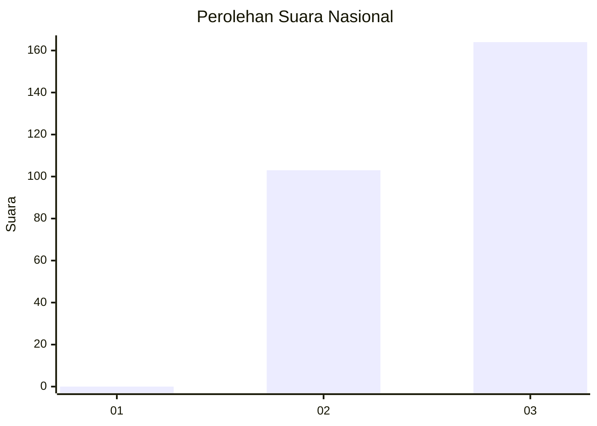
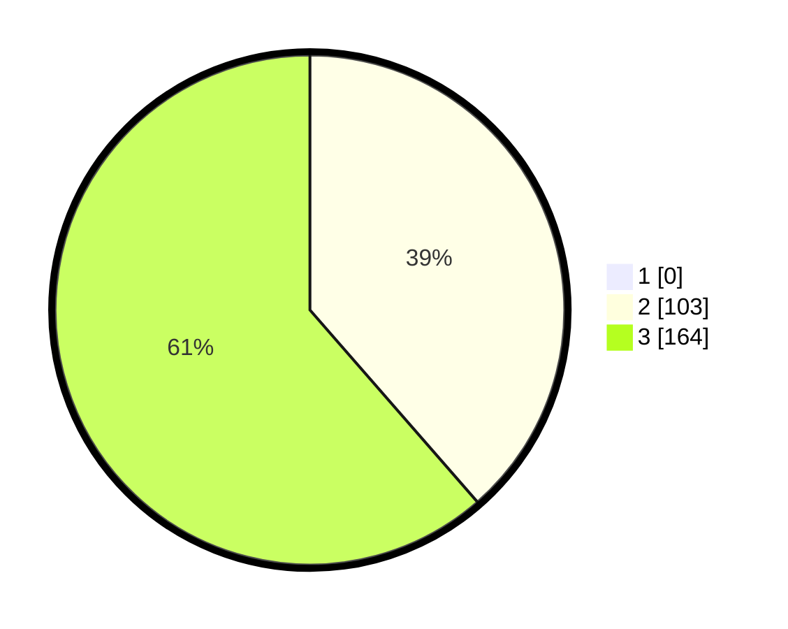

# Hasil

## Grafik

## Tabel

| No. | Nama Paslon    | Suara | Suara (raw) | Persentase |
|:--- |:-------------- | -----:| -----------:| ----------:|
| 1   | ANIES MUHAIMIN | 0     | [0][p-1]    | 0,00       |
| 2   | PRABOWO GIBRAN | 103   | [103][p-2]  | 38,58      |
| 3   | GANJAR MAHFUD  | 164   | [164][p-3]  | 61,42      |

[p-1]: https://github.com/gigit-pemilu/pemilu-2024/blob/main/pilpres/hitung-suara/sub/51-bali/sub/02-tabanan/sub/08-penebel/sub/2012-senganan/sub/017-tps/sub/paslon-1.txt
[p-2]: https://github.com/gigit-pemilu/pemilu-2024/blob/main/pilpres/hitung-suara/sub/51-bali/sub/02-tabanan/sub/08-penebel/sub/2012-senganan/sub/017-tps/sub/paslon-2.txt
[p-3]: https://github.com/gigit-pemilu/pemilu-2024/blob/main/pilpres/hitung-suara/sub/51-bali/sub/02-tabanan/sub/08-penebel/sub/2012-senganan/sub/017-tps/sub/paslon-3.txt

## Foto C Plano

https://sirekap-obj-formc.kpu.go.id/f715/pemilu/ppwp/51/02/08/20/12/5102082012017-20240214-204519--545b46b0-0cb1-4035-9077-c72f9b4bf9c5.jpg

https://sirekap-obj-formc.kpu.go.id/f715/pemilu/ppwp/51/02/08/20/12/5102082012017-20240214-204608--0da90675-cbad-41c4-b09c-61c282b7c7e9.jpg

https://sirekap-obj-formc.kpu.go.id/f715/pemilu/ppwp/51/02/08/20/12/5102082012017-20240214-204651--a5b46ab0-5d74-46e5-9fd4-2bbd318222de.jpg

## Metadata

| Key        | Value               |
| ---------- | ------------------- |
| Time Stamp | 2024-02-15 23:29:50 |

