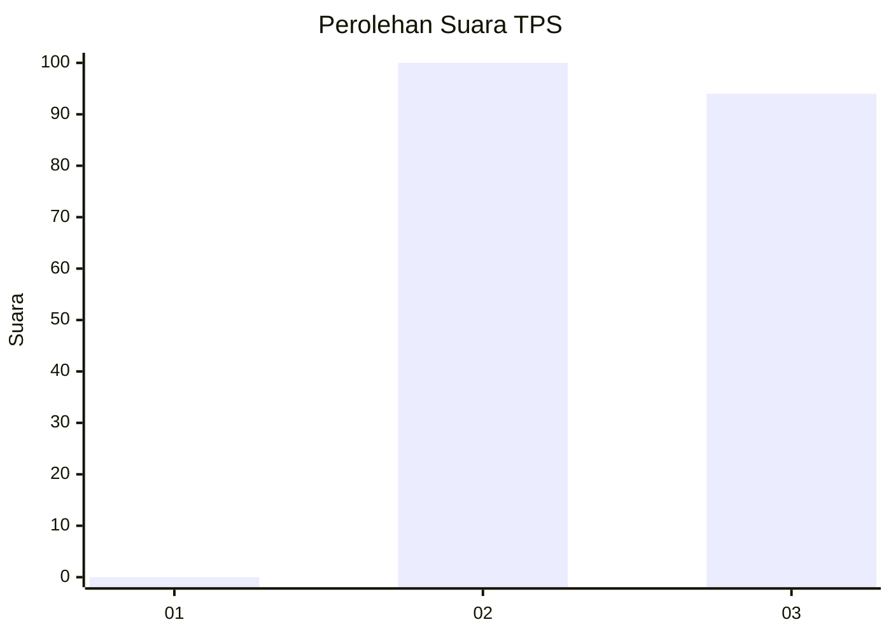
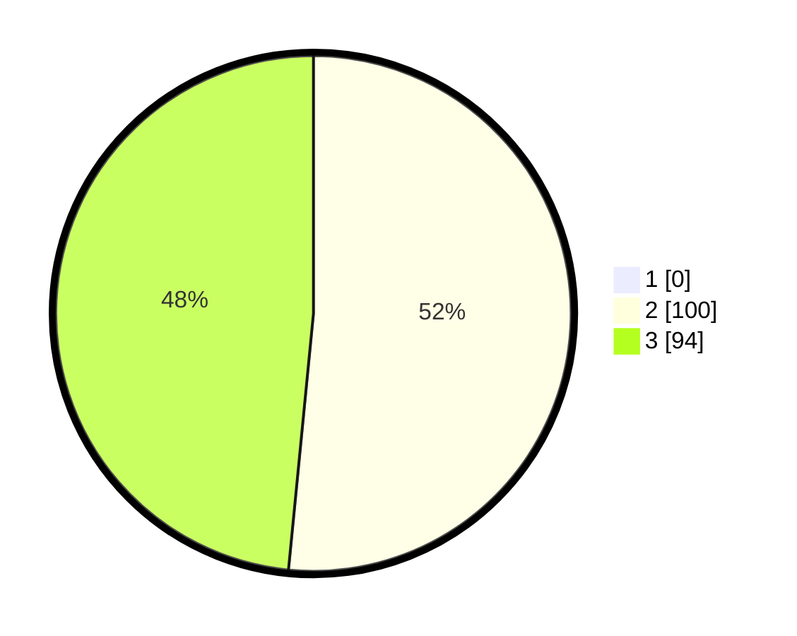

# Hasil

## Grafik

## Tabel

| No. | Nama Paslon    | Suara | Suara (raw) | Persentase |
|:--- |:-------------- | -----:| -----------:| ----------:|
| 1   | ANIES MUHAIMIN | 0     | [0][p-1]    | 0,00       |
| 2   | PRABOWO GIBRAN | 100   | [100][p-2]  | 51,55      |
| 3   | GANJAR MAHFUD  | 94    | [94][p-3]   | 48,45      |

[p-1]: https://github.com/gigit-pemilu/pemilu-2024-51-bali/blob/main/pilpres/hitung-suara/sub/51-bali/sub/02-tabanan/sub/08-penebel/sub/2012-senganan/sub/019-tps/sub/paslon-1.txt
[p-2]: https://github.com/gigit-pemilu/pemilu-2024-51-bali/blob/main/pilpres/hitung-suara/sub/51-bali/sub/02-tabanan/sub/08-penebel/sub/2012-senganan/sub/019-tps/sub/paslon-2.txt
[p-3]: https://github.com/gigit-pemilu/pemilu-2024-51-bali/blob/main/pilpres/hitung-suara/sub/51-bali/sub/02-tabanan/sub/08-penebel/sub/2012-senganan/sub/019-tps/sub/paslon-3.txt

## Foto C Plano

https://sirekap-obj-formc.kpu.go.id/a920/pemilu/ppwp/51/02/08/20/12/5102082012019-20240215-060438--04464bee-ced7-472d-b429-f5e723bb00ac.jpg

https://sirekap-obj-formc.kpu.go.id/a920/pemilu/ppwp/51/02/08/20/12/5102082012019-20240215-060458--e5aee0e5-9715-47c5-ae31-19ad62954d10.jpg

https://sirekap-obj-formc.kpu.go.id/a920/pemilu/ppwp/51/02/08/20/12/5102082012019-20240215-060513--523a5881-b6a7-44d0-8c14-cbe25f609763.jpg

## Metadata

| Key        | Value               |
| ---------- | ------------------- |
| Time Stamp | 2024-02-24 22:31:28 |

