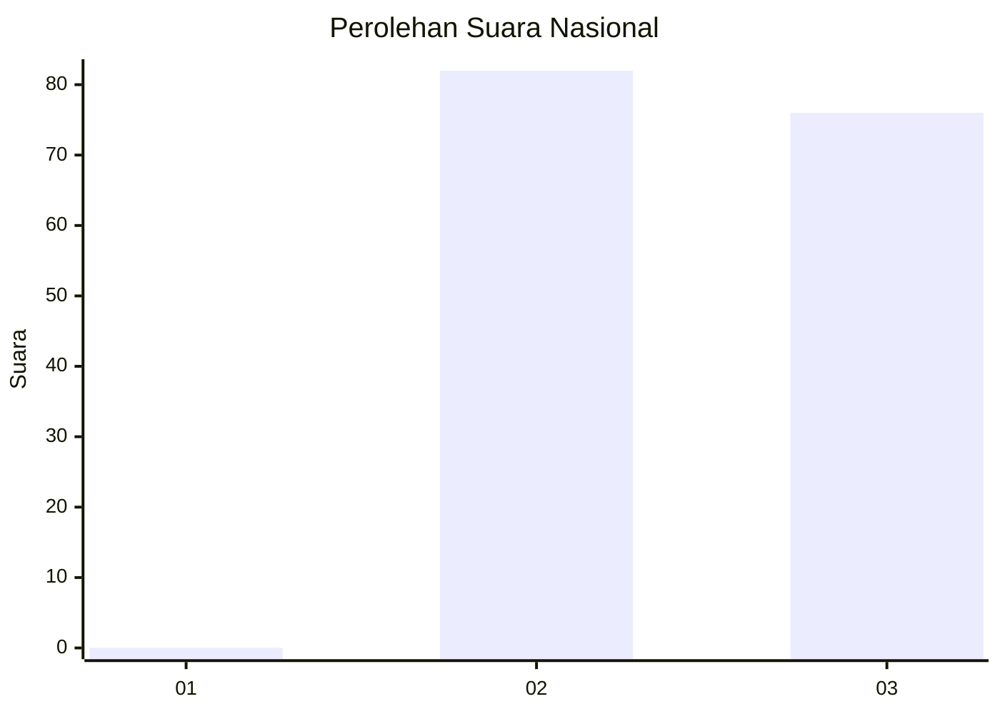
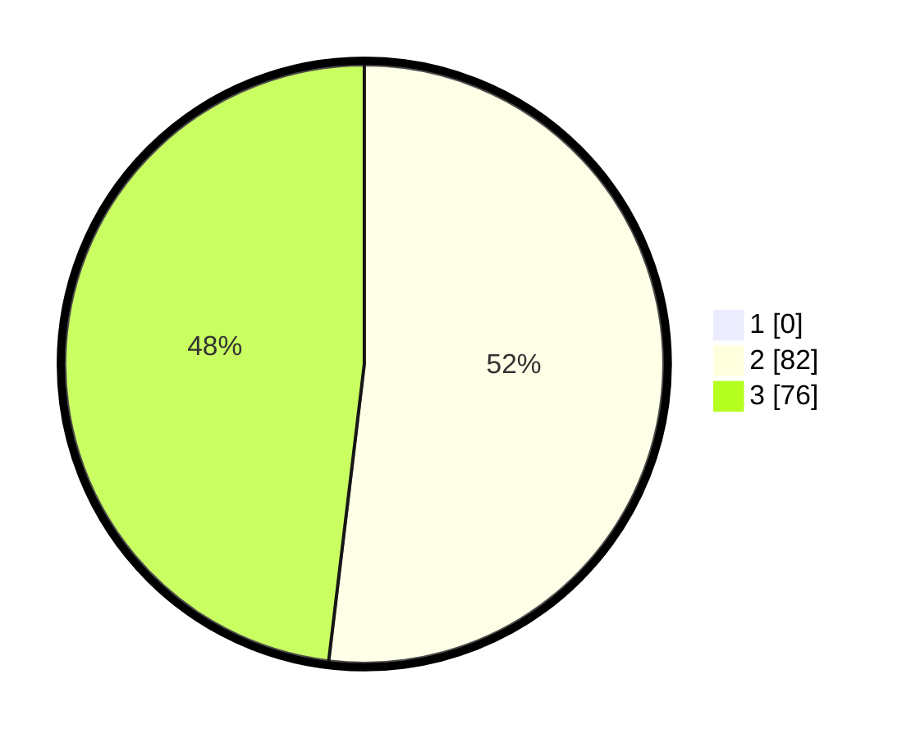

# Hasil

## Grafik

## Tabel

| No. | Nama Paslon    | Suara | Suara (raw) | Persentase |
|:--- |:-------------- | -----:| -----------:| ----------:|
| 1   | ANIES MUHAIMIN | 0     | [0][p-1]    | 0,00       |
| 2   | PRABOWO GIBRAN | 82    | [82][p-2]   | 51,90      |
| 3   | GANJAR MAHFUD  | 76    | [76][p-3]   | 48,10      |

[p-1]: https://github.com/gigit-pemilu/pemilu-2024/blob/main/pilpres/hitung-suara/sub/51-bali/sub/02-tabanan/sub/08-penebel/sub/2012-senganan/sub/020-tps/sub/paslon-1.txt
[p-2]: https://github.com/gigit-pemilu/pemilu-2024/blob/main/pilpres/hitung-suara/sub/51-bali/sub/02-tabanan/sub/08-penebel/sub/2012-senganan/sub/020-tps/sub/paslon-2.txt
[p-3]: https://github.com/gigit-pemilu/pemilu-2024/blob/main/pilpres/hitung-suara/sub/51-bali/sub/02-tabanan/sub/08-penebel/sub/2012-senganan/sub/020-tps/sub/paslon-3.txt

## Foto C Plano

https://sirekap-obj-formc.kpu.go.id/a545/pemilu/ppwp/51/02/08/20/12/5102082012020-20240216-141822--74c5c4e6-ba1b-49ac-aebc-924e0e71ff67.jpg

https://sirekap-obj-formc.kpu.go.id/a545/pemilu/ppwp/51/02/08/20/12/5102082012020-20240216-141823--fa1ea2c2-fcd1-4d64-a070-b078912f0c9e.jpg

https://sirekap-obj-formc.kpu.go.id/a545/pemilu/ppwp/51/02/08/20/12/5102082012020-20240216-141822--715610b9-c0c6-45b0-a7e4-e6637962c8d5.jpg

## Metadata

| Key        | Value               |
| ---------- | ------------------- |
| Time Stamp | 2024-02-16 14:30:33 |

## DATA PEMILIH TETAP

Jumlah pemilih dalam DPT: **170**.
 * L: **85**.
 * P: **85**.

## DATA PENGGUNA HAK PILIH

Jumlah pengguna hak pilih dalam DPT: **159**.
 * L: **82**.
 * P: **77**.

Jumlah pengguna hak pilih dalam DPTb: **0**.
 * L: **0**.
 * P: **0**.

Jumlah pengguna hak pilih dalam DPK: **0**.
 * L: **0**.
 * P: **0**.

Jumlah pengguna hak pilih: **159**.
 * L: **82**.
 * P: **77**.

## JUMLAH SUARA SAH DAN TIDAK SAH

JUMLAH SELURUH SUARA SAH: **158**.

JUMLAH SUARA TIDAK SAH: **1**.

JUMLAH SELURUH SUARA SAH DAN SUARA TIDAK SAH: **159**.

