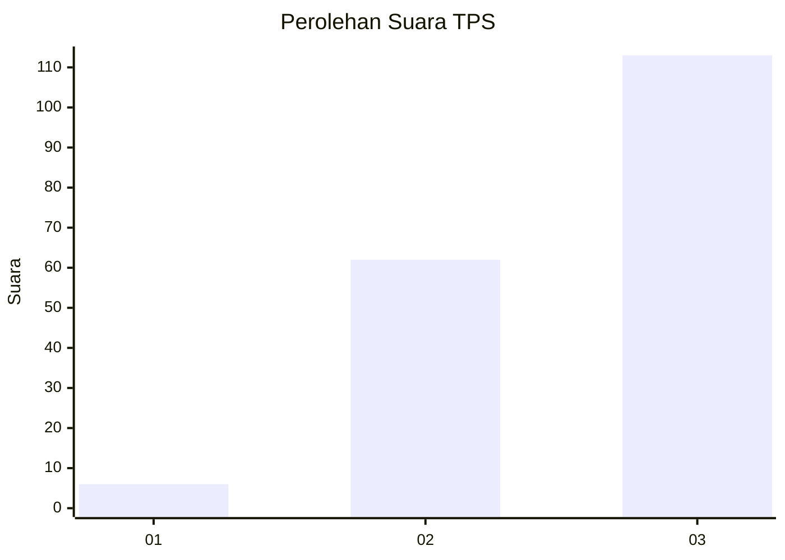
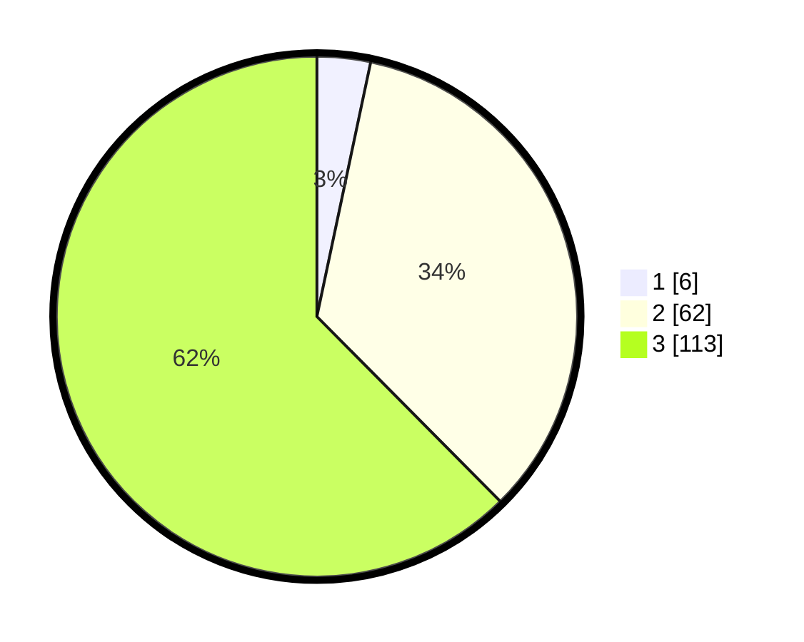

# Hasil

## Grafik

## Tabel

| No. | Nama Paslon    | Suara | Suara (raw) | Persentase |
|:--- |:-------------- | -----:| -----------:| ----------:|
| 1   | ANIES MUHAIMIN | 6     | [6][p-1]    | 3,31       |
| 2   | PRABOWO GIBRAN | 62    | [62][p-2]   | 34,25      |
| 3   | GANJAR MAHFUD  | 113   | [113][p-3]  | 62,43      |

[p-1]: https://github.com/gigit-pemilu/pemilu-2024-51-bali/blob/main/pilpres/hitung-suara/sub/51-bali/sub/02-tabanan/sub/08-penebel/sub/2013-jatiluwih/sub/001-tps/sub/paslon-1.txt
[p-2]: https://github.com/gigit-pemilu/pemilu-2024-51-bali/blob/main/pilpres/hitung-suara/sub/51-bali/sub/02-tabanan/sub/08-penebel/sub/2013-jatiluwih/sub/001-tps/sub/paslon-2.txt
[p-3]: https://github.com/gigit-pemilu/pemilu-2024-51-bali/blob/main/pilpres/hitung-suara/sub/51-bali/sub/02-tabanan/sub/08-penebel/sub/2013-jatiluwih/sub/001-tps/sub/paslon-3.txt

## Foto C Plano

https://sirekap-obj-formc.kpu.go.id/9cb9/pemilu/ppwp/51/02/08/20/13/5102082013001-20240216-131940--76ce8817-991e-4802-bbbf-a973e98f1b88.jpg

https://sirekap-obj-formc.kpu.go.id/9cb9/pemilu/ppwp/51/02/08/20/13/5102082013001-20240216-131942--fe4d49ec-9bad-4d3a-815c-85885e079670.jpg

https://sirekap-obj-formc.kpu.go.id/9cb9/pemilu/ppwp/51/02/08/20/13/5102082013001-20240216-131941--ba7fa3c2-ed60-497b-b135-4c8edf39ccf0.jpg

## Metadata

| Key        | Value               |
| ---------- | ------------------- |
| Time Stamp | 2024-02-16 14:30:33 |

## DATA PEMILIH TETAP

Jumlah pemilih dalam DPT: **225**.
 * L: **115**.
 * P: **110**.

## DATA PENGGUNA HAK PILIH

Jumlah pengguna hak pilih dalam DPT: **182**.
 * L: **97**.
 * P: **85**.

Jumlah pengguna hak pilih dalam DPTb: **0**.
 * L: **0**.
 * P: **0**.

Jumlah pengguna hak pilih dalam DPK: **2**.
 * L: **0**.
 * P: **2**.

Jumlah pengguna hak pilih: **184**.
 * L: **97**.
 * P: **87**.

## JUMLAH SUARA SAH DAN TIDAK SAH

JUMLAH SELURUH SUARA SAH: **181**.

JUMLAH SUARA TIDAK SAH: **3**.

JUMLAH SELURUH SUARA SAH DAN SUARA TIDAK SAH: **184**.

