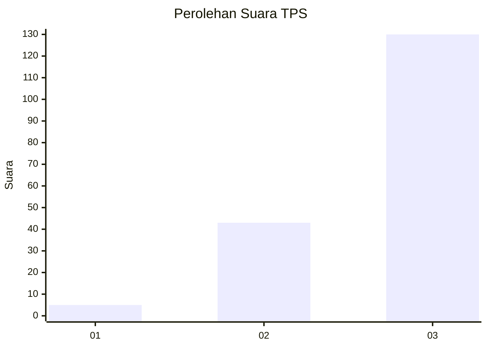
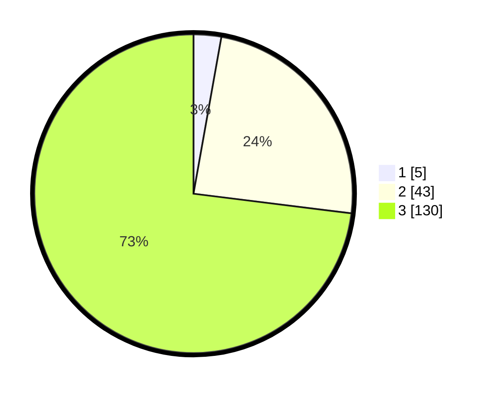

# Hasil

## Grafik

## Tabel

| No. | Nama Paslon    | Suara | Suara (raw) | Persentase |
|:--- |:-------------- | -----:| -----------:| ----------:|
| 1   | ANIES MUHAIMIN | 5     | [5][p-1]    | 2,81       |
| 2   | PRABOWO GIBRAN | 43    | [43][p-2]   | 24,16      |
| 3   | GANJAR MAHFUD  | 130   | [130][p-3]  | 73,03      |

[p-1]: https://github.com/gigit-pemilu/pemilu-2024-51-bali/blob/main/pilpres/hitung-suara/sub/51-bali/sub/02-tabanan/sub/08-penebel/sub/2013-jatiluwih/sub/002-tps/sub/paslon-1.txt
[p-2]: https://github.com/gigit-pemilu/pemilu-2024-51-bali/blob/main/pilpres/hitung-suara/sub/51-bali/sub/02-tabanan/sub/08-penebel/sub/2013-jatiluwih/sub/002-tps/sub/paslon-2.txt
[p-3]: https://github.com/gigit-pemilu/pemilu-2024-51-bali/blob/main/pilpres/hitung-suara/sub/51-bali/sub/02-tabanan/sub/08-penebel/sub/2013-jatiluwih/sub/002-tps/sub/paslon-3.txt

## Foto C Plano

https://sirekap-obj-formc.kpu.go.id/0187/pemilu/ppwp/51/02/08/20/13/5102082013002-20240216-032236--941da6bf-58c9-4a52-8b3b-73e03d230c31.jpg

https://sirekap-obj-formc.kpu.go.id/0187/pemilu/ppwp/51/02/08/20/13/5102082013002-20240216-032237--f0b27df1-7eae-4d76-9fa0-900f5891daba.jpg

https://sirekap-obj-formc.kpu.go.id/0187/pemilu/ppwp/51/02/08/20/13/5102082013002-20240216-032236--804c60a2-76ce-478b-9ee2-487cb92035d4.jpg

## Metadata

| Key        | Value               |
| ---------- | ------------------- |
| Time Stamp | 2024-02-16 12:51:22 |

## DATA PEMILIH TETAP

Jumlah pemilih dalam DPT: **203**.
 * L: **99**.
 * P: **104**.

## DATA PENGGUNA HAK PILIH

Jumlah pengguna hak pilih dalam DPT: **183**.
 * L: **90**.
 * P: **93**.

Jumlah pengguna hak pilih dalam DPTb: **1**.
 * L: **0**.
 * P: **1**.

Jumlah pengguna hak pilih dalam DPK: **0**.
 * L: **0**.
 * P: **0**.

Jumlah pengguna hak pilih: **184**.
 * L: **90**.
 * P: **94**.

## JUMLAH SUARA SAH DAN TIDAK SAH

JUMLAH SELURUH SUARA SAH: **178**.

JUMLAH SUARA TIDAK SAH: **6**.

JUMLAH SELURUH SUARA SAH DAN SUARA TIDAK SAH: **184**.

