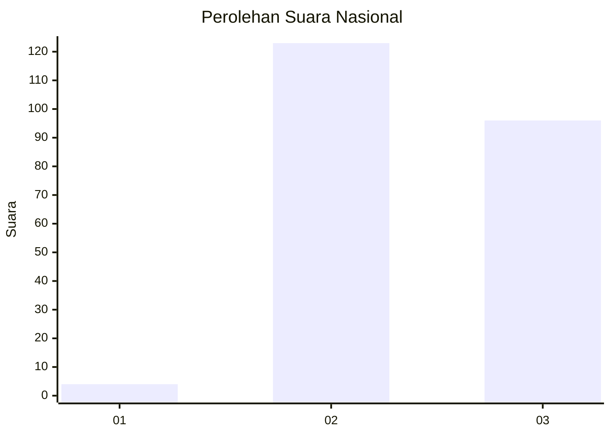
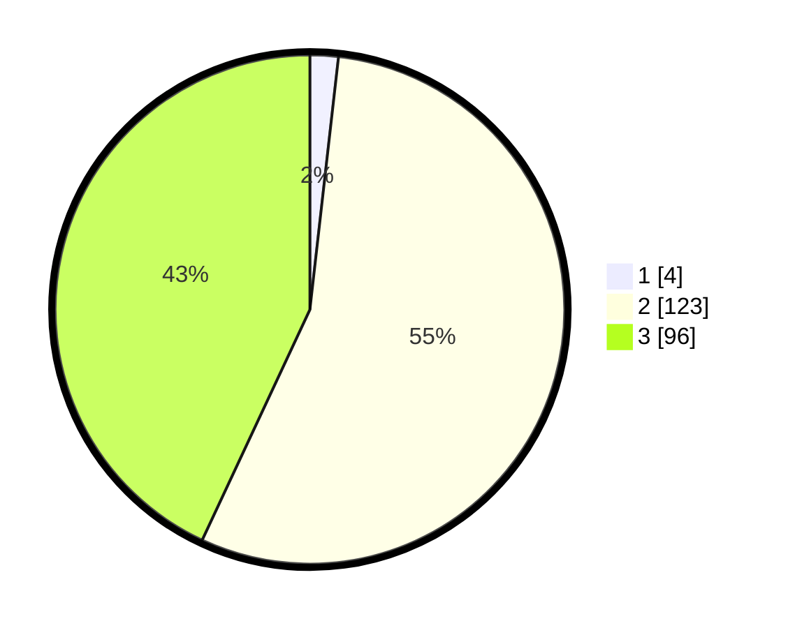

# Hasil

## Grafik

## Tabel

| No. | Nama Paslon    | Suara | Suara (raw) | Persentase |
|:--- |:-------------- | -----:| -----------:| ----------:|
| 1   | ANIES MUHAIMIN | 4     | [4][p-1]    | 1,79       |
| 2   | PRABOWO GIBRAN | 123   | [123][p-2]  | 55,16      |
| 3   | GANJAR MAHFUD  | 96    | [96][p-3]   | 43,05      |

[p-1]: https://github.com/gigit-pemilu/pemilu-2024/blob/main/pilpres/hitung-suara/sub/51-bali/sub/02-tabanan/sub/08-penebel/sub/2013-jatiluwih/sub/003-tps/sub/paslon-1.txt
[p-2]: https://github.com/gigit-pemilu/pemilu-2024/blob/main/pilpres/hitung-suara/sub/51-bali/sub/02-tabanan/sub/08-penebel/sub/2013-jatiluwih/sub/003-tps/sub/paslon-2.txt
[p-3]: https://github.com/gigit-pemilu/pemilu-2024/blob/main/pilpres/hitung-suara/sub/51-bali/sub/02-tabanan/sub/08-penebel/sub/2013-jatiluwih/sub/003-tps/sub/paslon-3.txt

## Foto C Plano

https://sirekap-obj-formc.kpu.go.id/703d/pemilu/ppwp/51/02/08/20/13/5102082013003-20240214-232221--5e6f6b8f-a361-4edc-976a-cec66856d526.jpg

https://sirekap-obj-formc.kpu.go.id/703d/pemilu/ppwp/51/02/08/20/13/5102082013003-20240214-232305--5b3ae69e-7916-4f71-a09b-cc78d4e0f3e1.jpg

https://sirekap-obj-formc.kpu.go.id/703d/pemilu/ppwp/51/02/08/20/13/5102082013003-20240214-232353--7c6560f9-8976-4e4c-b874-3e01f7e6609f.jpg

## Metadata

| Key        | Value               |
| ---------- | ------------------- |
| Time Stamp | 2024-02-15 23:29:50 |

## DATA PEMILIH TETAP

Jumlah pemilih dalam DPT: **255**.
 * L: **120**.
 * P: **135**.

## DATA PENGGUNA HAK PILIH

Jumlah pengguna hak pilih dalam DPT: **221**.
 * L: **106**.
 * P: **115**.

Jumlah pengguna hak pilih dalam DPTb: **2**.
 * L: **1**.
 * P: **1**.

Jumlah pengguna hak pilih dalam DPK: **1**.
 * L: **1**.
 * P: **0**.

Jumlah pengguna hak pilih: **224**.
 * L: **108**.
 * P: **116**.

## JUMLAH SUARA SAH DAN TIDAK SAH

JUMLAH SELURUH SUARA SAH: **223**.

JUMLAH SUARA TIDAK SAH: **1**.

JUMLAH SELURUH SUARA SAH DAN SUARA TIDAK SAH: **224**.

