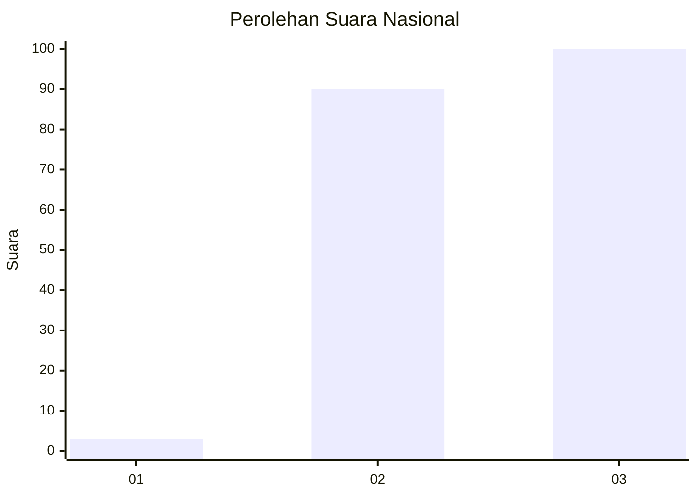
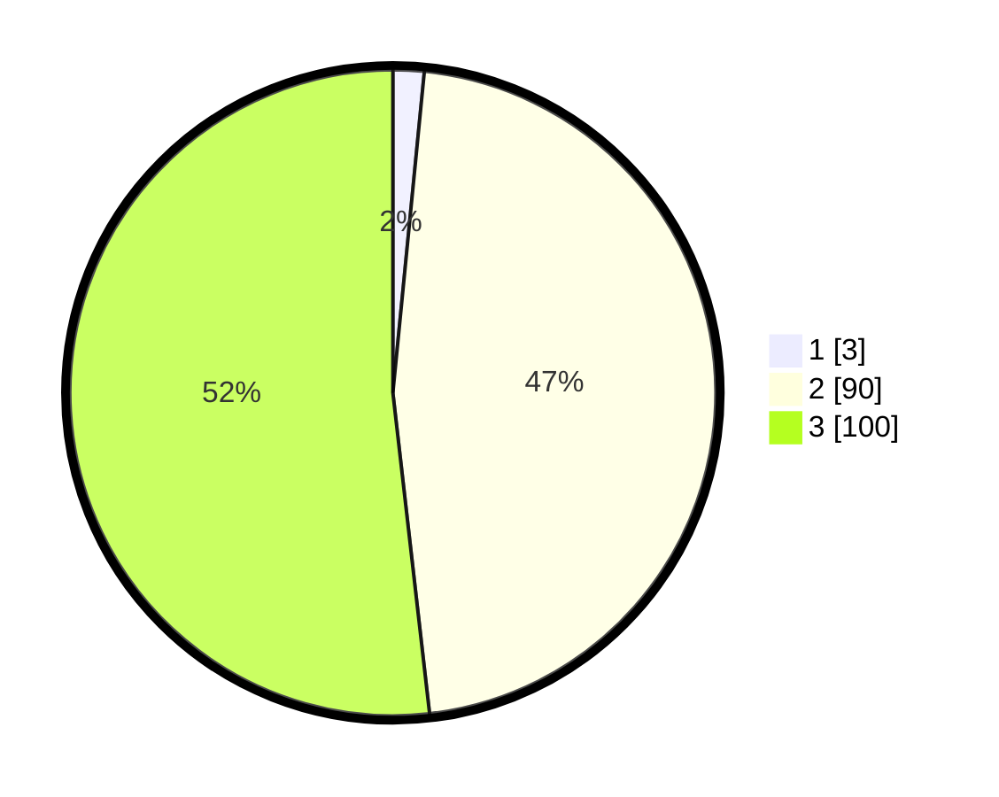

# Hasil

## Grafik

## Tabel

| No. | Nama Paslon    | Suara | Suara (raw) | Persentase |
|:--- |:-------------- | -----:| -----------:| ----------:|
| 1   | ANIES MUHAIMIN | 3     | [3][p-1]    | 1,55       |
| 2   | PRABOWO GIBRAN | 90    | [90][p-2]   | 46,63      |
| 3   | GANJAR MAHFUD  | 100   | [100][p-3]  | 51,81      |

[p-1]: https://github.com/gigit-pemilu/pemilu-2024/blob/main/pilpres/hitung-suara/sub/51-bali/sub/02-tabanan/sub/08-penebel/sub/2013-jatiluwih/sub/004-tps/sub/paslon-1.txt
[p-2]: https://github.com/gigit-pemilu/pemilu-2024/blob/main/pilpres/hitung-suara/sub/51-bali/sub/02-tabanan/sub/08-penebel/sub/2013-jatiluwih/sub/004-tps/sub/paslon-2.txt
[p-3]: https://github.com/gigit-pemilu/pemilu-2024/blob/main/pilpres/hitung-suara/sub/51-bali/sub/02-tabanan/sub/08-penebel/sub/2013-jatiluwih/sub/004-tps/sub/paslon-3.txt

## Foto C Plano

https://sirekap-obj-formc.kpu.go.id/df34/pemilu/ppwp/51/02/08/20/13/5102082013004-20240214-141600--ae7d80af-2a4b-4815-be86-f99776dae6e2.jpg

https://sirekap-obj-formc.kpu.go.id/df34/pemilu/ppwp/51/02/08/20/13/5102082013004-20240214-141855--95ec3b81-3c0f-446c-8624-0f2e53f16a87.jpg

https://sirekap-obj-formc.kpu.go.id/df34/pemilu/ppwp/51/02/08/20/13/5102082013004-20240215-212607--da9ca4c7-b73c-4233-a096-5da902615d8c.jpg

## Metadata

| Key        | Value               |
| ---------- | ------------------- |
| Time Stamp | 2024-02-15 21:30:27 |

## DATA PEMILIH TETAP

Jumlah pemilih dalam DPT: **257**.
 * L: **122**.
 * P: **135**.

## DATA PENGGUNA HAK PILIH

Jumlah pengguna hak pilih dalam DPT: **196**.
 * L: **93**.
 * P: **103**.

Jumlah pengguna hak pilih dalam DPTb: **0**.
 * L: **0**.
 * P: **0**.

Jumlah pengguna hak pilih dalam DPK: **2**.
 * L: **1**.
 * P: **1**.

Jumlah pengguna hak pilih: **198**.
 * L: **94**.
 * P: **104**.

## JUMLAH SUARA SAH DAN TIDAK SAH

JUMLAH SELURUH SUARA SAH: **193**.

JUMLAH SUARA TIDAK SAH: **5**.

JUMLAH SELURUH SUARA SAH DAN SUARA TIDAK SAH: **198**.

