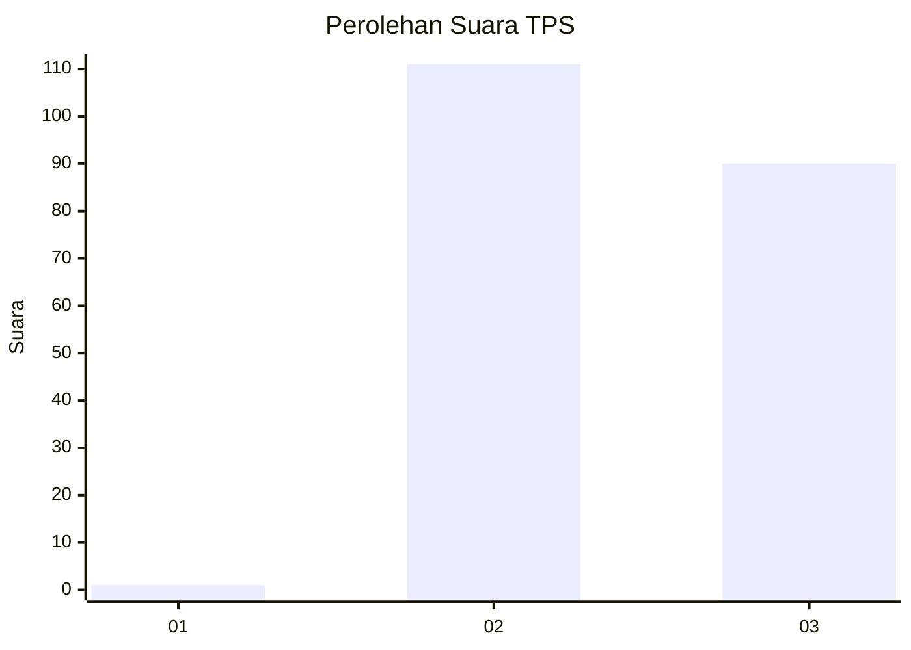
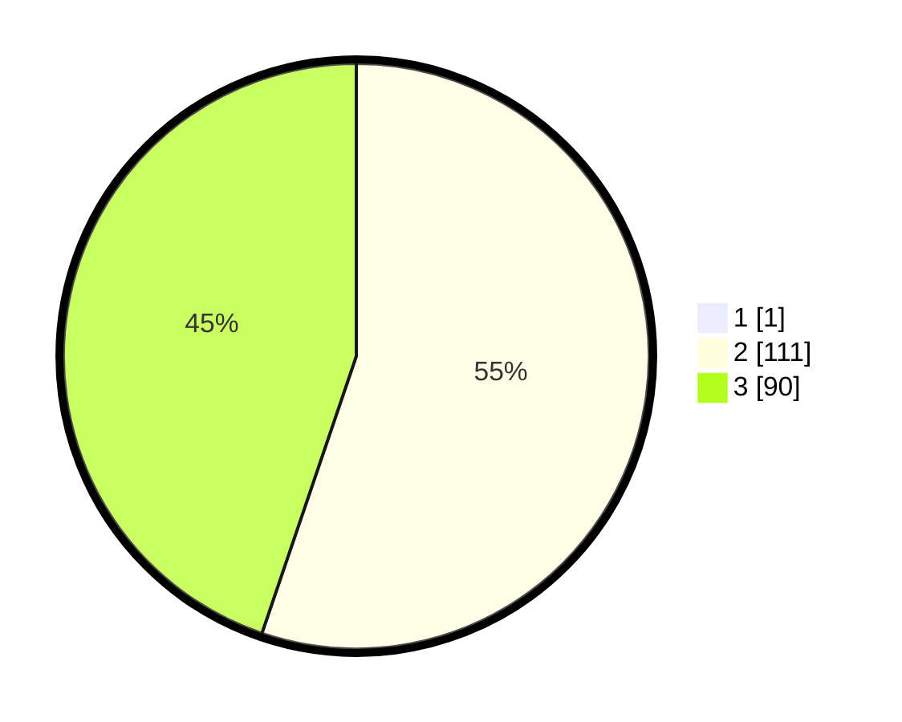

# Hasil

## Grafik

## Tabel

| No. | Nama Paslon    | Suara | Suara (raw) | Persentase |
|:--- |:-------------- | -----:| -----------:| ----------:|
| 1   | ANIES MUHAIMIN | 1     | [1][p-1]    | 0,50       |
| 2   | PRABOWO GIBRAN | 111   | [111][p-2]  | 54,95      |
| 3   | GANJAR MAHFUD  | 90    | [90][p-3]   | 44,55      |

[p-1]: https://github.com/gigit-pemilu/pemilu-2024-51-bali/blob/main/pilpres/hitung-suara/sub/51-bali/sub/02-tabanan/sub/08-penebel/sub/2013-jatiluwih/sub/005-tps/sub/paslon-1.txt
[p-2]: https://github.com/gigit-pemilu/pemilu-2024-51-bali/blob/main/pilpres/hitung-suara/sub/51-bali/sub/02-tabanan/sub/08-penebel/sub/2013-jatiluwih/sub/005-tps/sub/paslon-2.txt
[p-3]: https://github.com/gigit-pemilu/pemilu-2024-51-bali/blob/main/pilpres/hitung-suara/sub/51-bali/sub/02-tabanan/sub/08-penebel/sub/2013-jatiluwih/sub/005-tps/sub/paslon-3.txt

## Foto C Plano

https://sirekap-obj-formc.kpu.go.id/b3b2/pemilu/ppwp/51/02/08/20/13/5102082013005-20240216-085742--3e77b579-6149-4a95-8ccf-e62a8b2d18e1.jpg

https://sirekap-obj-formc.kpu.go.id/b3b2/pemilu/ppwp/51/02/08/20/13/5102082013005-20240216-085744--09c2e38f-660e-45a1-8d79-5a7da458bc3c.jpg

https://sirekap-obj-formc.kpu.go.id/b3b2/pemilu/ppwp/51/02/08/20/13/5102082013005-20240216-085743--d5322f75-b82c-4044-960f-5d5f198bf67a.jpg

## Metadata

| Key        | Value               |
| ---------- | ------------------- |
| Time Stamp | 2024-02-16 12:51:22 |

## DATA PEMILIH TETAP

Jumlah pemilih dalam DPT: **248**.
 * L: **125**.
 * P: **123**.

## DATA PENGGUNA HAK PILIH

Jumlah pengguna hak pilih dalam DPT: **206**.
 * L: **105**.
 * P: **101**.

Jumlah pengguna hak pilih dalam DPTb: **0**.
 * L: **0**.
 * P: **0**.

Jumlah pengguna hak pilih dalam DPK: **2**.
 * L: **1**.
 * P: **1**.

Jumlah pengguna hak pilih: **208**.
 * L: **106**.
 * P: **102**.

## JUMLAH SUARA SAH DAN TIDAK SAH

JUMLAH SELURUH SUARA SAH: **202**.

JUMLAH SUARA TIDAK SAH: **6**.

JUMLAH SELURUH SUARA SAH DAN SUARA TIDAK SAH: **208**.

