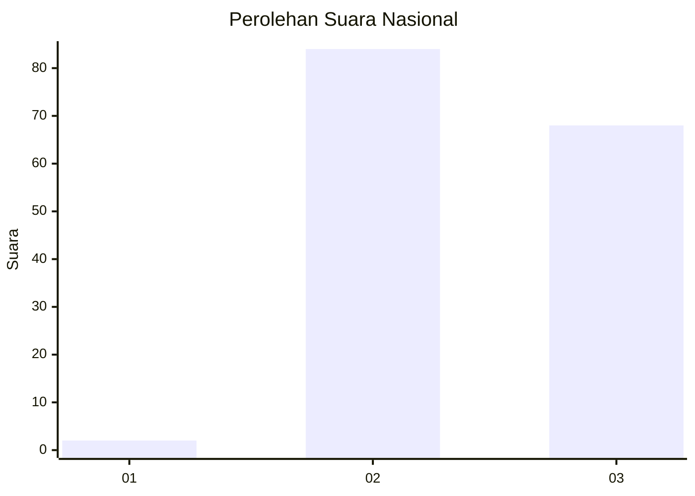
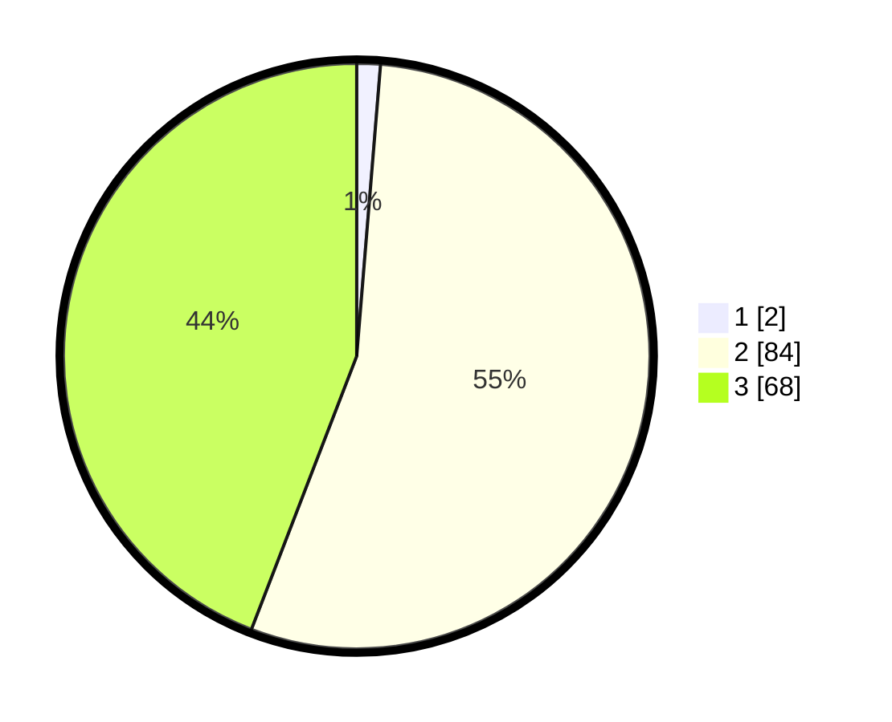

# Hasil

## Grafik

## Tabel

| No. | Nama Paslon    | Suara | Suara (raw) | Persentase |
|:--- |:-------------- | -----:| -----------:| ----------:|
| 1   | ANIES MUHAIMIN | 2     | [2][p-1]    | 1,30       |
| 2   | PRABOWO GIBRAN | 84    | [84][p-2]   | 54,55      |
| 3   | GANJAR MAHFUD  | 68    | [68][p-3]   | 44,16      |

[p-1]: https://github.com/gigit-pemilu/pemilu-2024/blob/main/pilpres/hitung-suara/sub/51-bali/sub/02-tabanan/sub/08-penebel/sub/2013-jatiluwih/sub/006-tps/sub/paslon-1.txt
[p-2]: https://github.com/gigit-pemilu/pemilu-2024/blob/main/pilpres/hitung-suara/sub/51-bali/sub/02-tabanan/sub/08-penebel/sub/2013-jatiluwih/sub/006-tps/sub/paslon-2.txt
[p-3]: https://github.com/gigit-pemilu/pemilu-2024/blob/main/pilpres/hitung-suara/sub/51-bali/sub/02-tabanan/sub/08-penebel/sub/2013-jatiluwih/sub/006-tps/sub/paslon-3.txt

## Foto C Plano

https://sirekap-obj-formc.kpu.go.id/cc8e/pemilu/ppwp/51/02/08/20/13/5102082013006-20240216-115312--aa6958cd-ecbc-41a1-adbb-4d64264110aa.jpg

https://sirekap-obj-formc.kpu.go.id/cc8e/pemilu/ppwp/51/02/08/20/13/5102082013006-20240216-115315--534f17c6-c78e-4279-b0ec-275c6020cfc4.jpg

https://sirekap-obj-formc.kpu.go.id/cc8e/pemilu/ppwp/51/02/08/20/13/5102082013006-20240216-115313--0499b9bb-2631-41c9-b6e0-721b759049eb.jpg

## Metadata

| Key        | Value               |
| ---------- | ------------------- |
| Time Stamp | 2024-02-16 14:30:33 |

## DATA PEMILIH TETAP

Jumlah pemilih dalam DPT: **207**.
 * L: **93**.
 * P: **114**.

## DATA PENGGUNA HAK PILIH

Jumlah pengguna hak pilih dalam DPT: **161**.
 * L: **70**.
 * P: **91**.

Jumlah pengguna hak pilih dalam DPTb: **0**.
 * L: **0**.
 * P: **0**.

Jumlah pengguna hak pilih dalam DPK: **0**.
 * L: **0**.
 * P: **0**.

Jumlah pengguna hak pilih: **161**.
 * L: **70**.
 * P: **91**.

## JUMLAH SUARA SAH DAN TIDAK SAH

JUMLAH SELURUH SUARA SAH: **154**.

JUMLAH SUARA TIDAK SAH: **7**.

JUMLAH SELURUH SUARA SAH DAN SUARA TIDAK SAH: **161**.

