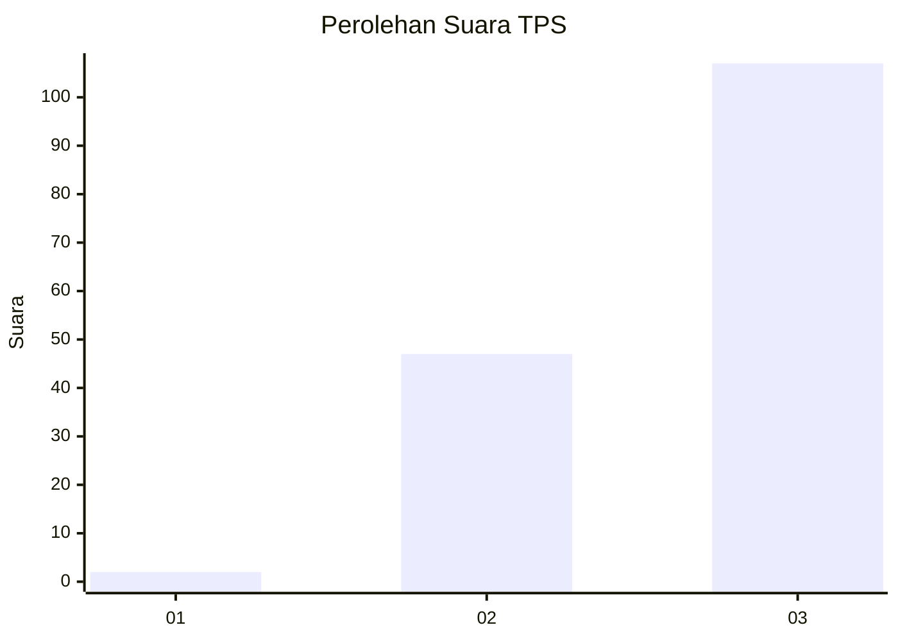
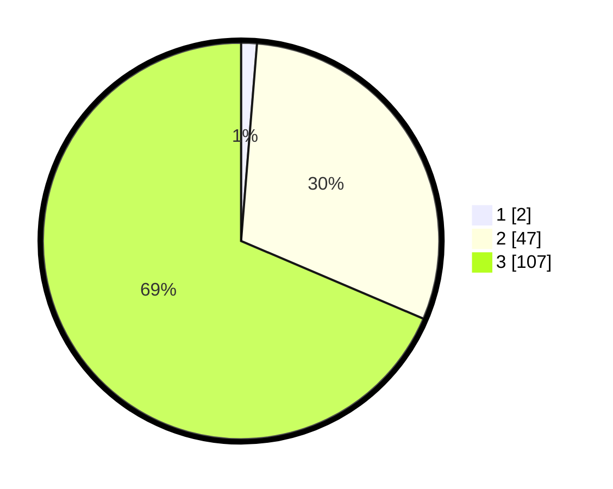

# Hasil

## Grafik

## Tabel

| No. | Nama Paslon    | Suara | Suara (raw) | Persentase |
|:--- |:-------------- | -----:| -----------:| ----------:|
| 1   | ANIES MUHAIMIN | 2     | [2][p-1]    | 1,28       |
| 2   | PRABOWO GIBRAN | 47    | [47][p-2]   | 30,13      |
| 3   | GANJAR MAHFUD  | 107   | [107][p-3]  | 68,59      |

[p-1]: https://github.com/gigit-pemilu/pemilu-2024-51-bali/blob/main/pilpres/hitung-suara/sub/51-bali/sub/02-tabanan/sub/08-penebel/sub/2013-jatiluwih/sub/008-tps/sub/paslon-1.txt
[p-2]: https://github.com/gigit-pemilu/pemilu-2024-51-bali/blob/main/pilpres/hitung-suara/sub/51-bali/sub/02-tabanan/sub/08-penebel/sub/2013-jatiluwih/sub/008-tps/sub/paslon-2.txt
[p-3]: https://github.com/gigit-pemilu/pemilu-2024-51-bali/blob/main/pilpres/hitung-suara/sub/51-bali/sub/02-tabanan/sub/08-penebel/sub/2013-jatiluwih/sub/008-tps/sub/paslon-3.txt

## Foto C Plano

https://sirekap-obj-formc.kpu.go.id/f28a/pemilu/ppwp/51/02/08/20/13/5102082013008-20240214-141059--32f26c63-eb01-4cd6-899d-cf4290a38f50.jpg

https://sirekap-obj-formc.kpu.go.id/f28a/pemilu/ppwp/51/02/08/20/13/5102082013008-20240214-141145--db6df643-512f-463d-a268-15889910d02b.jpg

https://sirekap-obj-formc.kpu.go.id/f28a/pemilu/ppwp/51/02/08/20/13/5102082013008-20240214-141217--03e1e045-afb4-4fcf-a814-ed2c42e0f9e1.jpg

## Metadata

| Key        | Value               |
| ---------- | ------------------- |
| Time Stamp | 2024-02-15 23:29:50 |

## DATA PEMILIH TETAP

Jumlah pemilih dalam DPT: **174**.
 * L: **78**.
 * P: **96**.

## DATA PENGGUNA HAK PILIH

Jumlah pengguna hak pilih dalam DPT: **171**.
 * L: **77**.
 * P: **94**.

Jumlah pengguna hak pilih dalam DPTb: **0**.
 * L: **0**.
 * P: **0**.

Jumlah pengguna hak pilih dalam DPK: **1**.
 * L: **1**.
 * P: **0**.

Jumlah pengguna hak pilih: **172**.
 * L: **78**.
 * P: **94**.

## JUMLAH SUARA SAH DAN TIDAK SAH

JUMLAH SELURUH SUARA SAH: **156**.

JUMLAH SUARA TIDAK SAH: **16**.

JUMLAH SELURUH SUARA SAH DAN SUARA TIDAK SAH: **172**.

