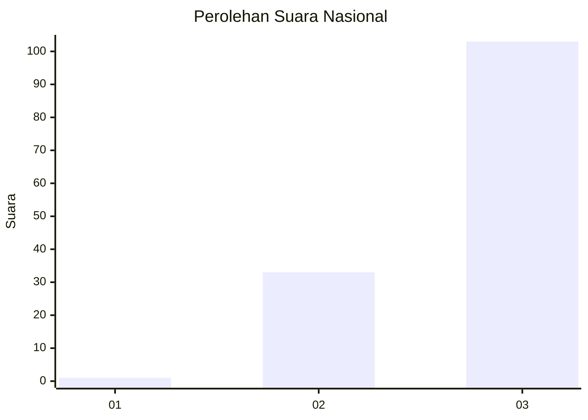
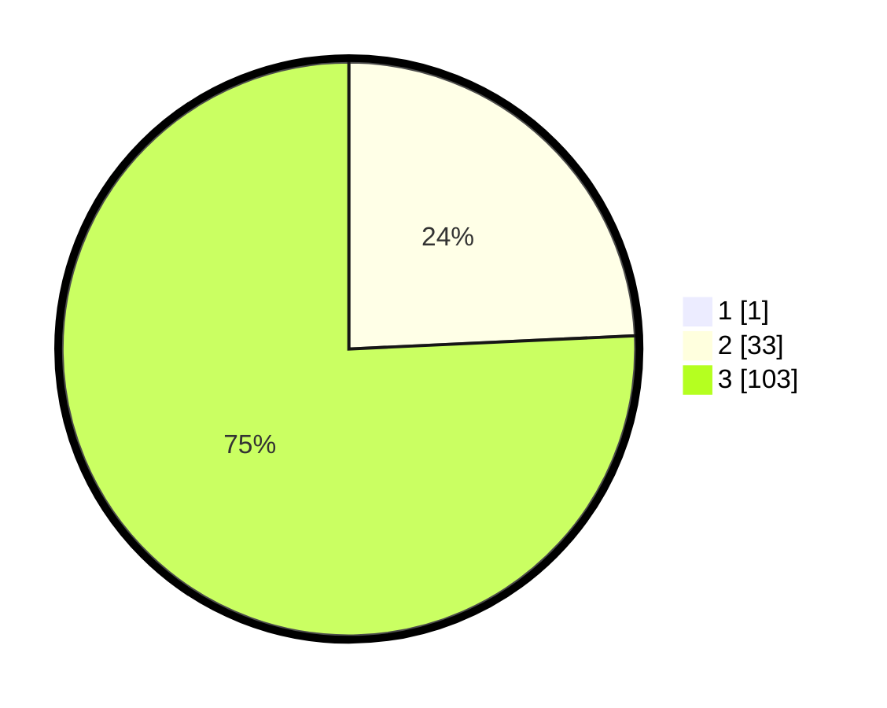

# Hasil

## Grafik

## Tabel

| No. | Nama Paslon    | Suara | Suara (raw) | Persentase |
|:--- |:-------------- | -----:| -----------:| ----------:|
| 1   | ANIES MUHAIMIN | 1     | [1][p-1]    | 0,73       |
| 2   | PRABOWO GIBRAN | 33    | [33][p-2]   | 24,09      |
| 3   | GANJAR MAHFUD  | 103   | [103][p-3]  | 75,18      |

[p-1]: https://github.com/gigit-pemilu/pemilu-2024/blob/main/pilpres/hitung-suara/sub/51-bali/sub/02-tabanan/sub/08-penebel/sub/2013-jatiluwih/sub/009-tps/sub/paslon-1.txt
[p-2]: https://github.com/gigit-pemilu/pemilu-2024/blob/main/pilpres/hitung-suara/sub/51-bali/sub/02-tabanan/sub/08-penebel/sub/2013-jatiluwih/sub/009-tps/sub/paslon-2.txt
[p-3]: https://github.com/gigit-pemilu/pemilu-2024/blob/main/pilpres/hitung-suara/sub/51-bali/sub/02-tabanan/sub/08-penebel/sub/2013-jatiluwih/sub/009-tps/sub/paslon-3.txt

## Foto C Plano

https://sirekap-obj-formc.kpu.go.id/ec7f/pemilu/ppwp/51/02/08/20/13/5102082013009-20240214-131209--f6849dfc-0211-40c4-bcce-784fd1cff2dc.jpg

https://sirekap-obj-formc.kpu.go.id/ec7f/pemilu/ppwp/51/02/08/20/13/5102082013009-20240214-130722--806f7dd5-7909-444d-8517-7273666aa800.jpg

https://sirekap-obj-formc.kpu.go.id/ec7f/pemilu/ppwp/51/02/08/20/13/5102082013009-20240214-130846--19888f67-dba3-4018-a58e-cc6d6b7b8fca.jpg

## Metadata

| Key        | Value               |
| ---------- | ------------------- |
| Time Stamp | 2024-02-14 21:46:01 |

## DATA PEMILIH TETAP

Jumlah pemilih dalam DPT: **157**.
 * L: **79**.
 * P: **78**.

## DATA PENGGUNA HAK PILIH

Jumlah pengguna hak pilih dalam DPT: **147**.
 * L: **74**.
 * P: **73**.

Jumlah pengguna hak pilih dalam DPTb: **0**.
 * L: **0**.
 * P: **0**.

Jumlah pengguna hak pilih dalam DPK: **0**.
 * L: **0**.
 * P: **0**.

Jumlah pengguna hak pilih: **147**.
 * L: **74**.
 * P: **73**.

## JUMLAH SUARA SAH DAN TIDAK SAH

JUMLAH SELURUH SUARA SAH: **137**.

JUMLAH SUARA TIDAK SAH: **10**.

JUMLAH SELURUH SUARA SAH DAN SUARA TIDAK SAH: **147**.

