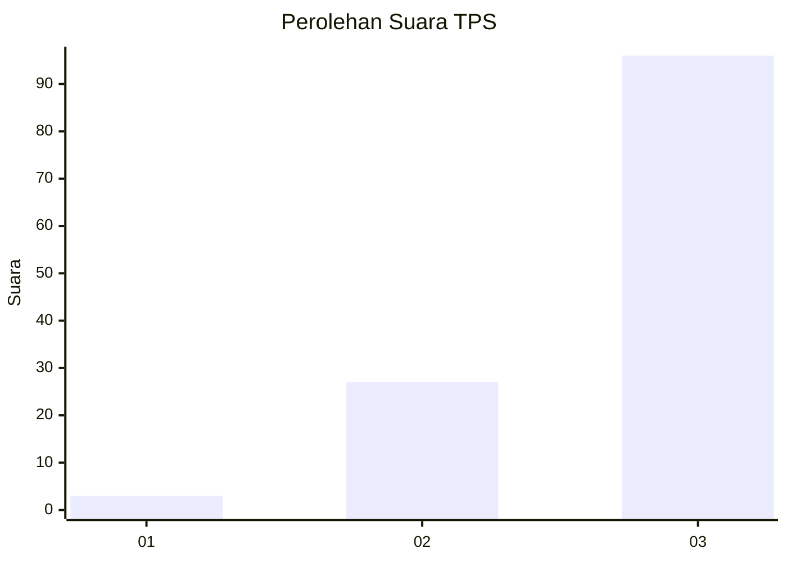
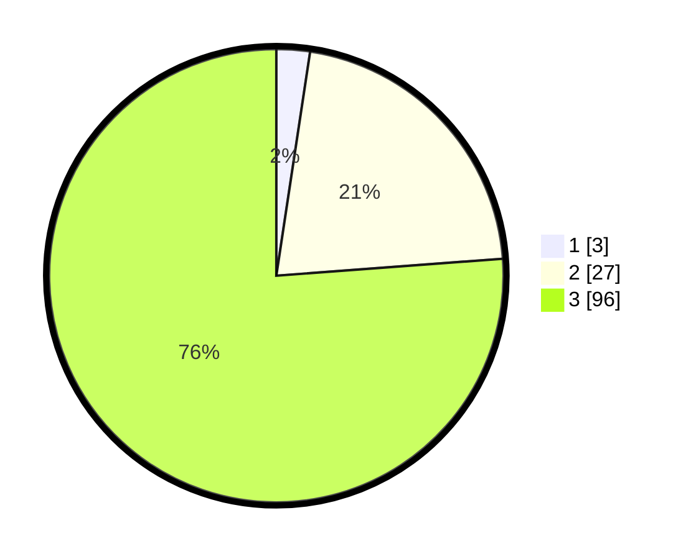

# Hasil

## Grafik

## Tabel

| No. | Nama Paslon    | Suara | Suara (raw) | Persentase |
|:--- |:-------------- | -----:| -----------:| ----------:|
| 1   | ANIES MUHAIMIN | 3     | [3][p-1]    | 2,38       |
| 2   | PRABOWO GIBRAN | 27    | [27][p-2]   | 21,43      |
| 3   | GANJAR MAHFUD  | 96    | [96][p-3]   | 76,19      |

[p-1]: https://github.com/gigit-pemilu/pemilu-2024-51-bali/blob/main/pilpres/hitung-suara/sub/51-bali/sub/02-tabanan/sub/08-penebel/sub/2013-jatiluwih/sub/010-tps/sub/paslon-1.txt
[p-2]: https://github.com/gigit-pemilu/pemilu-2024-51-bali/blob/main/pilpres/hitung-suara/sub/51-bali/sub/02-tabanan/sub/08-penebel/sub/2013-jatiluwih/sub/010-tps/sub/paslon-2.txt
[p-3]: https://github.com/gigit-pemilu/pemilu-2024-51-bali/blob/main/pilpres/hitung-suara/sub/51-bali/sub/02-tabanan/sub/08-penebel/sub/2013-jatiluwih/sub/010-tps/sub/paslon-3.txt

## Foto C Plano

https://sirekap-obj-formc.kpu.go.id/cf8d/pemilu/ppwp/51/02/08/20/13/5102082013010-20240216-205244--e07e6b79-7aaa-476b-884d-135735d16ee0.jpg

https://sirekap-obj-formc.kpu.go.id/cf8d/pemilu/ppwp/51/02/08/20/13/5102082013010-20240216-205245--b4a4f2bc-5aba-46b2-8b57-f346668006a4.jpg

https://sirekap-obj-formc.kpu.go.id/cf8d/pemilu/ppwp/51/02/08/20/13/5102082013010-20240216-205244--29886c17-6bd5-41a0-aae3-9cba5a0e7627.jpg

## Metadata

| Key        | Value               |
| ---------- | ------------------- |
| Time Stamp | 2024-02-21 18:00:00 |

## DATA PEMILIH TETAP

Jumlah pemilih dalam DPT: **145**.
 * L: **71**.
 * P: **74**.

## DATA PENGGUNA HAK PILIH

Jumlah pengguna hak pilih dalam DPT: **131**.
 * L: **66**.
 * P: **65**.

Jumlah pengguna hak pilih dalam DPTb: **0**.
 * L: **0**.
 * P: **0**.

Jumlah pengguna hak pilih dalam DPK: **0**.
 * L: **0**.
 * P: **0**.

Jumlah pengguna hak pilih: **131**.
 * L: **66**.
 * P: **65**.

## JUMLAH SUARA SAH DAN TIDAK SAH

JUMLAH SELURUH SUARA SAH: **126**.

JUMLAH SUARA TIDAK SAH: **5**.

JUMLAH SELURUH SUARA SAH DAN SUARA TIDAK SAH: **131**.

