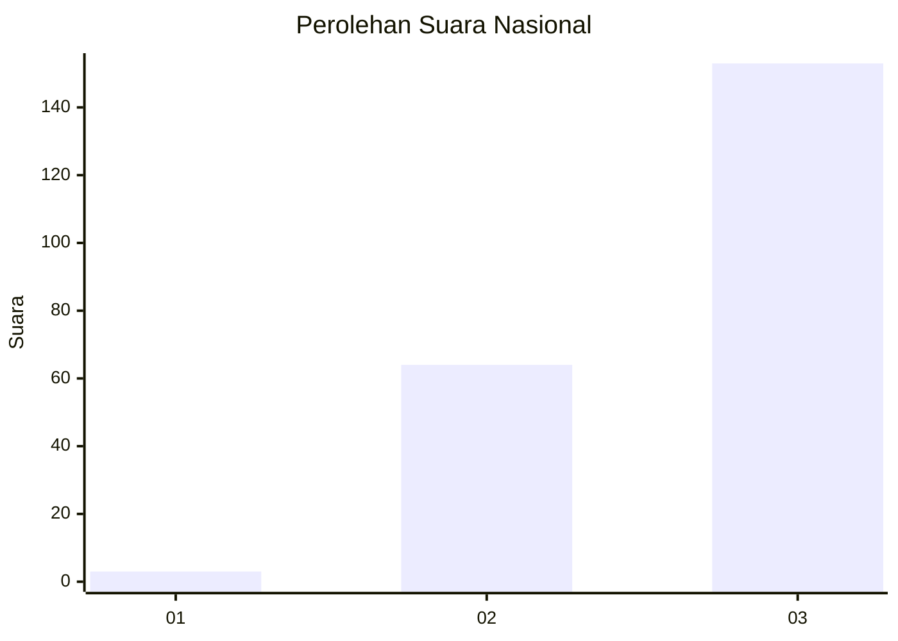
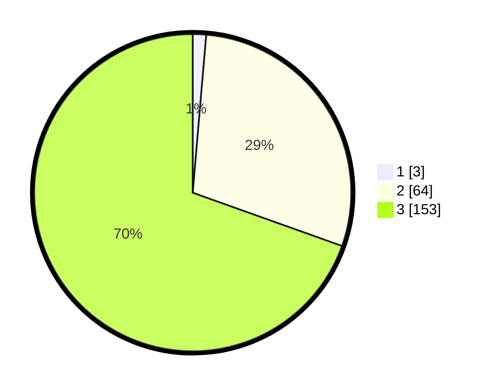

# Hasil

## Grafik

## Tabel

| No. | Nama Paslon    | Suara | Suara (raw) | Persentase |
|:--- |:-------------- | -----:| -----------:| ----------:|
| 1   | ANIES MUHAIMIN | 3     | [3][p-1]    | 1,36       |
| 2   | PRABOWO GIBRAN | 64    | [64][p-2]   | 29,09      |
| 3   | GANJAR MAHFUD  | 153   | [153][p-3]  | 69,55      |

[p-1]: https://github.com/gigit-pemilu/pemilu-2024/blob/main/pilpres/hitung-suara/sub/51-bali/sub/02-tabanan/sub/08-penebel/sub/2014-wongaya-gede/sub/003-tps/sub/paslon-1.txt
[p-2]: https://github.com/gigit-pemilu/pemilu-2024/blob/main/pilpres/hitung-suara/sub/51-bali/sub/02-tabanan/sub/08-penebel/sub/2014-wongaya-gede/sub/003-tps/sub/paslon-2.txt
[p-3]: https://github.com/gigit-pemilu/pemilu-2024/blob/main/pilpres/hitung-suara/sub/51-bali/sub/02-tabanan/sub/08-penebel/sub/2014-wongaya-gede/sub/003-tps/sub/paslon-3.txt

## Foto C Plano

https://sirekap-obj-formc.kpu.go.id/9263/pemilu/ppwp/51/02/08/20/14/5102082014003-20240214-214635--17070c26-a4bd-4f77-ad7e-8407c98cc7d0.jpg

https://sirekap-obj-formc.kpu.go.id/9263/pemilu/ppwp/51/02/08/20/14/5102082014003-20240214-214737--9ee0265f-b642-47be-83d0-672144c6857f.jpg

https://sirekap-obj-formc.kpu.go.id/9263/pemilu/ppwp/51/02/08/20/14/5102082014003-20240214-214919--f0cd4315-4ed7-455d-8d00-f3937959cdbe.jpg

## Metadata

| Key        | Value               |
| ---------- | ------------------- |
| Time Stamp | 2024-02-15 23:29:50 |

