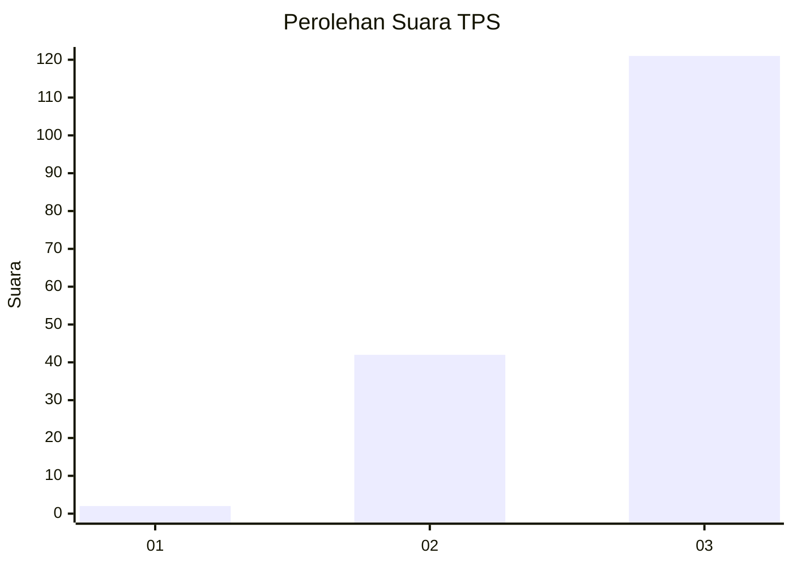
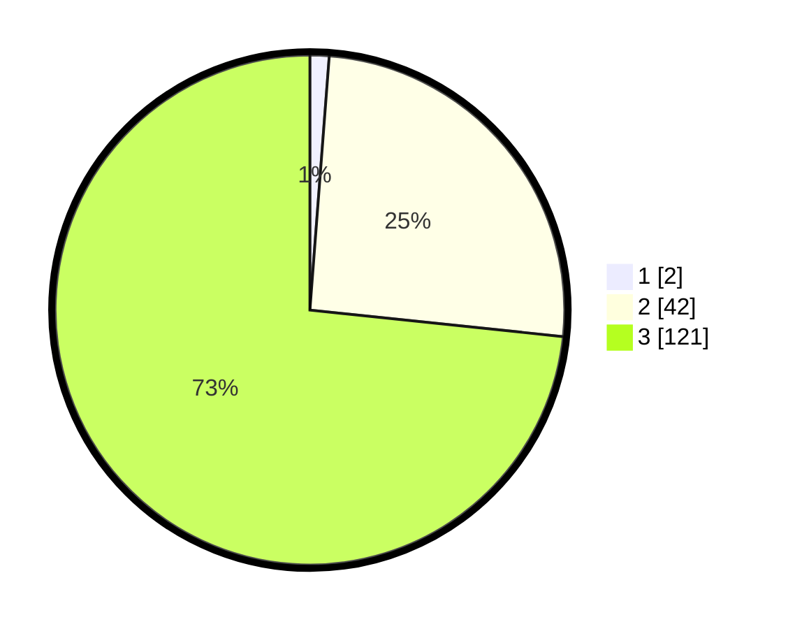

# Hasil

## Grafik

## Tabel

| No. | Nama Paslon    | Suara | Suara (raw) | Persentase |
|:--- |:-------------- | -----:| -----------:| ----------:|
| 1   | ANIES MUHAIMIN | 2     | [2][p-1]    | 1,21       |
| 2   | PRABOWO GIBRAN | 42    | [42][p-2]   | 25,45      |
| 3   | GANJAR MAHFUD  | 121   | [121][p-3]  | 73,33      |

[p-1]: https://github.com/gigit-pemilu/pemilu-2024-51-bali/blob/main/pilpres/hitung-suara/sub/51-bali/sub/02-tabanan/sub/08-penebel/sub/2014-wongaya-gede/sub/004-tps/sub/paslon-1.txt
[p-2]: https://github.com/gigit-pemilu/pemilu-2024-51-bali/blob/main/pilpres/hitung-suara/sub/51-bali/sub/02-tabanan/sub/08-penebel/sub/2014-wongaya-gede/sub/004-tps/sub/paslon-2.txt
[p-3]: https://github.com/gigit-pemilu/pemilu-2024-51-bali/blob/main/pilpres/hitung-suara/sub/51-bali/sub/02-tabanan/sub/08-penebel/sub/2014-wongaya-gede/sub/004-tps/sub/paslon-3.txt

## Foto C Plano

https://sirekap-obj-formc.kpu.go.id/d56e/pemilu/ppwp/51/02/08/20/14/5102082014004-20240214-132035--56debbe3-fa17-48ae-a4cd-a6dccbbd29b6.jpg

https://sirekap-obj-formc.kpu.go.id/d56e/pemilu/ppwp/51/02/08/20/14/5102082014004-20240214-132614--7563d03a-e091-43aa-aae4-2526d617f1c7.jpg

## Metadata

| Key        | Value               |
| ---------- | ------------------- |
| Time Stamp | 2024-02-15 07:00:44 |

