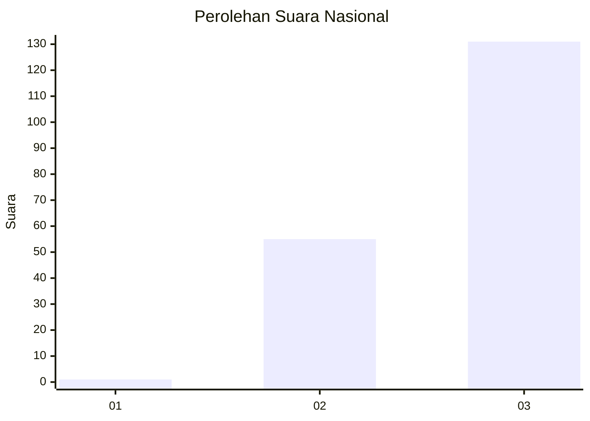
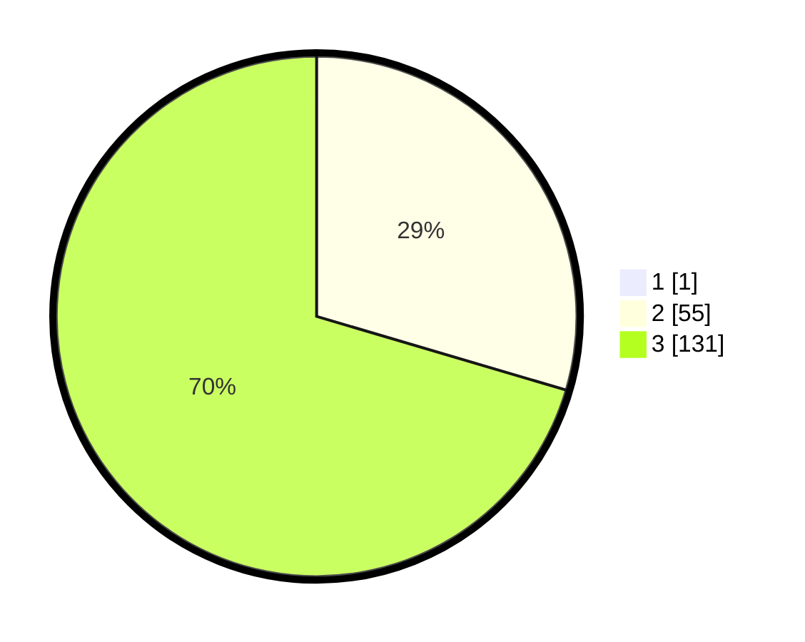

# Hasil

## Grafik

## Tabel

| No. | Nama Paslon    | Suara | Suara (raw) | Persentase |
|:--- |:-------------- | -----:| -----------:| ----------:|
| 1   | ANIES MUHAIMIN | 1     | [1][p-1]    | 0,53       |
| 2   | PRABOWO GIBRAN | 55    | [55][p-2]   | 29,41      |
| 3   | GANJAR MAHFUD  | 131   | [131][p-3]  | 70,05      |

[p-1]: https://github.com/gigit-pemilu/pemilu-2024/blob/main/pilpres/hitung-suara/sub/51-bali/sub/02-tabanan/sub/08-penebel/sub/2014-wongaya-gede/sub/005-tps/sub/paslon-1.txt
[p-2]: https://github.com/gigit-pemilu/pemilu-2024/blob/main/pilpres/hitung-suara/sub/51-bali/sub/02-tabanan/sub/08-penebel/sub/2014-wongaya-gede/sub/005-tps/sub/paslon-2.txt
[p-3]: https://github.com/gigit-pemilu/pemilu-2024/blob/main/pilpres/hitung-suara/sub/51-bali/sub/02-tabanan/sub/08-penebel/sub/2014-wongaya-gede/sub/005-tps/sub/paslon-3.txt

## Foto C Plano

https://sirekap-obj-formc.kpu.go.id/d5c1/pemilu/ppwp/51/02/08/20/14/5102082014005-20240216-171748--f73011e2-72ac-46e0-8da4-501b849a972e.jpg

https://sirekap-obj-formc.kpu.go.id/d5c1/pemilu/ppwp/51/02/08/20/14/5102082014005-20240214-191258--7298c54c-025e-4412-bd4a-f0e80fca2184.jpg

https://sirekap-obj-formc.kpu.go.id/d5c1/pemilu/ppwp/51/02/08/20/14/5102082014005-20240216-171749--0f0145b3-cff6-448f-b413-b0d0172b158c.jpg

## Metadata

| Key        | Value               |
| ---------- | ------------------- |
| Time Stamp | 2024-02-21 19:00:00 |

## DATA PEMILIH TETAP

Jumlah pemilih dalam DPT: **223**.
 * L: **108**.
 * P: **115**.

## DATA PENGGUNA HAK PILIH

Jumlah pengguna hak pilih dalam DPT: **191**.
 * L: **95**.
 * P: **96**.

Jumlah pengguna hak pilih dalam DPTb: **0**.
 * L: **0**.
 * P: **0**.

Jumlah pengguna hak pilih dalam DPK: **1**.
 * L: **1**.
 * P: **0**.

Jumlah pengguna hak pilih: **192**.
 * L: **96**.
 * P: **96**.

## JUMLAH SUARA SAH DAN TIDAK SAH

JUMLAH SELURUH SUARA SAH: **187**.

JUMLAH SUARA TIDAK SAH: **5**.

JUMLAH SELURUH SUARA SAH DAN SUARA TIDAK SAH: **192**.

