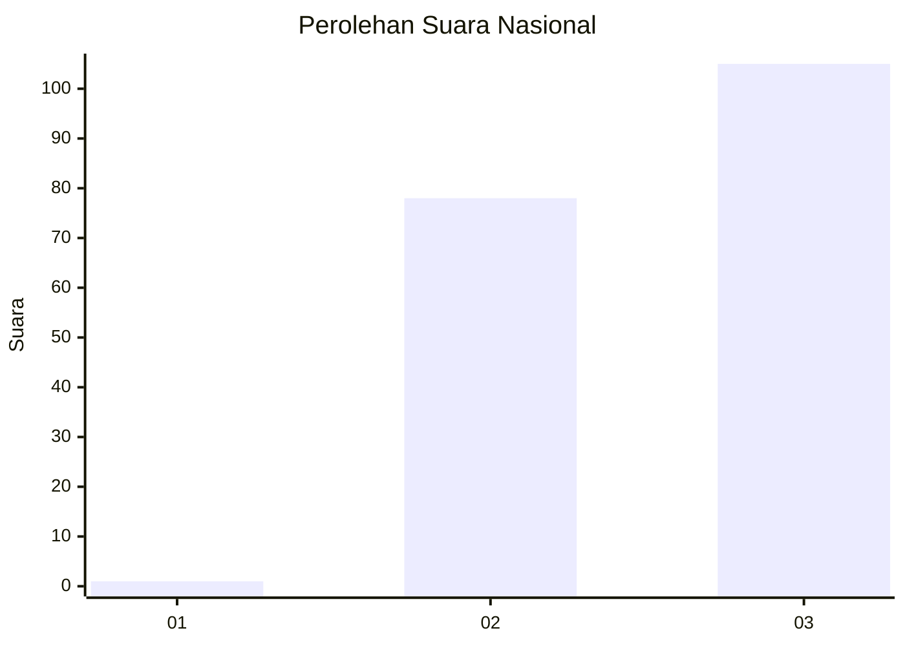
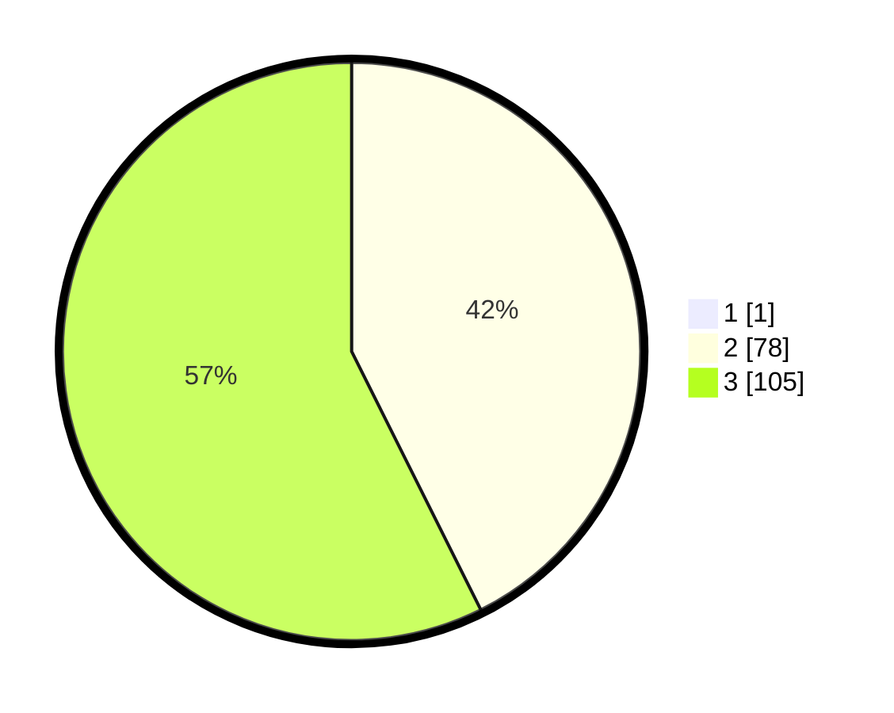

# Hasil

## Grafik

## Tabel

| No. | Nama Paslon    | Suara | Suara (raw) | Persentase |
|:--- |:-------------- | -----:| -----------:| ----------:|
| 1   | ANIES MUHAIMIN | 1     | [1][p-1]    | 0,54       |
| 2   | PRABOWO GIBRAN | 78    | [78][p-2]   | 42,39      |
| 3   | GANJAR MAHFUD  | 105   | [105][p-3]  | 57,07      |

[p-1]: https://github.com/gigit-pemilu/pemilu-2024/blob/main/pilpres/hitung-suara/sub/51-bali/sub/02-tabanan/sub/08-penebel/sub/2014-wongaya-gede/sub/006-tps/sub/paslon-1.txt
[p-2]: https://github.com/gigit-pemilu/pemilu-2024/blob/main/pilpres/hitung-suara/sub/51-bali/sub/02-tabanan/sub/08-penebel/sub/2014-wongaya-gede/sub/006-tps/sub/paslon-2.txt
[p-3]: https://github.com/gigit-pemilu/pemilu-2024/blob/main/pilpres/hitung-suara/sub/51-bali/sub/02-tabanan/sub/08-penebel/sub/2014-wongaya-gede/sub/006-tps/sub/paslon-3.txt

## Foto C Plano

https://sirekap-obj-formc.kpu.go.id/c04e/pemilu/ppwp/51/02/08/20/14/5102082014006-20240214-223457--10c9912a-d28b-4510-b9e0-d7fc0a99688c.jpg

https://sirekap-obj-formc.kpu.go.id/c04e/pemilu/ppwp/51/02/08/20/14/5102082014006-20240214-223625--e4282af1-bd17-42eb-af64-4dca1c48ff82.jpg

https://sirekap-obj-formc.kpu.go.id/c04e/pemilu/ppwp/51/02/08/20/14/5102082014006-20240214-223738--56fae86c-d810-4df4-b88f-f189288336f6.jpg

## Metadata

| Key        | Value               |
| ---------- | ------------------- |
| Time Stamp | 2024-02-15 23:29:50 |

