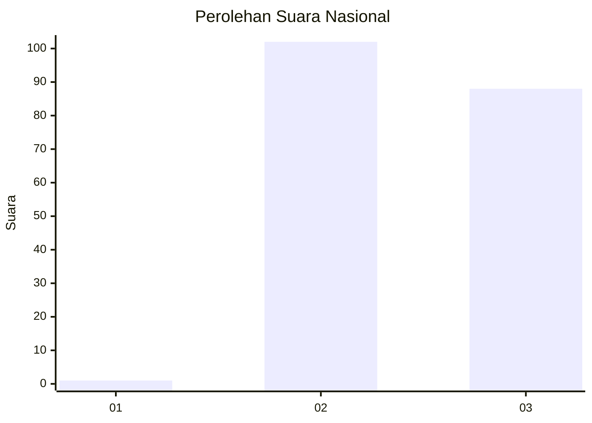
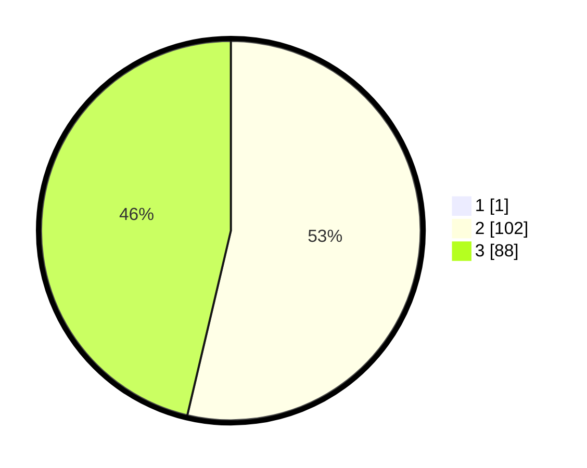

# Hasil

## Grafik

## Tabel

| No. | Nama Paslon    | Suara | Suara (raw) | Persentase |
|:--- |:-------------- | -----:| -----------:| ----------:|
| 1   | ANIES MUHAIMIN | 1     | [1][p-1]    | 0,52       |
| 2   | PRABOWO GIBRAN | 102   | [102][p-2]  | 53,40      |
| 3   | GANJAR MAHFUD  | 88    | [88][p-3]   | 46,07      |

[p-1]: https://github.com/gigit-pemilu/pemilu-2024/blob/main/pilpres/hitung-suara/sub/51-bali/sub/02-tabanan/sub/08-penebel/sub/2014-wongaya-gede/sub/008-tps/sub/paslon-1.txt
[p-2]: https://github.com/gigit-pemilu/pemilu-2024/blob/main/pilpres/hitung-suara/sub/51-bali/sub/02-tabanan/sub/08-penebel/sub/2014-wongaya-gede/sub/008-tps/sub/paslon-2.txt
[p-3]: https://github.com/gigit-pemilu/pemilu-2024/blob/main/pilpres/hitung-suara/sub/51-bali/sub/02-tabanan/sub/08-penebel/sub/2014-wongaya-gede/sub/008-tps/sub/paslon-3.txt

## Foto C Plano

https://sirekap-obj-formc.kpu.go.id/15dd/pemilu/ppwp/51/02/08/20/14/5102082014008-20240214-133022--54200799-4483-4b42-a56b-e1addaf381d2.jpg

https://sirekap-obj-formc.kpu.go.id/15dd/pemilu/ppwp/51/02/08/20/14/5102082014008-20240215-105751--0a73f2cc-a8f2-4a14-b767-0ce8b87bf9aa.jpg

https://sirekap-obj-formc.kpu.go.id/15dd/pemilu/ppwp/51/02/08/20/14/5102082014008-20240214-133355--56355f0e-3e04-415f-8acb-f065c63f7e15.jpg

## Metadata

| Key        | Value               |
| ---------- | ------------------- |
| Time Stamp | 2024-02-15 23:29:50 |

## DATA PEMILIH TETAP

Jumlah pemilih dalam DPT: **251**.
 * L: **121**.
 * P: **130**.

## DATA PENGGUNA HAK PILIH

Jumlah pengguna hak pilih dalam DPT: **193**.
 * L: **92**.
 * P: **101**.

Jumlah pengguna hak pilih dalam DPTb: **2**.
 * L: **1**.
 * P: **1**.

Jumlah pengguna hak pilih dalam DPK: **2**.
 * L: **0**.
 * P: **2**.

Jumlah pengguna hak pilih: **197**.
 * L: **93**.
 * P: **104**.

## JUMLAH SUARA SAH DAN TIDAK SAH

JUMLAH SELURUH SUARA SAH: **191**.

JUMLAH SUARA TIDAK SAH: **6**.

JUMLAH SELURUH SUARA SAH DAN SUARA TIDAK SAH: **197**.

