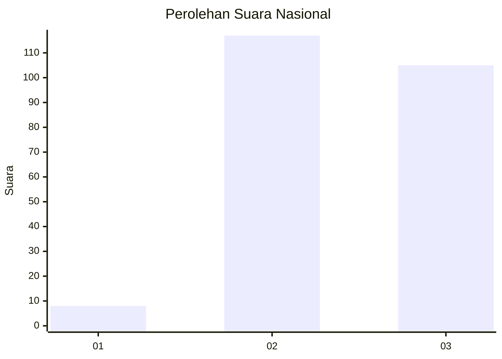
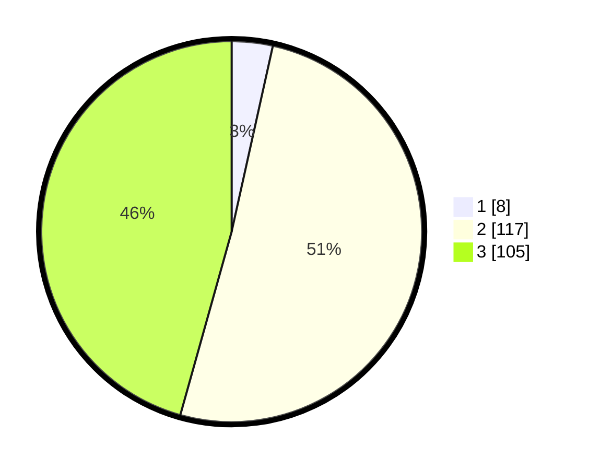

# Hasil

## Grafik

## Tabel

| No. | Nama Paslon    | Suara | Suara (raw) | Persentase |
|:--- |:-------------- | -----:| -----------:| ----------:|
| 1   | ANIES MUHAIMIN | 8     | [8][p-1]    | 3,48       |
| 2   | PRABOWO GIBRAN | 117   | [117][p-2]  | 50,87      |
| 3   | GANJAR MAHFUD  | 105   | [105][p-3]  | 45,65      |

[p-1]: https://github.com/gigit-pemilu/pemilu-2024/blob/main/pilpres/hitung-suara/sub/51-bali/sub/02-tabanan/sub/08-penebel/sub/2015-tajen/sub/007-tps/sub/paslon-1.txt
[p-2]: https://github.com/gigit-pemilu/pemilu-2024/blob/main/pilpres/hitung-suara/sub/51-bali/sub/02-tabanan/sub/08-penebel/sub/2015-tajen/sub/007-tps/sub/paslon-2.txt
[p-3]: https://github.com/gigit-pemilu/pemilu-2024/blob/main/pilpres/hitung-suara/sub/51-bali/sub/02-tabanan/sub/08-penebel/sub/2015-tajen/sub/007-tps/sub/paslon-3.txt

## Foto C Plano

https://sirekap-obj-formc.kpu.go.id/f76e/pemilu/ppwp/51/02/08/20/15/5102082015007-20240214-132430--9773941e-5b77-4a7d-8d9d-3cb774bf2d0d.jpg

https://sirekap-obj-formc.kpu.go.id/f76e/pemilu/ppwp/51/02/08/20/15/5102082015007-20240214-132541--30388214-7616-43dc-82ae-00c336b61590.jpg

https://sirekap-obj-formc.kpu.go.id/f76e/pemilu/ppwp/51/02/08/20/15/5102082015007-20240214-132631--934a0187-4ea6-48cf-94e1-a3789593db17.jpg

## Metadata

| Key        | Value               |
| ---------- | ------------------- |
| Time Stamp | 2024-02-14 21:46:01 |

## DATA PEMILIH TETAP

Jumlah pemilih dalam DPT: **285**.
 * L: **140**.
 * P: **145**.

## DATA PENGGUNA HAK PILIH

Jumlah pengguna hak pilih dalam DPT: **238**.
 * L: **117**.
 * P: **121**.

Jumlah pengguna hak pilih dalam DPTb: **0**.
 * L: **0**.
 * P: **0**.

Jumlah pengguna hak pilih dalam DPK: **0**.
 * L: **0**.
 * P: **0**.

Jumlah pengguna hak pilih: **238**.
 * L: **117**.
 * P: **121**.

## JUMLAH SUARA SAH DAN TIDAK SAH

JUMLAH SELURUH SUARA SAH: **230**.

JUMLAH SUARA TIDAK SAH: **8**.

JUMLAH SELURUH SUARA SAH DAN SUARA TIDAK SAH: **238**.

