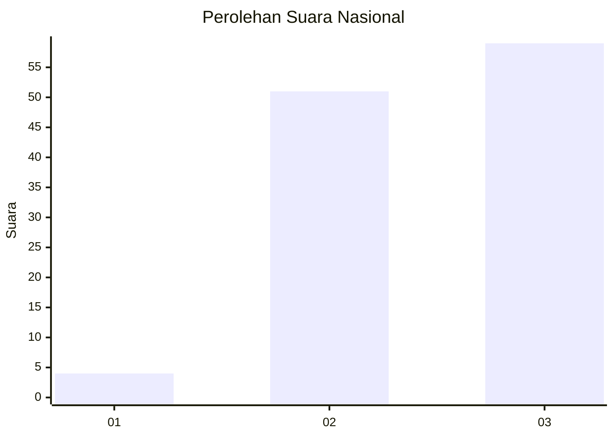
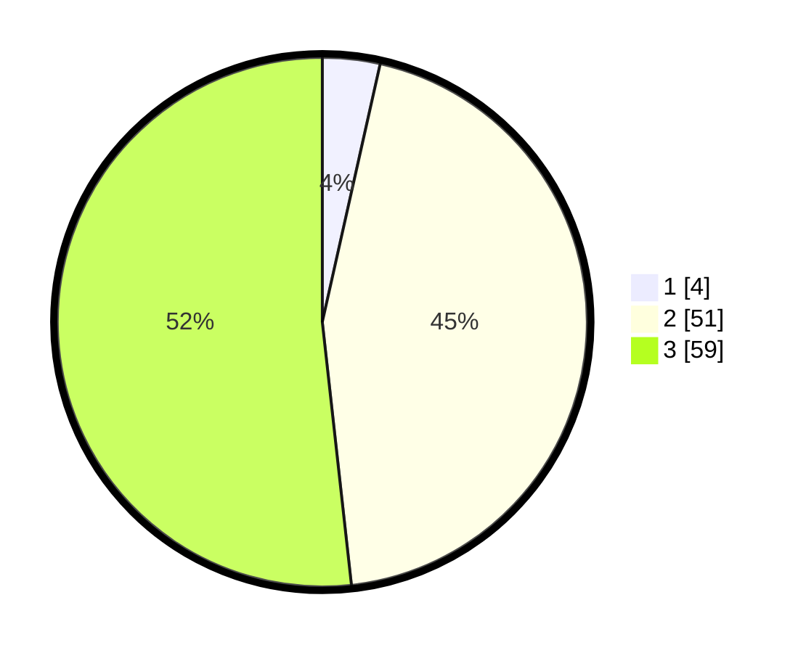

# Hasil

## Grafik

## Tabel

| No. | Nama Paslon    | Suara | Suara (raw) | Persentase |
|:--- |:-------------- | -----:| -----------:| ----------:|
| 1   | ANIES MUHAIMIN | 4     | [4][p-1]    | 3,51       |
| 2   | PRABOWO GIBRAN | 51    | [51][p-2]   | 44,74      |
| 3   | GANJAR MAHFUD  | 59    | [59][p-3]   | 51,75      |

[p-1]: https://github.com/gigit-pemilu/pemilu-2024/blob/main/pilpres/hitung-suara/sub/51-bali/sub/02-tabanan/sub/08-penebel/sub/2015-tajen/sub/008-tps/sub/paslon-1.txt
[p-2]: https://github.com/gigit-pemilu/pemilu-2024/blob/main/pilpres/hitung-suara/sub/51-bali/sub/02-tabanan/sub/08-penebel/sub/2015-tajen/sub/008-tps/sub/paslon-2.txt
[p-3]: https://github.com/gigit-pemilu/pemilu-2024/blob/main/pilpres/hitung-suara/sub/51-bali/sub/02-tabanan/sub/08-penebel/sub/2015-tajen/sub/008-tps/sub/paslon-3.txt

## Foto C Plano

https://sirekap-obj-formc.kpu.go.id/2669/pemilu/ppwp/51/02/08/20/15/5102082015008-20240214-211431--0d6e1b70-181f-465f-9b4e-1316b2b9c774.jpg

https://sirekap-obj-formc.kpu.go.id/2669/pemilu/ppwp/51/02/08/20/15/5102082015008-20240214-211435--c89479c7-f092-4b91-8e9c-f96b10e21df9.jpg

https://sirekap-obj-formc.kpu.go.id/2669/pemilu/ppwp/51/02/08/20/15/5102082015008-20240214-211438--b9a8ded8-ec22-4a6c-b654-7b3c380cb89d.jpg

## Metadata

| Key        | Value               |
| ---------- | ------------------- |
| Time Stamp | 2024-02-16 12:51:22 |

## DATA PEMILIH TETAP

Jumlah pemilih dalam DPT: **139**.
 * L: **65**.
 * P: **74**.

## DATA PENGGUNA HAK PILIH

Jumlah pengguna hak pilih dalam DPT: **122**.
 * L: **58**.
 * P: **64**.

Jumlah pengguna hak pilih dalam DPTb: **0**.
 * L: **0**.
 * P: **0**.

Jumlah pengguna hak pilih dalam DPK: **0**.
 * L: **0**.
 * P: **0**.

Jumlah pengguna hak pilih: **122**.
 * L: **58**.
 * P: **64**.

## JUMLAH SUARA SAH DAN TIDAK SAH

JUMLAH SELURUH SUARA SAH: **114**.

JUMLAH SUARA TIDAK SAH: **8**.

JUMLAH SELURUH SUARA SAH DAN SUARA TIDAK SAH: **122**.

