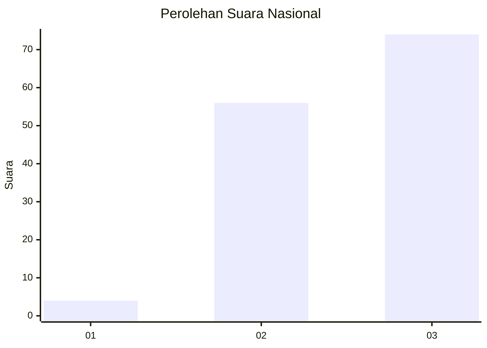
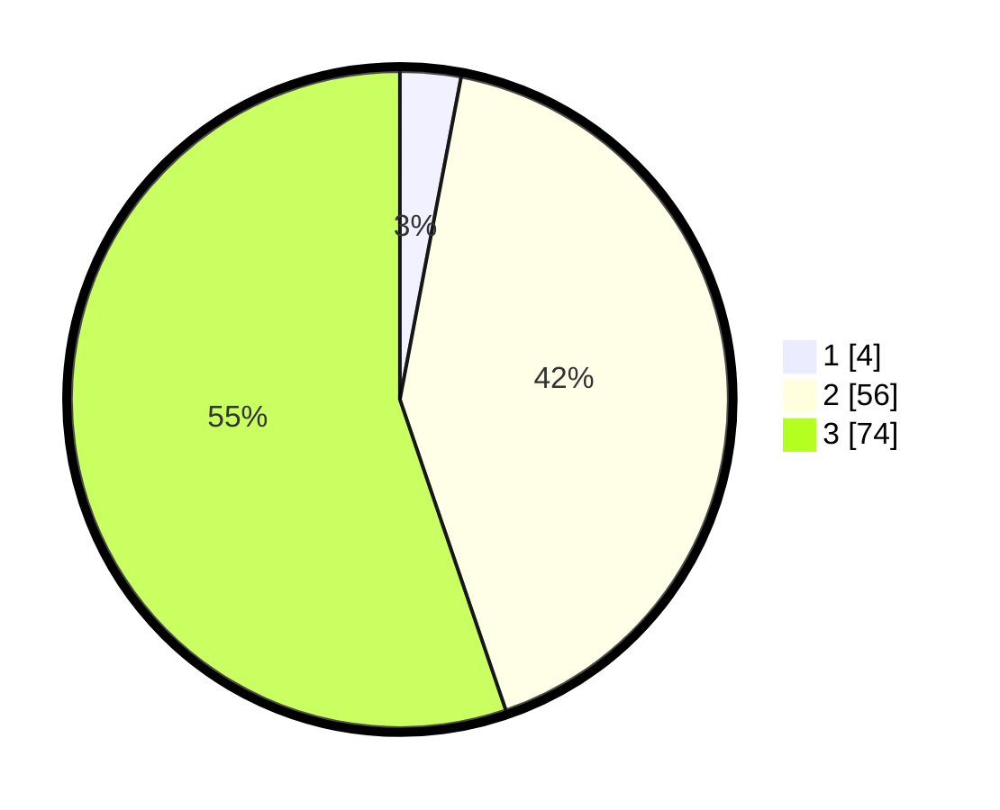

# Hasil

## Grafik

## Tabel

| No. | Nama Paslon    | Suara | Suara (raw) | Persentase |
|:--- |:-------------- | -----:| -----------:| ----------:|
| 1   | ANIES MUHAIMIN | 4     | [4][p-1]    | 2,99       |
| 2   | PRABOWO GIBRAN | 56    | [56][p-2]   | 41,79      |
| 3   | GANJAR MAHFUD  | 74    | [74][p-3]   | 55,22      |

[p-1]: https://github.com/gigit-pemilu/pemilu-2024/blob/main/pilpres/hitung-suara/sub/51-bali/sub/02-tabanan/sub/08-penebel/sub/2015-tajen/sub/009-tps/sub/paslon-1.txt
[p-2]: https://github.com/gigit-pemilu/pemilu-2024/blob/main/pilpres/hitung-suara/sub/51-bali/sub/02-tabanan/sub/08-penebel/sub/2015-tajen/sub/009-tps/sub/paslon-2.txt
[p-3]: https://github.com/gigit-pemilu/pemilu-2024/blob/main/pilpres/hitung-suara/sub/51-bali/sub/02-tabanan/sub/08-penebel/sub/2015-tajen/sub/009-tps/sub/paslon-3.txt

## Foto C Plano

https://sirekap-obj-formc.kpu.go.id/55e7/pemilu/ppwp/51/02/08/20/15/5102082015009-20240214-141104--e5beb590-f0a9-4c7e-baed-ef0e82869c7e.jpg

https://sirekap-obj-formc.kpu.go.id/55e7/pemilu/ppwp/51/02/08/20/15/5102082015009-20240214-141246--928c0120-8c7d-4b81-b66c-55f0a4a97b92.jpg

https://sirekap-obj-formc.kpu.go.id/55e7/pemilu/ppwp/51/02/08/20/15/5102082015009-20240214-195005--490e3f53-5868-4b7a-ae0f-3e099a83777a.jpg

## Metadata

| Key        | Value               |
| ---------- | ------------------- |
| Time Stamp | 2024-02-14 21:46:01 |

## DATA PEMILIH TETAP

Jumlah pemilih dalam DPT: **166**.
 * L: **83**.
 * P: **83**.

## DATA PENGGUNA HAK PILIH

Jumlah pengguna hak pilih dalam DPT: **136**.
 * L: **65**.
 * P: **71**.

Jumlah pengguna hak pilih dalam DPTb: **0**.
 * L: **0**.
 * P: **0**.

Jumlah pengguna hak pilih dalam DPK: **0**.
 * L: **0**.
 * P: **0**.

Jumlah pengguna hak pilih: **136**.
 * L: **65**.
 * P: **71**.

## JUMLAH SUARA SAH DAN TIDAK SAH

JUMLAH SELURUH SUARA SAH: **134**.

JUMLAH SUARA TIDAK SAH: **2**.

JUMLAH SELURUH SUARA SAH DAN SUARA TIDAK SAH: **136**.

