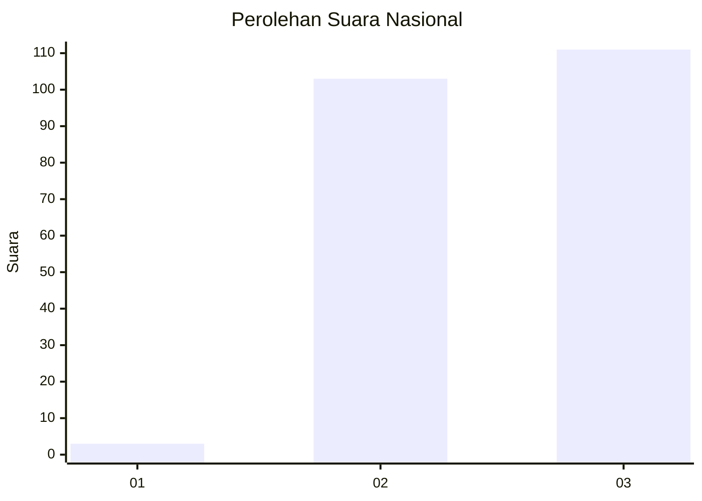
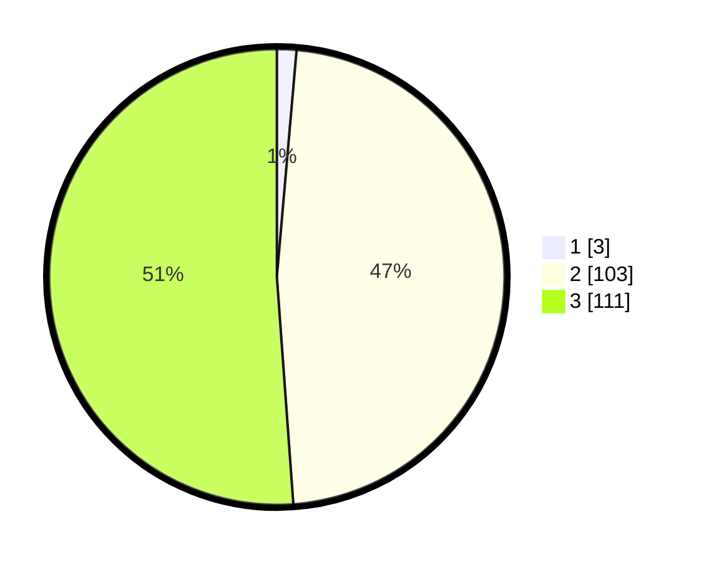

# Hasil

## Grafik

## Tabel

| No. | Nama Paslon    | Suara | Suara (raw) | Persentase |
|:--- |:-------------- | -----:| -----------:| ----------:|
| 1   | ANIES MUHAIMIN | 3     | [3][p-1]    | 1,38       |
| 2   | PRABOWO GIBRAN | 103   | [103][p-2]  | 47,47      |
| 3   | GANJAR MAHFUD  | 111   | [111][p-3]  | 51,15      |

[p-1]: https://github.com/gigit-pemilu/pemilu-2024/blob/main/pilpres/hitung-suara/sub/51-bali/sub/02-tabanan/sub/08-penebel/sub/2015-tajen/sub/010-tps/sub/paslon-1.txt
[p-2]: https://github.com/gigit-pemilu/pemilu-2024/blob/main/pilpres/hitung-suara/sub/51-bali/sub/02-tabanan/sub/08-penebel/sub/2015-tajen/sub/010-tps/sub/paslon-2.txt
[p-3]: https://github.com/gigit-pemilu/pemilu-2024/blob/main/pilpres/hitung-suara/sub/51-bali/sub/02-tabanan/sub/08-penebel/sub/2015-tajen/sub/010-tps/sub/paslon-3.txt

## Foto C Plano

https://sirekap-obj-formc.kpu.go.id/dba7/pemilu/ppwp/51/02/08/20/15/5102082015010-20240214-185857--c66d08c1-e933-4ff0-90b0-027d4c1adc19.jpg

https://sirekap-obj-formc.kpu.go.id/dba7/pemilu/ppwp/51/02/08/20/15/5102082015010-20240214-185916--bda9df6f-7495-4cb3-82b2-f02002b8f8e6.jpg

https://sirekap-obj-formc.kpu.go.id/dba7/pemilu/ppwp/51/02/08/20/15/5102082015010-20240214-185948--24b0ec79-e4ba-4036-a826-4de0a77f15c5.jpg

## Metadata

| Key        | Value               |
| ---------- | ------------------- |
| Time Stamp | 2024-02-14 21:46:01 |

## DATA PEMILIH TETAP

Jumlah pemilih dalam DPT: **267**.
 * L: **125**.
 * P: **142**.

## DATA PENGGUNA HAK PILIH

Jumlah pengguna hak pilih dalam DPT: **221**.
 * L: **105**.
 * P: **116**.

Jumlah pengguna hak pilih dalam DPTb: **0**.
 * L: **0**.
 * P: **0**.

Jumlah pengguna hak pilih dalam DPK: **0**.
 * L: **0**.
 * P: **0**.

Jumlah pengguna hak pilih: **221**.
 * L: **105**.
 * P: **116**.

## JUMLAH SUARA SAH DAN TIDAK SAH

JUMLAH SELURUH SUARA SAH: **217**.

JUMLAH SUARA TIDAK SAH: **4**.

JUMLAH SELURUH SUARA SAH DAN SUARA TIDAK SAH: **221**.

