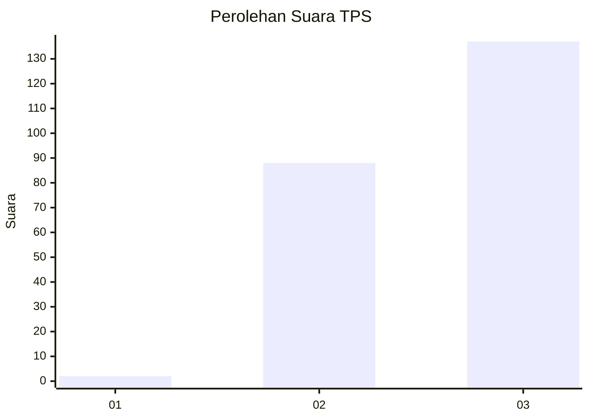
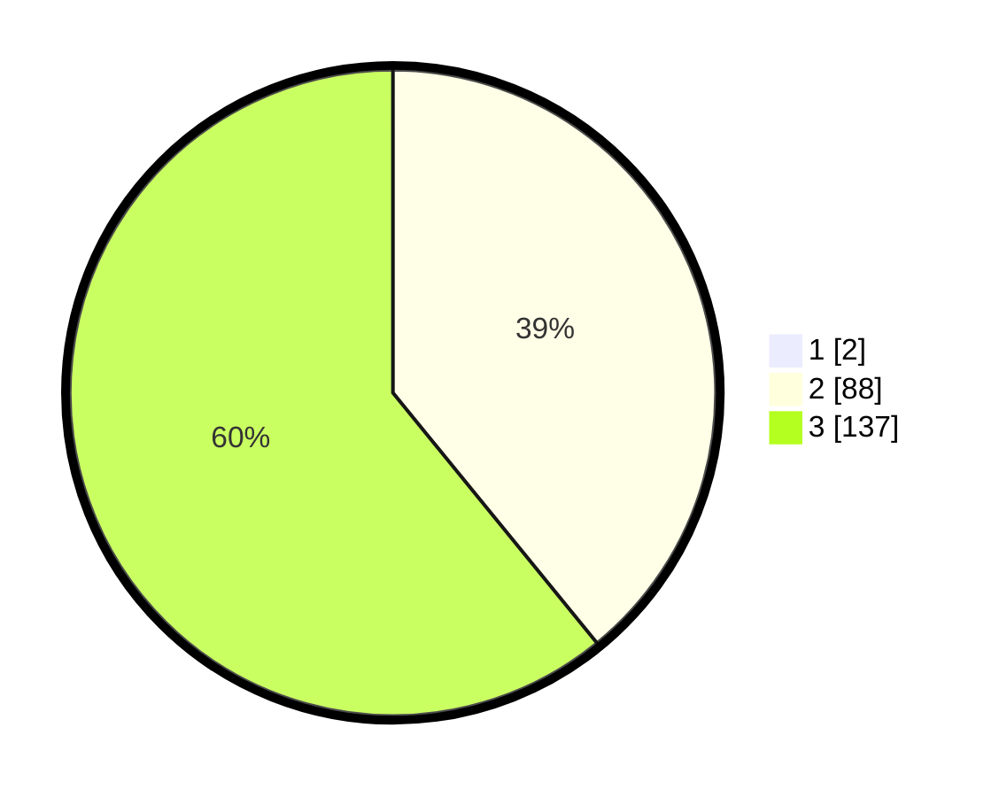

# Hasil

## Grafik

## Tabel

| No. | Nama Paslon    | Suara | Suara (raw) | Persentase |
|:--- |:-------------- | -----:| -----------:| ----------:|
| 1   | ANIES MUHAIMIN | 2     | [2][p-1]    | 0,88       |
| 2   | PRABOWO GIBRAN | 88    | [88][p-2]   | 38,77      |
| 3   | GANJAR MAHFUD  | 137   | [137][p-3]  | 60,35      |

[p-1]: https://github.com/gigit-pemilu/pemilu-2024-51-bali/blob/main/pilpres/hitung-suara/sub/51-bali/sub/02-tabanan/sub/08-penebel/sub/2016-tegallinggah/sub/001-tps/sub/paslon-1.txt
[p-2]: https://github.com/gigit-pemilu/pemilu-2024-51-bali/blob/main/pilpres/hitung-suara/sub/51-bali/sub/02-tabanan/sub/08-penebel/sub/2016-tegallinggah/sub/001-tps/sub/paslon-2.txt
[p-3]: https://github.com/gigit-pemilu/pemilu-2024-51-bali/blob/main/pilpres/hitung-suara/sub/51-bali/sub/02-tabanan/sub/08-penebel/sub/2016-tegallinggah/sub/001-tps/sub/paslon-3.txt

## Foto C Plano

https://sirekap-obj-formc.kpu.go.id/3250/pemilu/ppwp/51/02/08/20/16/5102082016001-20240216-140400--6f5fc42c-d11b-469d-8aac-0b4b8554e597.jpg

https://sirekap-obj-formc.kpu.go.id/3250/pemilu/ppwp/51/02/08/20/16/5102082016001-20240216-140402--ae95f494-048f-45c2-b1f3-542e4d09bb11.jpg

https://sirekap-obj-formc.kpu.go.id/3250/pemilu/ppwp/51/02/08/20/16/5102082016001-20240216-140401--312c818d-eab0-4268-865e-386fcf67310e.jpg

## Metadata

| Key        | Value               |
| ---------- | ------------------- |
| Time Stamp | 2024-02-16 14:30:33 |

## DATA PEMILIH TETAP

Jumlah pemilih dalam DPT: **273**.
 * L: **128**.
 * P: **145**.

## DATA PENGGUNA HAK PILIH

Jumlah pengguna hak pilih dalam DPT: **245**.
 * L: **117**.
 * P: **128**.

Jumlah pengguna hak pilih dalam DPTb: **0**.
 * L: **0**.
 * P: **0**.

Jumlah pengguna hak pilih dalam DPK: **0**.
 * L: **0**.
 * P: **0**.

Jumlah pengguna hak pilih: **245**.
 * L: **117**.
 * P: **128**.

## JUMLAH SUARA SAH DAN TIDAK SAH

JUMLAH SELURUH SUARA SAH: **227**.

JUMLAH SUARA TIDAK SAH: **18**.

JUMLAH SELURUH SUARA SAH DAN SUARA TIDAK SAH: **245**.

