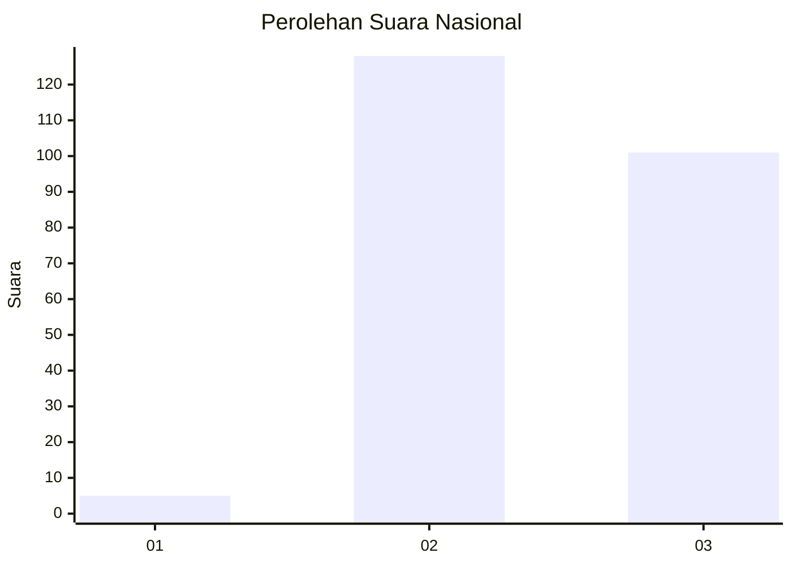
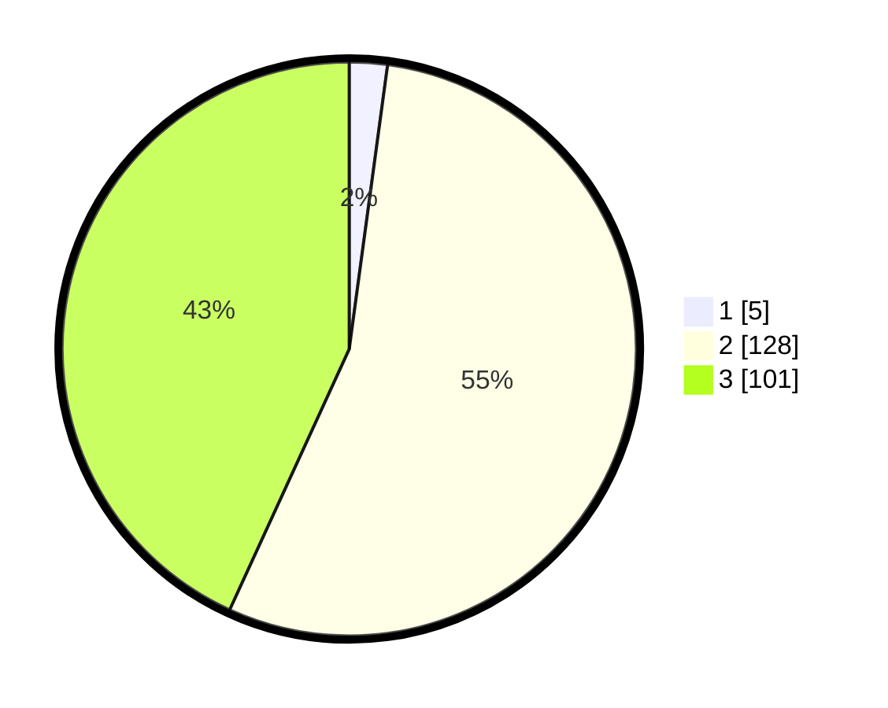

# Hasil

## Grafik

## Tabel

| No. | Nama Paslon    | Suara | Suara (raw) | Persentase |
|:--- |:-------------- | -----:| -----------:| ----------:|
| 1   | ANIES MUHAIMIN | 5     | [5][p-1]    | 2,14       |
| 2   | PRABOWO GIBRAN | 128   | [128][p-2]  | 54,70      |
| 3   | GANJAR MAHFUD  | 101   | [101][p-3]  | 43,16      |

[p-1]: https://github.com/gigit-pemilu/pemilu-2024/blob/main/pilpres/hitung-suara/sub/51-bali/sub/02-tabanan/sub/08-penebel/sub/2016-tegallinggah/sub/002-tps/sub/paslon-1.txt
[p-2]: https://github.com/gigit-pemilu/pemilu-2024/blob/main/pilpres/hitung-suara/sub/51-bali/sub/02-tabanan/sub/08-penebel/sub/2016-tegallinggah/sub/002-tps/sub/paslon-2.txt
[p-3]: https://github.com/gigit-pemilu/pemilu-2024/blob/main/pilpres/hitung-suara/sub/51-bali/sub/02-tabanan/sub/08-penebel/sub/2016-tegallinggah/sub/002-tps/sub/paslon-3.txt

## Foto C Plano

https://sirekap-obj-formc.kpu.go.id/cf15/pemilu/ppwp/51/02/08/20/16/5102082016002-20240216-143427--9dfa5f2d-9874-4507-8c53-882431415253.jpg

https://sirekap-obj-formc.kpu.go.id/cf15/pemilu/ppwp/51/02/08/20/16/5102082016002-20240216-143428--e5311ea2-9221-43a9-bc64-8a83a18a2e79.jpg

https://sirekap-obj-formc.kpu.go.id/cf15/pemilu/ppwp/51/02/08/20/16/5102082016002-20240216-143427--4233af82-0c82-4f9c-a7d6-610f288a45f2.jpg

## Metadata

| Key        | Value               |
| ---------- | ------------------- |
| Time Stamp | 2024-02-16 16:25:10 |

## DATA PEMILIH TETAP

Jumlah pemilih dalam DPT: **273**.
 * L: **129**.
 * P: **144**.

## DATA PENGGUNA HAK PILIH

Jumlah pengguna hak pilih dalam DPT: **239**.
 * L: **120**.
 * P: **119**.

Jumlah pengguna hak pilih dalam DPTb: **4**.
 * L: **1**.
 * P: **3**.

Jumlah pengguna hak pilih dalam DPK: **2**.
 * L: **0**.
 * P: **2**.

Jumlah pengguna hak pilih: **245**.
 * L: **121**.
 * P: **124**.

## JUMLAH SUARA SAH DAN TIDAK SAH

JUMLAH SELURUH SUARA SAH: **234**.

JUMLAH SUARA TIDAK SAH: **11**.

JUMLAH SELURUH SUARA SAH DAN SUARA TIDAK SAH: **245**.

