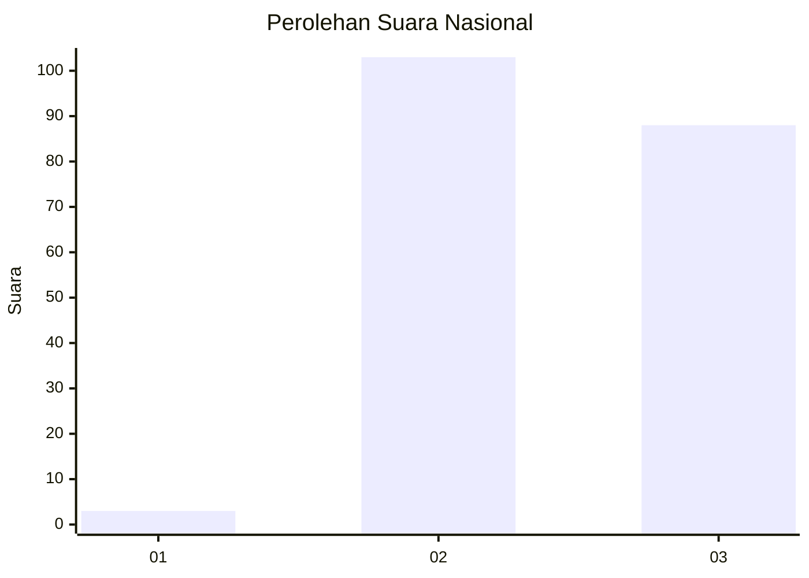
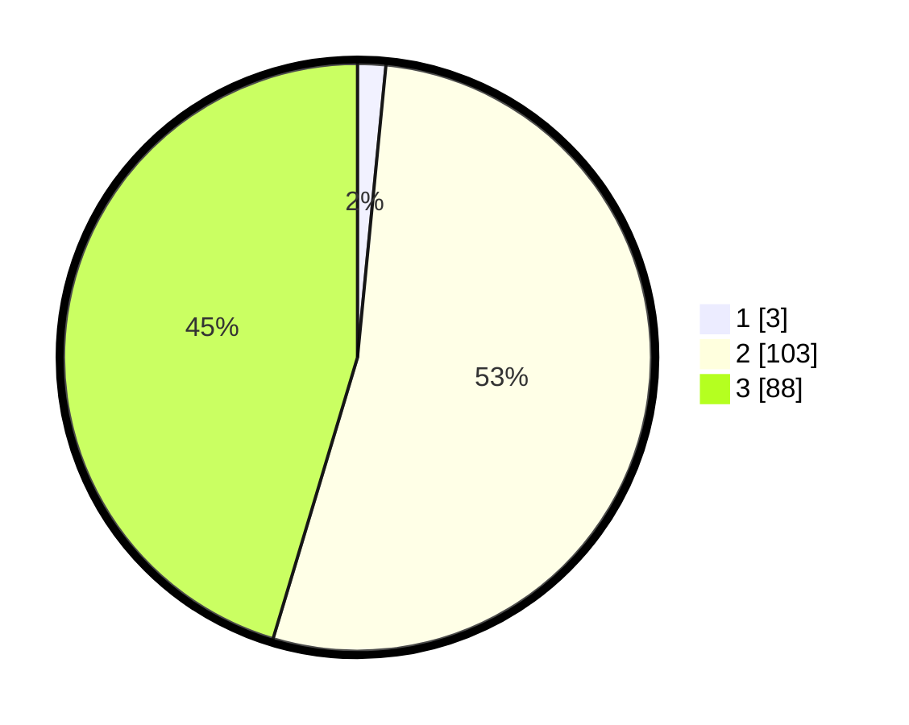

# Hasil

## Grafik

## Tabel

| No. | Nama Paslon    | Suara | Suara (raw) | Persentase |
|:--- |:-------------- | -----:| -----------:| ----------:|
| 1   | ANIES MUHAIMIN | 3     | [3][p-1]    | 1,55       |
| 2   | PRABOWO GIBRAN | 103   | [103][p-2]  | 53,09      |
| 3   | GANJAR MAHFUD  | 88    | [88][p-3]   | 45,36      |

[p-1]: https://github.com/gigit-pemilu/pemilu-2024/blob/main/pilpres/hitung-suara/sub/51-bali/sub/02-tabanan/sub/08-penebel/sub/2016-tegallinggah/sub/003-tps/sub/paslon-1.txt
[p-2]: https://github.com/gigit-pemilu/pemilu-2024/blob/main/pilpres/hitung-suara/sub/51-bali/sub/02-tabanan/sub/08-penebel/sub/2016-tegallinggah/sub/003-tps/sub/paslon-2.txt
[p-3]: https://github.com/gigit-pemilu/pemilu-2024/blob/main/pilpres/hitung-suara/sub/51-bali/sub/02-tabanan/sub/08-penebel/sub/2016-tegallinggah/sub/003-tps/sub/paslon-3.txt

## Foto C Plano

https://sirekap-obj-formc.kpu.go.id/2647/pemilu/ppwp/51/02/08/20/16/5102082016003-20240215-224213--b8f44832-8666-493e-aaec-540169a7b371.jpg

https://sirekap-obj-formc.kpu.go.id/2647/pemilu/ppwp/51/02/08/20/16/5102082016003-20240215-224215--e1137993-ee36-49a9-ad7b-4eba6dc0eb79.jpg

https://sirekap-obj-formc.kpu.go.id/2647/pemilu/ppwp/51/02/08/20/16/5102082016003-20240215-224214--b73f1d3a-56d5-436e-baee-cfb81832f87f.jpg

## Metadata

| Key        | Value               |
| ---------- | ------------------- |
| Time Stamp | 2024-02-16 12:51:22 |

## DATA PEMILIH TETAP

Jumlah pemilih dalam DPT: **234**.
 * L: **111**.
 * P: **123**.

## DATA PENGGUNA HAK PILIH

Jumlah pengguna hak pilih dalam DPT: **202**.
 * L: **98**.
 * P: **104**.

Jumlah pengguna hak pilih dalam DPTb: **0**.
 * L: **0**.
 * P: **0**.

Jumlah pengguna hak pilih dalam DPK: **0**.
 * L: **0**.
 * P: **0**.

Jumlah pengguna hak pilih: **202**.
 * L: **98**.
 * P: **104**.

## JUMLAH SUARA SAH DAN TIDAK SAH

JUMLAH SELURUH SUARA SAH: **194**.

JUMLAH SUARA TIDAK SAH: **8**.

JUMLAH SELURUH SUARA SAH DAN SUARA TIDAK SAH: **202**.

