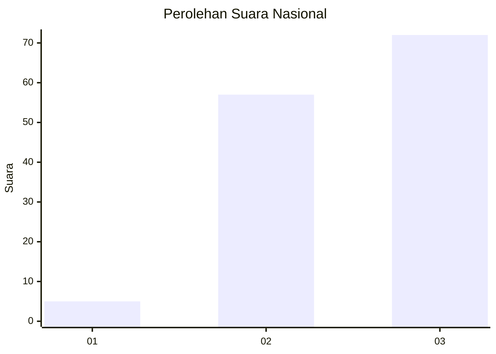
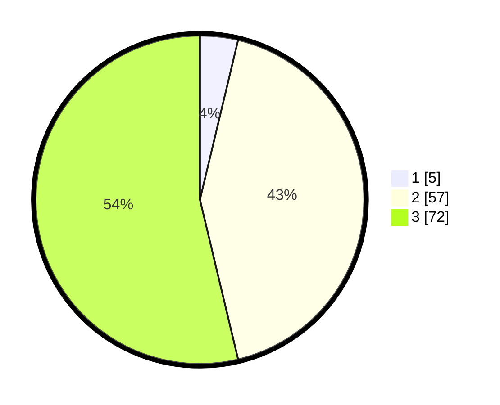

# Hasil

## Grafik

## Tabel

| No. | Nama Paslon    | Suara | Suara (raw) | Persentase |
|:--- |:-------------- | -----:| -----------:| ----------:|
| 1   | ANIES MUHAIMIN | 5     | [5][p-1]    | 3,73       |
| 2   | PRABOWO GIBRAN | 57    | [57][p-2]   | 42,54      |
| 3   | GANJAR MAHFUD  | 72    | [72][p-3]   | 53,73      |

[p-1]: https://github.com/gigit-pemilu/pemilu-2024/blob/main/pilpres/hitung-suara/sub/51-bali/sub/02-tabanan/sub/08-penebel/sub/2016-tegallinggah/sub/004-tps/sub/paslon-1.txt
[p-2]: https://github.com/gigit-pemilu/pemilu-2024/blob/main/pilpres/hitung-suara/sub/51-bali/sub/02-tabanan/sub/08-penebel/sub/2016-tegallinggah/sub/004-tps/sub/paslon-2.txt
[p-3]: https://github.com/gigit-pemilu/pemilu-2024/blob/main/pilpres/hitung-suara/sub/51-bali/sub/02-tabanan/sub/08-penebel/sub/2016-tegallinggah/sub/004-tps/sub/paslon-3.txt

## Foto C Plano

https://sirekap-obj-formc.kpu.go.id/4ab1/pemilu/ppwp/51/02/08/20/16/5102082016004-20240215-221740--bb5507f9-a2c8-4547-878b-b9d72d5063bd.jpg

https://sirekap-obj-formc.kpu.go.id/4ab1/pemilu/ppwp/51/02/08/20/16/5102082016004-20240215-221742--07365109-603e-49dd-97b9-b71e53736857.jpg

https://sirekap-obj-formc.kpu.go.id/4ab1/pemilu/ppwp/51/02/08/20/16/5102082016004-20240215-221741--2dfd7412-ea3a-4441-8e38-ea459e653bb0.jpg

## Metadata

| Key        | Value               |
| ---------- | ------------------- |
| Time Stamp | 2024-02-16 12:51:22 |

## DATA PEMILIH TETAP

Jumlah pemilih dalam DPT: **153**.
 * L: **77**.
 * P: **76**.

## DATA PENGGUNA HAK PILIH

Jumlah pengguna hak pilih dalam DPT: **138**.
 * L: **71**.
 * P: **67**.

Jumlah pengguna hak pilih dalam DPTb: **0**.
 * L: **0**.
 * P: **0**.

Jumlah pengguna hak pilih dalam DPK: **3**.
 * L: **2**.
 * P: **1**.

Jumlah pengguna hak pilih: **141**.
 * L: **73**.
 * P: **68**.

## JUMLAH SUARA SAH DAN TIDAK SAH

JUMLAH SELURUH SUARA SAH: **134**.

JUMLAH SUARA TIDAK SAH: **7**.

JUMLAH SELURUH SUARA SAH DAN SUARA TIDAK SAH: **141**.

