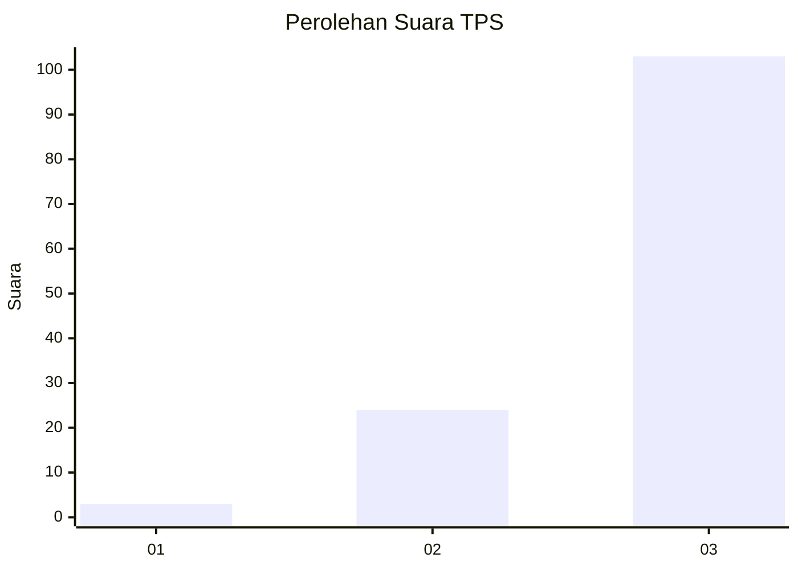
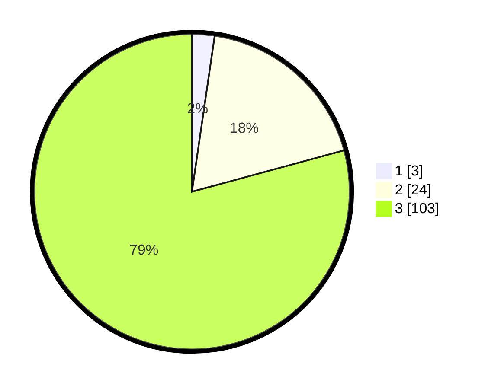

# Hasil

## Grafik

## Tabel

| No. | Nama Paslon    | Suara | Suara (raw) | Persentase |
|:--- |:-------------- | -----:| -----------:| ----------:|
| 1   | ANIES MUHAIMIN | 3     | [3][p-1]    | 2,31       |
| 2   | PRABOWO GIBRAN | 24    | [24][p-2]   | 18,46      |
| 3   | GANJAR MAHFUD  | 103   | [103][p-3]  | 79,23      |

[p-1]: https://github.com/gigit-pemilu/pemilu-2024-51-bali/blob/main/pilpres/hitung-suara/sub/51-bali/sub/02-tabanan/sub/08-penebel/sub/2017-pesagi/sub/001-tps/sub/paslon-1.txt
[p-2]: https://github.com/gigit-pemilu/pemilu-2024-51-bali/blob/main/pilpres/hitung-suara/sub/51-bali/sub/02-tabanan/sub/08-penebel/sub/2017-pesagi/sub/001-tps/sub/paslon-2.txt
[p-3]: https://github.com/gigit-pemilu/pemilu-2024-51-bali/blob/main/pilpres/hitung-suara/sub/51-bali/sub/02-tabanan/sub/08-penebel/sub/2017-pesagi/sub/001-tps/sub/paslon-3.txt

## Foto C Plano

https://sirekap-obj-formc.kpu.go.id/32dd/pemilu/ppwp/51/02/08/20/17/5102082017001-20240216-143817--7465708e-34be-4e05-b742-10f477cfecef.jpg

https://sirekap-obj-formc.kpu.go.id/32dd/pemilu/ppwp/51/02/08/20/17/5102082017001-20240216-143819--3385f11f-c445-4db0-b2e2-0b32e32e1636.jpg

https://sirekap-obj-formc.kpu.go.id/32dd/pemilu/ppwp/51/02/08/20/17/5102082017001-20240216-143818--b56edafa-cd03-45df-99ce-d4769d393336.jpg

## Metadata

| Key        | Value               |
| ---------- | ------------------- |
| Time Stamp | 2024-02-21 19:00:00 |

## DATA PEMILIH TETAP

Jumlah pemilih dalam DPT: **143**.
 * L: **70**.
 * P: **73**.

## DATA PENGGUNA HAK PILIH

Jumlah pengguna hak pilih dalam DPT: **131**.
 * L: **66**.
 * P: **65**.

Jumlah pengguna hak pilih dalam DPTb: **1**.
 * L: **1**.
 * P: **0**.

Jumlah pengguna hak pilih dalam DPK: **0**.
 * L: **0**.
 * P: **0**.

Jumlah pengguna hak pilih: **132**.
 * L: **67**.
 * P: **65**.

## JUMLAH SUARA SAH DAN TIDAK SAH

JUMLAH SELURUH SUARA SAH: **130**.

JUMLAH SUARA TIDAK SAH: **2**.

JUMLAH SELURUH SUARA SAH DAN SUARA TIDAK SAH: **132**.

