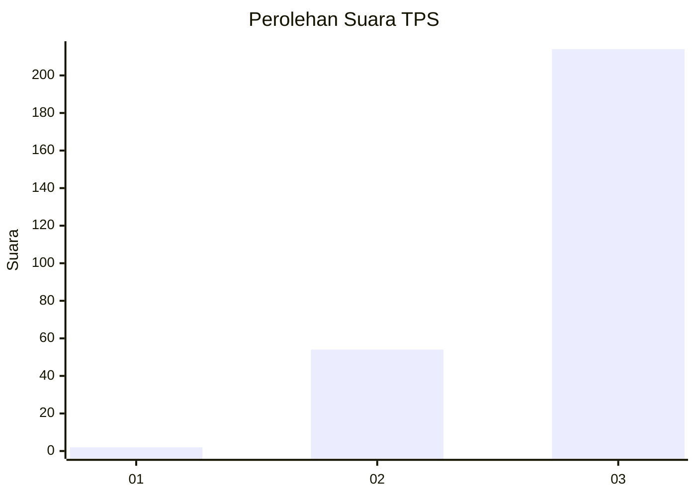
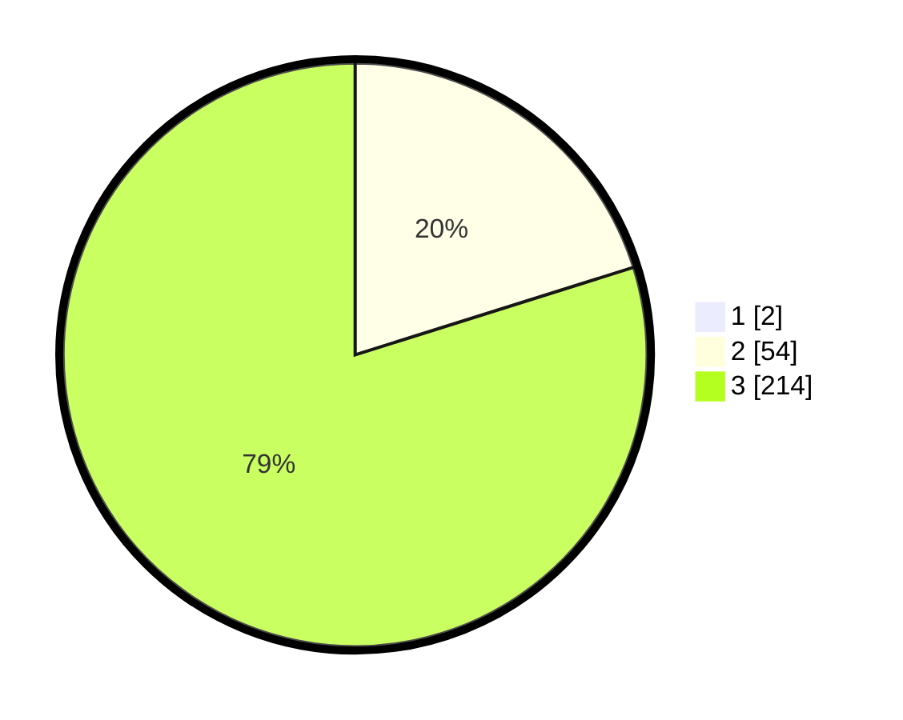

# Hasil

## Grafik

## Tabel

| No. | Nama Paslon    | Suara | Suara (raw) | Persentase |
|:--- |:-------------- | -----:| -----------:| ----------:|
| 1   | ANIES MUHAIMIN | 2     | [2][p-1]    | 0,74       |
| 2   | PRABOWO GIBRAN | 54    | [54][p-2]   | 20,00      |
| 3   | GANJAR MAHFUD  | 214   | [214][p-3]  | 79,26      |

[p-1]: https://github.com/gigit-pemilu/pemilu-2024-51-bali/blob/main/pilpres/hitung-suara/sub/51-bali/sub/02-tabanan/sub/08-penebel/sub/2017-pesagi/sub/005-tps/sub/paslon-1.txt
[p-2]: https://github.com/gigit-pemilu/pemilu-2024-51-bali/blob/main/pilpres/hitung-suara/sub/51-bali/sub/02-tabanan/sub/08-penebel/sub/2017-pesagi/sub/005-tps/sub/paslon-2.txt
[p-3]: https://github.com/gigit-pemilu/pemilu-2024-51-bali/blob/main/pilpres/hitung-suara/sub/51-bali/sub/02-tabanan/sub/08-penebel/sub/2017-pesagi/sub/005-tps/sub/paslon-3.txt

## Foto C Plano

https://sirekap-obj-formc.kpu.go.id/0c17/pemilu/ppwp/51/02/08/20/17/5102082017005-20240216-135851--51572618-089c-4b09-b00c-7cafd4bf5610.jpg

https://sirekap-obj-formc.kpu.go.id/0c17/pemilu/ppwp/51/02/08/20/17/5102082017005-20240216-135852--e0396fd1-7a81-4a20-b7a8-c4a97dbc356d.jpg

https://sirekap-obj-formc.kpu.go.id/0c17/pemilu/ppwp/51/02/08/20/17/5102082017005-20240216-135851--cc8f25c1-cd4c-4e62-911a-186220389f83.jpg

## Metadata

| Key        | Value               |
| ---------- | ------------------- |
| Time Stamp | 2024-02-16 14:30:33 |

## DATA PEMILIH TETAP

Jumlah pemilih dalam DPT: **297**.
 * L: **148**.
 * P: **149**.

## DATA PENGGUNA HAK PILIH

Jumlah pengguna hak pilih dalam DPT: **273**.
 * L: **136**.
 * P: **137**.

Jumlah pengguna hak pilih dalam DPTb: **0**.
 * L: **0**.
 * P: **0**.

Jumlah pengguna hak pilih dalam DPK: **0**.
 * L: **0**.
 * P: **0**.

Jumlah pengguna hak pilih: **273**.
 * L: **136**.
 * P: **137**.

## JUMLAH SUARA SAH DAN TIDAK SAH

JUMLAH SELURUH SUARA SAH: **270**.

JUMLAH SUARA TIDAK SAH: **3**.

JUMLAH SELURUH SUARA SAH DAN SUARA TIDAK SAH: **273**.

