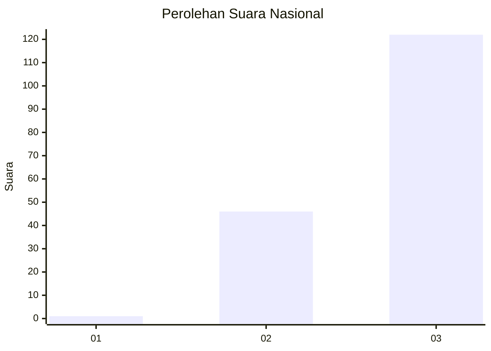
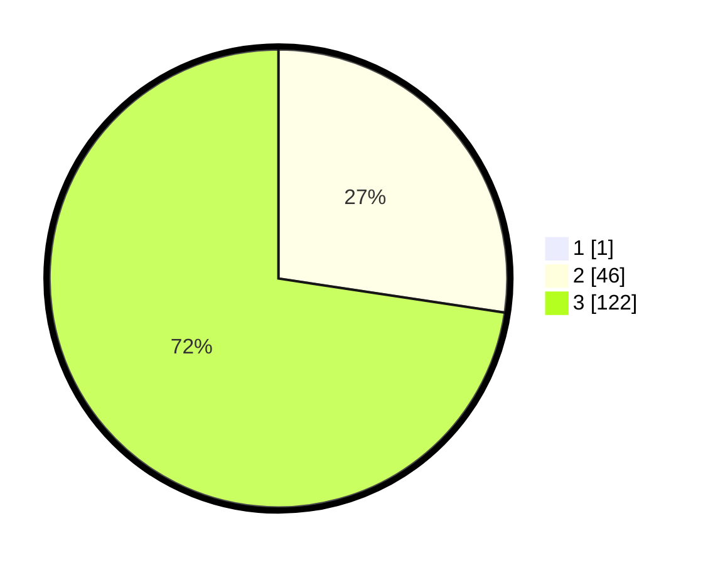

# Hasil

## Grafik

## Tabel

| No. | Nama Paslon    | Suara | Suara (raw) | Persentase |
|:--- |:-------------- | -----:| -----------:| ----------:|
| 1   | ANIES MUHAIMIN | 1     | [1][p-1]    | 0,59       |
| 2   | PRABOWO GIBRAN | 46    | [46][p-2]   | 27,22      |
| 3   | GANJAR MAHFUD  | 122   | [122][p-3]  | 72,19      |

[p-1]: https://github.com/gigit-pemilu/pemilu-2024/blob/main/pilpres/hitung-suara/sub/51-bali/sub/02-tabanan/sub/08-penebel/sub/2017-pesagi/sub/007-tps/sub/paslon-1.txt
[p-2]: https://github.com/gigit-pemilu/pemilu-2024/blob/main/pilpres/hitung-suara/sub/51-bali/sub/02-tabanan/sub/08-penebel/sub/2017-pesagi/sub/007-tps/sub/paslon-2.txt
[p-3]: https://github.com/gigit-pemilu/pemilu-2024/blob/main/pilpres/hitung-suara/sub/51-bali/sub/02-tabanan/sub/08-penebel/sub/2017-pesagi/sub/007-tps/sub/paslon-3.txt

## Foto C Plano

https://sirekap-obj-formc.kpu.go.id/bedc/pemilu/ppwp/51/02/08/20/17/5102082017007-20240215-102439--348ea24b-81ca-4dc9-8f3e-66c96755455e.jpg

https://sirekap-obj-formc.kpu.go.id/bedc/pemilu/ppwp/51/02/08/20/17/5102082017007-20240215-102500--e46b10a2-75a7-4ad9-9db0-30e64be60ee4.jpg

https://sirekap-obj-formc.kpu.go.id/bedc/pemilu/ppwp/51/02/08/20/17/5102082017007-20240215-102450--2aee6a1a-3d42-4c1b-a7a6-aa48ed571c8a.jpg

## Metadata

| Key        | Value               |
| ---------- | ------------------- |
| Time Stamp | 2024-02-15 21:30:27 |

## DATA PEMILIH TETAP

Jumlah pemilih dalam DPT: **203**.
 * L: **98**.
 * P: **105**.

## DATA PENGGUNA HAK PILIH

Jumlah pengguna hak pilih dalam DPT: **169**.
 * L: **84**.
 * P: **85**.

Jumlah pengguna hak pilih dalam DPTb: **0**.
 * L: **0**.
 * P: **0**.

Jumlah pengguna hak pilih dalam DPK: **1**.
 * L: **0**.
 * P: **1**.

Jumlah pengguna hak pilih: **170**.
 * L: **84**.
 * P: **86**.

## JUMLAH SUARA SAH DAN TIDAK SAH

JUMLAH SELURUH SUARA SAH: **169**.

JUMLAH SUARA TIDAK SAH: **1**.

JUMLAH SELURUH SUARA SAH DAN SUARA TIDAK SAH: **170**.

