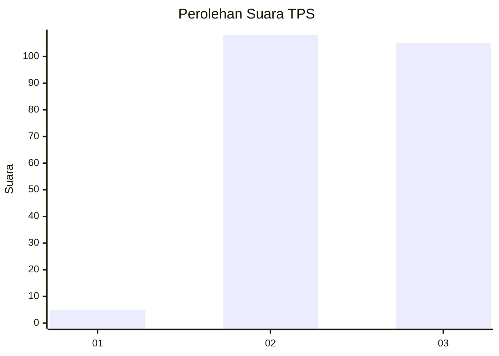
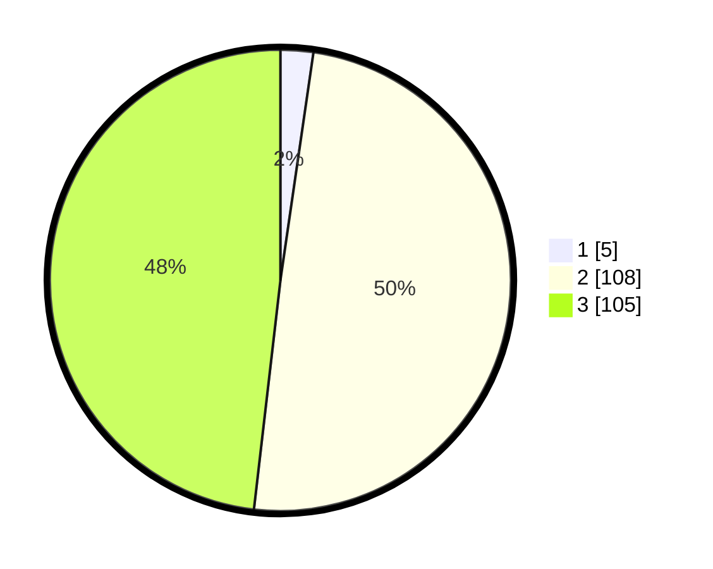

# Hasil

## Grafik

## Tabel

| No. | Nama Paslon    | Suara | Suara (raw) | Persentase |
|:--- |:-------------- | -----:| -----------:| ----------:|
| 1   | ANIES MUHAIMIN | 5     | [5][p-1]    | 2,29       |
| 2   | PRABOWO GIBRAN | 108   | [108][p-2]  | 49,54      |
| 3   | GANJAR MAHFUD  | 105   | [105][p-3]  | 48,17      |

[p-1]: https://github.com/gigit-pemilu/pemilu-2024-51-bali/blob/main/pilpres/hitung-suara/sub/51-bali/sub/02-tabanan/sub/08-penebel/sub/2018-sangketan/sub/002-tps/sub/paslon-1.txt
[p-2]: https://github.com/gigit-pemilu/pemilu-2024-51-bali/blob/main/pilpres/hitung-suara/sub/51-bali/sub/02-tabanan/sub/08-penebel/sub/2018-sangketan/sub/002-tps/sub/paslon-2.txt
[p-3]: https://github.com/gigit-pemilu/pemilu-2024-51-bali/blob/main/pilpres/hitung-suara/sub/51-bali/sub/02-tabanan/sub/08-penebel/sub/2018-sangketan/sub/002-tps/sub/paslon-3.txt

## Foto C Plano

https://sirekap-obj-formc.kpu.go.id/d376/pemilu/ppwp/51/02/08/20/18/5102082018002-20240216-034249--7ddce5b4-04fb-4fec-b247-6d9654b17e68.jpg

https://sirekap-obj-formc.kpu.go.id/d376/pemilu/ppwp/51/02/08/20/18/5102082018002-20240216-034253--57652db0-a682-4dfe-ba6d-cdea52ddbac8.jpg

https://sirekap-obj-formc.kpu.go.id/d376/pemilu/ppwp/51/02/08/20/18/5102082018002-20240216-034250--a70d9f0b-a85f-4061-920d-7726ba70c58d.jpg

## Metadata

| Key        | Value               |
| ---------- | ------------------- |
| Time Stamp | 2024-02-16 16:25:10 |

## DATA PEMILIH TETAP

Jumlah pemilih dalam DPT: **257**.
 * L: **118**.
 * P: **139**.

## DATA PENGGUNA HAK PILIH

Jumlah pengguna hak pilih dalam DPT: **222**.
 * L: **107**.
 * P: **115**.

Jumlah pengguna hak pilih dalam DPTb: **1**.
 * L: **0**.
 * P: **1**.

Jumlah pengguna hak pilih dalam DPK: **0**.
 * L: **0**.
 * P: **0**.

Jumlah pengguna hak pilih: **223**.
 * L: **107**.
 * P: **116**.

## JUMLAH SUARA SAH DAN TIDAK SAH

JUMLAH SELURUH SUARA SAH: **218**.

JUMLAH SUARA TIDAK SAH: **5**.

JUMLAH SELURUH SUARA SAH DAN SUARA TIDAK SAH: **223**.

