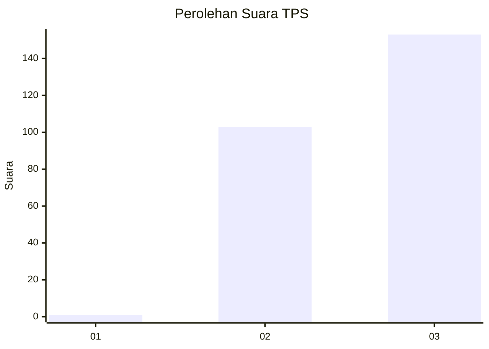
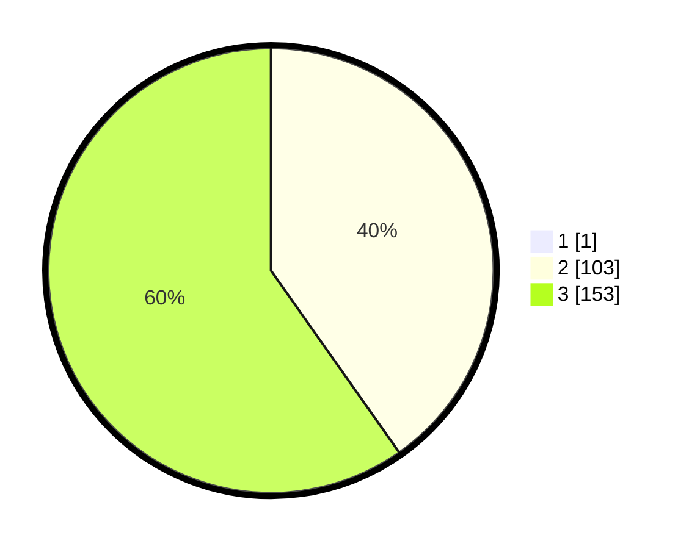

# Hasil

## Grafik

## Tabel

| No. | Nama Paslon    | Suara | Suara (raw) | Persentase |
|:--- |:-------------- | -----:| -----------:| ----------:|
| 1   | ANIES MUHAIMIN | 1     | [1][p-1]    | 0,39       |
| 2   | PRABOWO GIBRAN | 103   | [103][p-2]  | 40,08      |
| 3   | GANJAR MAHFUD  | 153   | [153][p-3]  | 59,53      |

[p-1]: https://github.com/gigit-pemilu/pemilu-2024-51-bali/blob/main/pilpres/hitung-suara/sub/51-bali/sub/02-tabanan/sub/08-penebel/sub/2018-sangketan/sub/003-tps/sub/paslon-1.txt
[p-2]: https://github.com/gigit-pemilu/pemilu-2024-51-bali/blob/main/pilpres/hitung-suara/sub/51-bali/sub/02-tabanan/sub/08-penebel/sub/2018-sangketan/sub/003-tps/sub/paslon-2.txt
[p-3]: https://github.com/gigit-pemilu/pemilu-2024-51-bali/blob/main/pilpres/hitung-suara/sub/51-bali/sub/02-tabanan/sub/08-penebel/sub/2018-sangketan/sub/003-tps/sub/paslon-3.txt

## Foto C Plano

https://sirekap-obj-formc.kpu.go.id/9415/pemilu/ppwp/51/02/08/20/18/5102082018003-20240216-033049--0bdeb9b5-a8ce-485e-87fd-13222c8705c2.jpg

https://sirekap-obj-formc.kpu.go.id/9415/pemilu/ppwp/51/02/08/20/18/5102082018003-20240214-200454--afba9149-6f82-4246-b4d2-c452ad5303b9.jpg

https://sirekap-obj-formc.kpu.go.id/9415/pemilu/ppwp/51/02/08/20/18/5102082018003-20240214-200524--daba522a-c2d4-4938-a2a4-a0b6b6106a29.jpg

## Metadata

| Key        | Value               |
| ---------- | ------------------- |
| Time Stamp | 2024-02-16 04:00:27 |

## DATA PEMILIH TETAP

Jumlah pemilih dalam DPT: **285**.
 * L: **142**.
 * P: **143**.

## DATA PENGGUNA HAK PILIH

Jumlah pengguna hak pilih dalam DPT: **256**.
 * L: **130**.
 * P: **126**.

Jumlah pengguna hak pilih dalam DPTb: **0**.
 * L: **0**.
 * P: **0**.

Jumlah pengguna hak pilih dalam DPK: **1**.
 * L: **1**.
 * P: **0**.

Jumlah pengguna hak pilih: **257**.
 * L: **131**.
 * P: **126**.

## JUMLAH SUARA SAH DAN TIDAK SAH

JUMLAH SELURUH SUARA SAH: **257**.

JUMLAH SUARA TIDAK SAH: **0**.

JUMLAH SELURUH SUARA SAH DAN SUARA TIDAK SAH: **257**.

