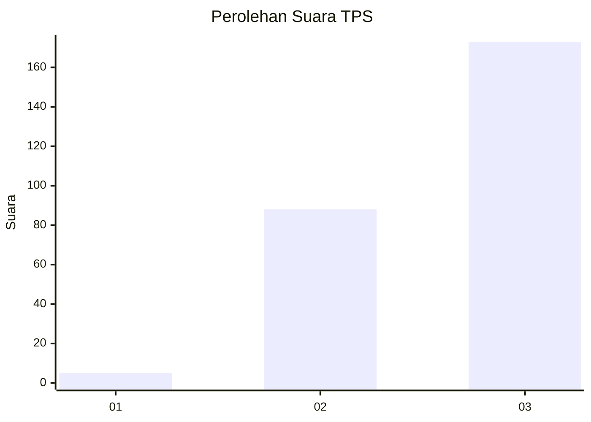
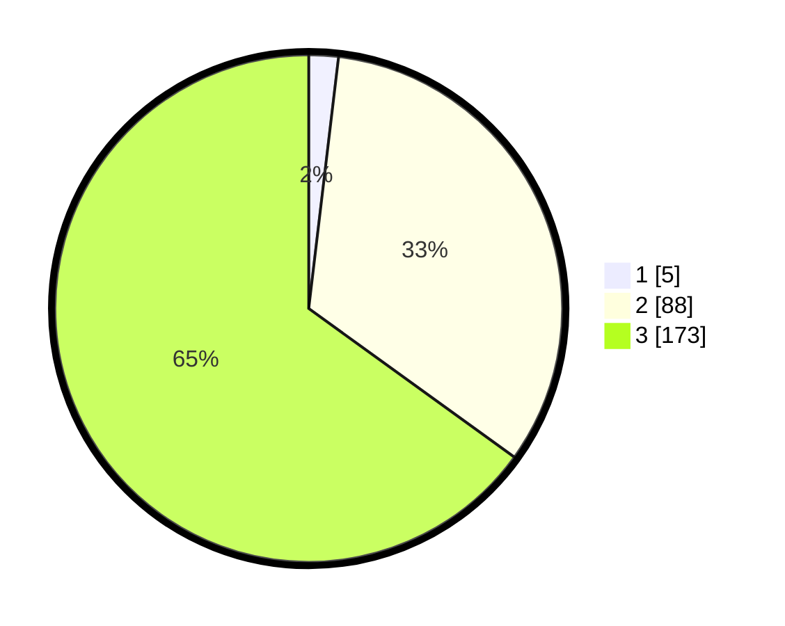

# Hasil

## Grafik

## Tabel

| No. | Nama Paslon    | Suara | Suara (raw) | Persentase |
|:--- |:-------------- | -----:| -----------:| ----------:|
| 1   | ANIES MUHAIMIN | 5     | [5][p-1]    | 1,88       |
| 2   | PRABOWO GIBRAN | 88    | [88][p-2]   | 33,08      |
| 3   | GANJAR MAHFUD  | 173   | [173][p-3]  | 65,04      |

[p-1]: https://github.com/gigit-pemilu/pemilu-2024-51-bali/blob/main/pilpres/hitung-suara/sub/51-bali/sub/02-tabanan/sub/08-penebel/sub/2018-sangketan/sub/004-tps/sub/paslon-1.txt
[p-2]: https://github.com/gigit-pemilu/pemilu-2024-51-bali/blob/main/pilpres/hitung-suara/sub/51-bali/sub/02-tabanan/sub/08-penebel/sub/2018-sangketan/sub/004-tps/sub/paslon-2.txt
[p-3]: https://github.com/gigit-pemilu/pemilu-2024-51-bali/blob/main/pilpres/hitung-suara/sub/51-bali/sub/02-tabanan/sub/08-penebel/sub/2018-sangketan/sub/004-tps/sub/paslon-3.txt

## Foto C Plano

https://sirekap-obj-formc.kpu.go.id/b751/pemilu/ppwp/51/02/08/20/18/5102082018004-20240215-232708--76686834-f721-486c-8873-acc30167a710.jpg

https://sirekap-obj-formc.kpu.go.id/b751/pemilu/ppwp/51/02/08/20/18/5102082018004-20240215-232712--c8841797-d9c8-4b93-b3ab-a0ca44af45dc.jpg

https://sirekap-obj-formc.kpu.go.id/b751/pemilu/ppwp/51/02/08/20/18/5102082018004-20240215-232711--f9334be8-ed9f-484c-8600-21e2c2cc7027.jpg

## Metadata

| Key        | Value               |
| ---------- | ------------------- |
| Time Stamp | 2024-02-16 16:25:10 |

## DATA PEMILIH TETAP

Jumlah pemilih dalam DPT: **296**.
 * L: **161**.
 * P: **135**.

## DATA PENGGUNA HAK PILIH

Jumlah pengguna hak pilih dalam DPT: **271**.
 * L: **148**.
 * P: **123**.

Jumlah pengguna hak pilih dalam DPTb: **2**.
 * L: **1**.
 * P: **1**.

Jumlah pengguna hak pilih dalam DPK: **0**.
 * L: **0**.
 * P: **0**.

Jumlah pengguna hak pilih: **273**.
 * L: **149**.
 * P: **124**.

## JUMLAH SUARA SAH DAN TIDAK SAH

JUMLAH SELURUH SUARA SAH: **266**.

JUMLAH SUARA TIDAK SAH: **7**.

JUMLAH SELURUH SUARA SAH DAN SUARA TIDAK SAH: **273**.

