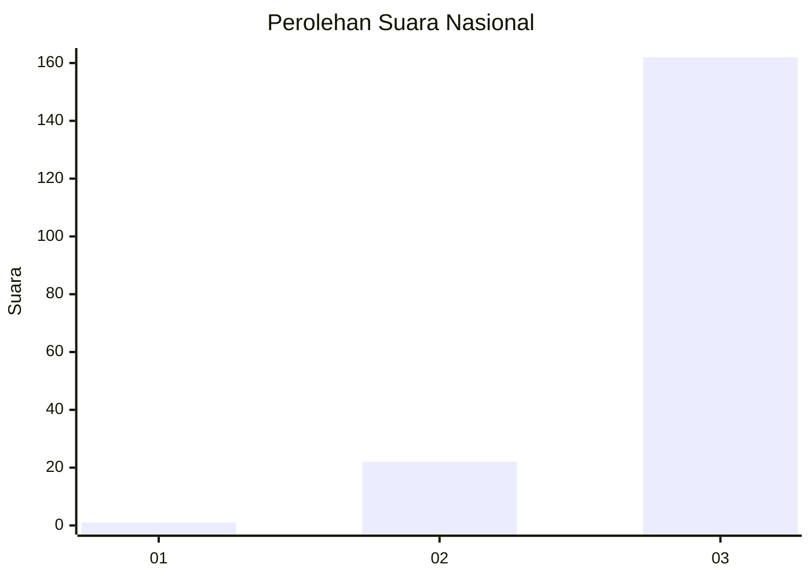
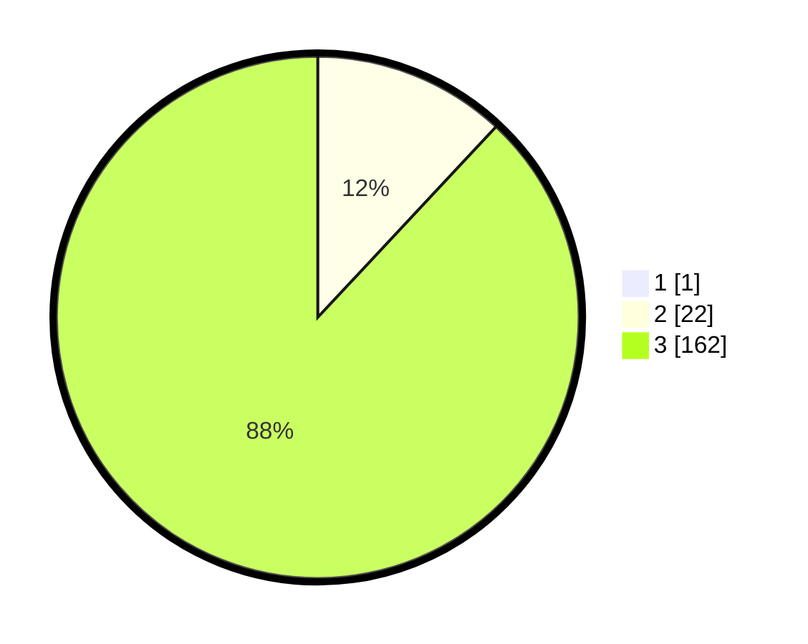

# Hasil

## Grafik

## Tabel

| No. | Nama Paslon    | Suara | Suara (raw) | Persentase |
|:--- |:-------------- | -----:| -----------:| ----------:|
| 1   | ANIES MUHAIMIN | 1     | [1][p-1]    | 0,54       |
| 2   | PRABOWO GIBRAN | 22    | [22][p-2]   | 11,89      |
| 3   | GANJAR MAHFUD  | 162   | [162][p-3]  | 87,57      |

[p-1]: https://github.com/gigit-pemilu/pemilu-2024/blob/main/pilpres/hitung-suara/sub/51-bali/sub/02-tabanan/sub/08-penebel/sub/2018-sangketan/sub/005-tps/sub/paslon-1.txt
[p-2]: https://github.com/gigit-pemilu/pemilu-2024/blob/main/pilpres/hitung-suara/sub/51-bali/sub/02-tabanan/sub/08-penebel/sub/2018-sangketan/sub/005-tps/sub/paslon-2.txt
[p-3]: https://github.com/gigit-pemilu/pemilu-2024/blob/main/pilpres/hitung-suara/sub/51-bali/sub/02-tabanan/sub/08-penebel/sub/2018-sangketan/sub/005-tps/sub/paslon-3.txt

## Foto C Plano

https://sirekap-obj-formc.kpu.go.id/6e21/pemilu/ppwp/51/02/08/20/18/5102082018005-20240216-003224--fe4fe4e9-1e55-4bfc-b4bf-b703e3224ad0.jpg

https://sirekap-obj-formc.kpu.go.id/6e21/pemilu/ppwp/51/02/08/20/18/5102082018005-20240216-003226--45fa7882-8e60-4857-9091-934327971805.jpg

https://sirekap-obj-formc.kpu.go.id/6e21/pemilu/ppwp/51/02/08/20/18/5102082018005-20240216-003225--8ba62b1d-44b0-42f4-b40a-7756c74d2338.jpg

## Metadata

| Key        | Value               |
| ---------- | ------------------- |
| Time Stamp | 2024-02-16 16:25:10 |

## DATA PEMILIH TETAP

Jumlah pemilih dalam DPT: **203**.
 * L: **100**.
 * P: **103**.

## DATA PENGGUNA HAK PILIH

Jumlah pengguna hak pilih dalam DPT: **186**.
 * L: **94**.
 * P: **92**.

Jumlah pengguna hak pilih dalam DPTb: **0**.
 * L: **0**.
 * P: **0**.

Jumlah pengguna hak pilih dalam DPK: **0**.
 * L: **0**.
 * P: **0**.

Jumlah pengguna hak pilih: **186**.
 * L: **94**.
 * P: **92**.

## JUMLAH SUARA SAH DAN TIDAK SAH

JUMLAH SELURUH SUARA SAH: **185**.

JUMLAH SUARA TIDAK SAH: **1**.

JUMLAH SELURUH SUARA SAH DAN SUARA TIDAK SAH: **186**.

