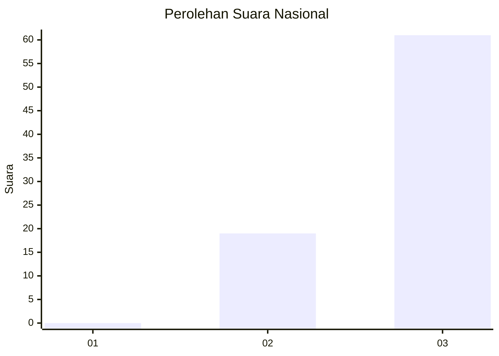
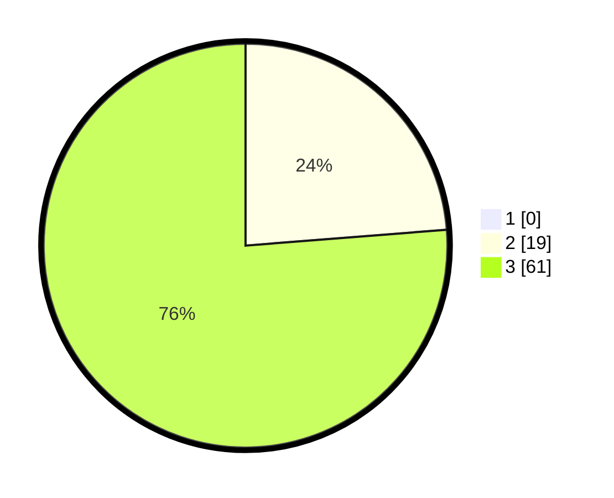

# Hasil

## Grafik

## Tabel

| No. | Nama Paslon    | Suara | Suara (raw) | Persentase |
|:--- |:-------------- | -----:| -----------:| ----------:|
| 1   | ANIES MUHAIMIN | 0     | [0][p-1]    | 0,00       |
| 2   | PRABOWO GIBRAN | 19    | [19][p-2]   | 23,75      |
| 3   | GANJAR MAHFUD  | 61    | [61][p-3]   | 76,25      |

[p-1]: https://github.com/gigit-pemilu/pemilu-2024/blob/main/pilpres/hitung-suara/sub/51-bali/sub/02-tabanan/sub/08-penebel/sub/2018-sangketan/sub/008-tps/sub/paslon-1.txt
[p-2]: https://github.com/gigit-pemilu/pemilu-2024/blob/main/pilpres/hitung-suara/sub/51-bali/sub/02-tabanan/sub/08-penebel/sub/2018-sangketan/sub/008-tps/sub/paslon-2.txt
[p-3]: https://github.com/gigit-pemilu/pemilu-2024/blob/main/pilpres/hitung-suara/sub/51-bali/sub/02-tabanan/sub/08-penebel/sub/2018-sangketan/sub/008-tps/sub/paslon-3.txt

## Foto C Plano

https://sirekap-obj-formc.kpu.go.id/0a8d/pemilu/ppwp/51/02/08/20/18/5102082018008-20240214-132710--d6f26812-e5ce-4ac9-9baa-470a60a9661d.jpg

https://sirekap-obj-formc.kpu.go.id/0a8d/pemilu/ppwp/51/02/08/20/18/5102082018008-20240216-023514--751892dc-1b3d-4d45-bd05-ba359f6a44a4.jpg

https://sirekap-obj-formc.kpu.go.id/0a8d/pemilu/ppwp/51/02/08/20/18/5102082018008-20240214-132854--c36ce73d-de7a-48b0-93ae-6f2a80839af8.jpg

## Metadata

| Key        | Value               |
| ---------- | ------------------- |
| Time Stamp | 2024-02-16 16:25:10 |

## DATA PEMILIH TETAP

Jumlah pemilih dalam DPT: **90**.
 * L: **41**.
 * P: **49**.

## DATA PENGGUNA HAK PILIH

Jumlah pengguna hak pilih dalam DPT: **83**.
 * L: **39**.
 * P: **44**.

Jumlah pengguna hak pilih dalam DPTb: **0**.
 * L: **0**.
 * P: **0**.

Jumlah pengguna hak pilih dalam DPK: **0**.
 * L: **0**.
 * P: **0**.

Jumlah pengguna hak pilih: **83**.
 * L: **39**.
 * P: **44**.

## JUMLAH SUARA SAH DAN TIDAK SAH

JUMLAH SELURUH SUARA SAH: **80**.

JUMLAH SUARA TIDAK SAH: **3**.

JUMLAH SELURUH SUARA SAH DAN SUARA TIDAK SAH: **83**.

