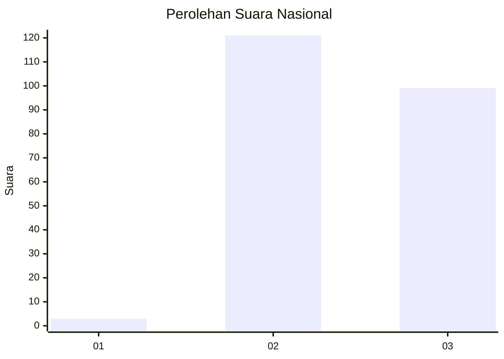
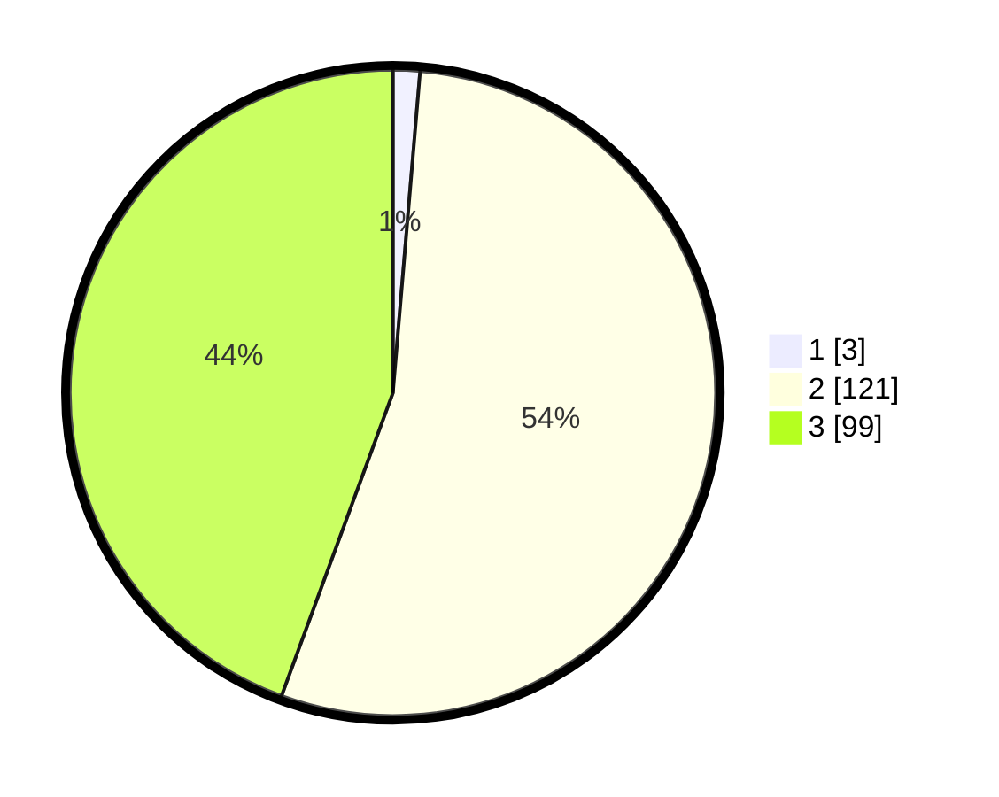

# Hasil

## Grafik

## Tabel

| No. | Nama Paslon    | Suara | Suara (raw) | Persentase |
|:--- |:-------------- | -----:| -----------:| ----------:|
| 1   | ANIES MUHAIMIN | 3     | [3][p-1]    | 1,35       |
| 2   | PRABOWO GIBRAN | 121   | [121][p-2]  | 54,26      |
| 3   | GANJAR MAHFUD  | 99    | [99][p-3]   | 44,39      |

[p-1]: https://github.com/gigit-pemilu/pemilu-2024/blob/main/pilpres/hitung-suara/sub/51-bali/sub/02-tabanan/sub/09-baturiti/sub/2001-perean/sub/002-tps/sub/paslon-1.txt
[p-2]: https://github.com/gigit-pemilu/pemilu-2024/blob/main/pilpres/hitung-suara/sub/51-bali/sub/02-tabanan/sub/09-baturiti/sub/2001-perean/sub/002-tps/sub/paslon-2.txt
[p-3]: https://github.com/gigit-pemilu/pemilu-2024/blob/main/pilpres/hitung-suara/sub/51-bali/sub/02-tabanan/sub/09-baturiti/sub/2001-perean/sub/002-tps/sub/paslon-3.txt

## Foto C Plano

https://sirekap-obj-formc.kpu.go.id/4b28/pemilu/ppwp/51/02/09/20/01/5102092001002-20240214-215715--c5daa086-8383-46bc-b25c-bb6f2708d87f.jpg

https://sirekap-obj-formc.kpu.go.id/4b28/pemilu/ppwp/51/02/09/20/01/5102092001002-20240215-161627--080b7b57-c585-43d2-ae9d-e58b6d1ab6a3.jpg

https://sirekap-obj-formc.kpu.go.id/4b28/pemilu/ppwp/51/02/09/20/01/5102092001002-20240214-220406--5d24a681-c78d-4bb9-8a01-0cae78c24be1.jpg

## Metadata

| Key        | Value               |
| ---------- | ------------------- |
| Time Stamp | 2024-02-15 23:29:50 |

