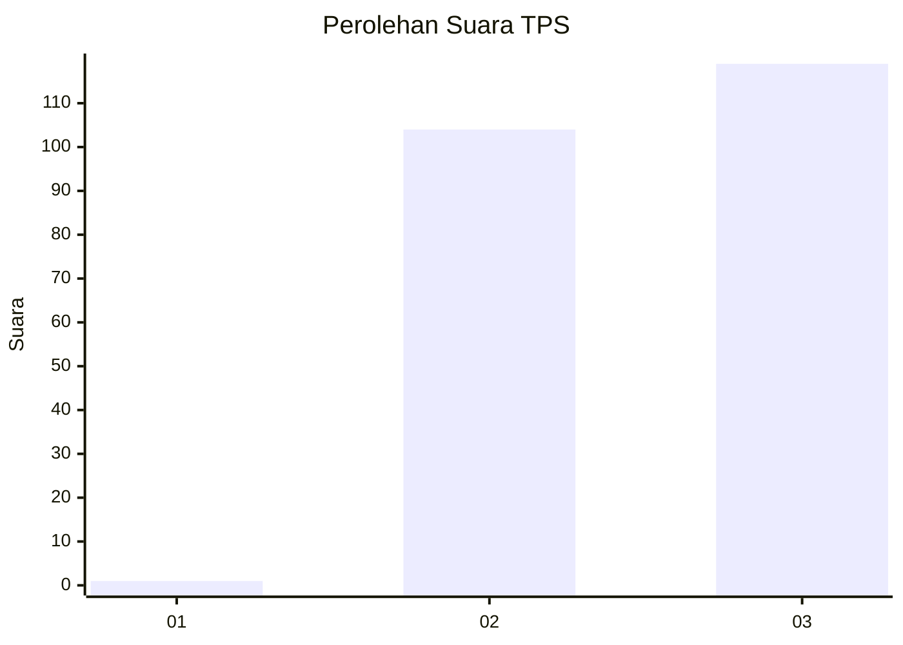
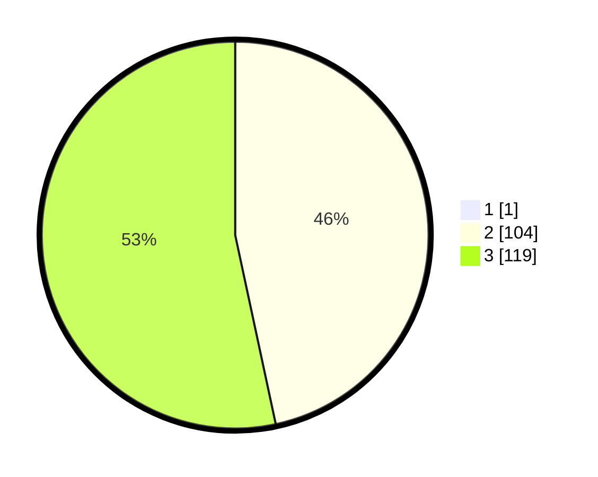

# Hasil

## Grafik

## Tabel

| No. | Nama Paslon    | Suara | Suara (raw) | Persentase |
|:--- |:-------------- | -----:| -----------:| ----------:|
| 1   | ANIES MUHAIMIN | 1     | [1][p-1]    | 0,45       |
| 2   | PRABOWO GIBRAN | 104   | [104][p-2]  | 46,43      |
| 3   | GANJAR MAHFUD  | 119   | [119][p-3]  | 53,13      |

[p-1]: https://github.com/gigit-pemilu/pemilu-2024-51-bali/blob/main/pilpres/hitung-suara/sub/51-bali/sub/02-tabanan/sub/09-baturiti/sub/2001-perean/sub/003-tps/sub/paslon-1.txt
[p-2]: https://github.com/gigit-pemilu/pemilu-2024-51-bali/blob/main/pilpres/hitung-suara/sub/51-bali/sub/02-tabanan/sub/09-baturiti/sub/2001-perean/sub/003-tps/sub/paslon-2.txt
[p-3]: https://github.com/gigit-pemilu/pemilu-2024-51-bali/blob/main/pilpres/hitung-suara/sub/51-bali/sub/02-tabanan/sub/09-baturiti/sub/2001-perean/sub/003-tps/sub/paslon-3.txt

## Foto C Plano

https://sirekap-obj-formc.kpu.go.id/9072/pemilu/ppwp/51/02/09/20/01/5102092001003-20240215-154434--32e54744-a03e-4783-9048-e7e1871b3644.jpg

https://sirekap-obj-formc.kpu.go.id/9072/pemilu/ppwp/51/02/09/20/01/5102092001003-20240215-154632--079baeb9-6c69-43ff-9e8e-0ff554cb7822.jpg

https://sirekap-obj-formc.kpu.go.id/9072/pemilu/ppwp/51/02/09/20/01/5102092001003-20240215-154907--6897b611-9934-4428-8e75-170974fe5e68.jpg

## Metadata

| Key        | Value               |
| ---------- | ------------------- |
| Time Stamp | 2024-02-26 23:00:00 |

