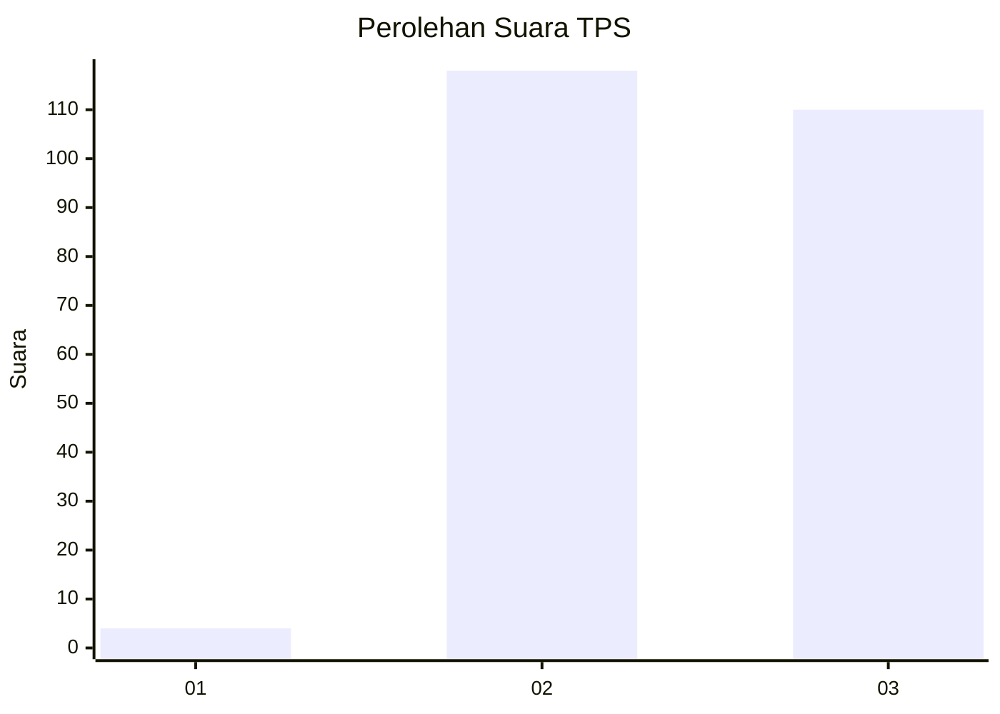
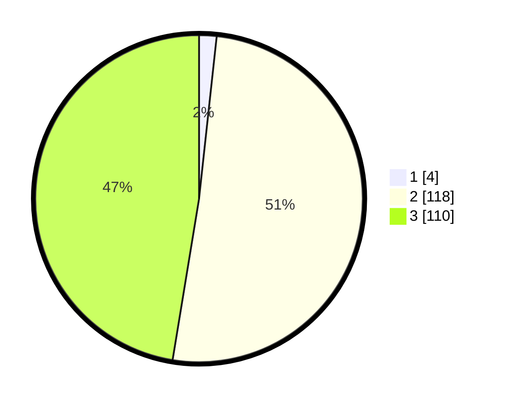

# Hasil

## Grafik

## Tabel

| No. | Nama Paslon    | Suara | Suara (raw) | Persentase |
|:--- |:-------------- | -----:| -----------:| ----------:|
| 1   | ANIES MUHAIMIN | 4     | [4][p-1]    | 1,72       |
| 2   | PRABOWO GIBRAN | 118   | [118][p-2]  | 50,86      |
| 3   | GANJAR MAHFUD  | 110   | [110][p-3]  | 47,41      |

[p-1]: https://github.com/gigit-pemilu/pemilu-2024-51-bali/blob/main/pilpres/hitung-suara/sub/51-bali/sub/02-tabanan/sub/09-baturiti/sub/2001-perean/sub/004-tps/sub/paslon-1.txt
[p-2]: https://github.com/gigit-pemilu/pemilu-2024-51-bali/blob/main/pilpres/hitung-suara/sub/51-bali/sub/02-tabanan/sub/09-baturiti/sub/2001-perean/sub/004-tps/sub/paslon-2.txt
[p-3]: https://github.com/gigit-pemilu/pemilu-2024-51-bali/blob/main/pilpres/hitung-suara/sub/51-bali/sub/02-tabanan/sub/09-baturiti/sub/2001-perean/sub/004-tps/sub/paslon-3.txt

## Foto C Plano

https://sirekap-obj-formc.kpu.go.id/de27/pemilu/ppwp/51/02/09/20/01/5102092001004-20240215-183905--902b0c24-aa76-4431-9a7c-27fe78255c2c.jpg

https://sirekap-obj-formc.kpu.go.id/de27/pemilu/ppwp/51/02/09/20/01/5102092001004-20240216-205428--4664d3fa-f844-431c-b587-3bc96c296332.jpg

https://sirekap-obj-formc.kpu.go.id/de27/pemilu/ppwp/51/02/09/20/01/5102092001004-20240216-210059--f6a96d5e-ca2a-4a41-8d13-16c6251cc3b0.jpg

## Metadata

| Key        | Value               |
| ---------- | ------------------- |
| Time Stamp | 2024-02-21 15:00:00 |

## DATA PEMILIH TETAP

Jumlah pemilih dalam DPT: **276**.
 * L: **135**.
 * P: **141**.

## DATA PENGGUNA HAK PILIH

Jumlah pengguna hak pilih dalam DPT: **241**.
 * L: **120**.
 * P: **121**.

Jumlah pengguna hak pilih dalam DPTb: **0**.
 * L: **0**.
 * P: **0**.

Jumlah pengguna hak pilih dalam DPK: **0**.
 * L: **0**.
 * P: **0**.

Jumlah pengguna hak pilih: **241**.
 * L: **120**.
 * P: **121**.

## JUMLAH SUARA SAH DAN TIDAK SAH

JUMLAH SELURUH SUARA SAH: **232**.

JUMLAH SUARA TIDAK SAH: **9**.

JUMLAH SELURUH SUARA SAH DAN SUARA TIDAK SAH: **241**.

