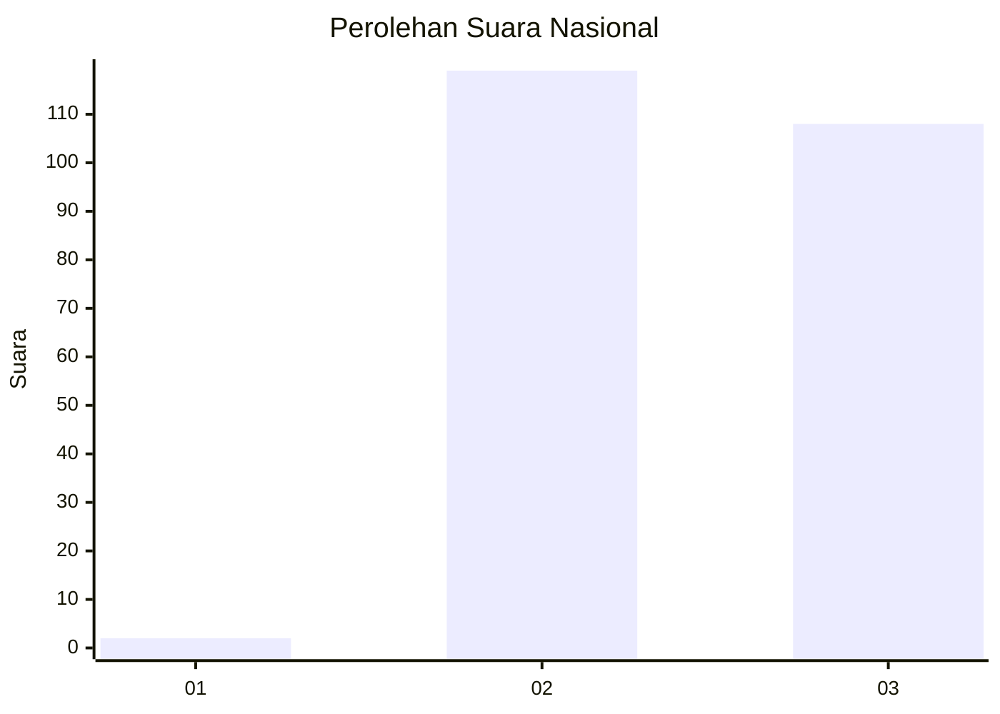
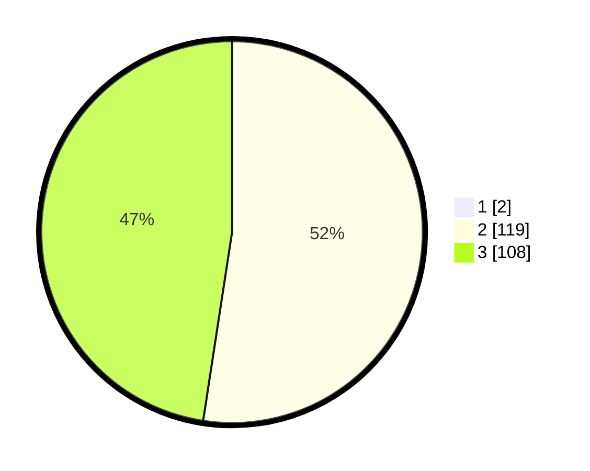

# Hasil

## Grafik

## Tabel

| No. | Nama Paslon    | Suara | Suara (raw) | Persentase |
|:--- |:-------------- | -----:| -----------:| ----------:|
| 1   | ANIES MUHAIMIN | 2     | [2][p-1]    | 0,87       |
| 2   | PRABOWO GIBRAN | 119   | [119][p-2]  | 51,97      |
| 3   | GANJAR MAHFUD  | 108   | [108][p-3]  | 47,16      |

[p-1]: https://github.com/gigit-pemilu/pemilu-2024/blob/main/pilpres/hitung-suara/sub/51-bali/sub/02-tabanan/sub/09-baturiti/sub/2001-perean/sub/005-tps/sub/paslon-1.txt
[p-2]: https://github.com/gigit-pemilu/pemilu-2024/blob/main/pilpres/hitung-suara/sub/51-bali/sub/02-tabanan/sub/09-baturiti/sub/2001-perean/sub/005-tps/sub/paslon-2.txt
[p-3]: https://github.com/gigit-pemilu/pemilu-2024/blob/main/pilpres/hitung-suara/sub/51-bali/sub/02-tabanan/sub/09-baturiti/sub/2001-perean/sub/005-tps/sub/paslon-3.txt

## Foto C Plano

https://sirekap-obj-formc.kpu.go.id/aaef/pemilu/ppwp/51/02/09/20/01/5102092001005-20240216-072406--899b16a3-a954-401b-b442-4a49d4a00e77.jpg

https://sirekap-obj-formc.kpu.go.id/aaef/pemilu/ppwp/51/02/09/20/01/5102092001005-20240216-072420--e32a3adc-234d-422f-bc39-a63c78170c2b.jpg

https://sirekap-obj-formc.kpu.go.id/aaef/pemilu/ppwp/51/02/09/20/01/5102092001005-20240217-010356--fd273f1c-24ad-4f61-9ce6-464086699c7d.jpg

## Metadata

| Key        | Value               |
| ---------- | ------------------- |
| Time Stamp | 2024-02-17 01:07:28 |

## DATA PEMILIH TETAP

Jumlah pemilih dalam DPT: **272**.
 * L: **137**.
 * P: **135**.

## DATA PENGGUNA HAK PILIH

Jumlah pengguna hak pilih dalam DPT: **234**.
 * L: **117**.
 * P: **117**.

Jumlah pengguna hak pilih dalam DPTb: **3**.
 * L: **2**.
 * P: **1**.

Jumlah pengguna hak pilih dalam DPK: **0**.
 * L: **0**.
 * P: **0**.

Jumlah pengguna hak pilih: **237**.
 * L: **119**.
 * P: **118**.

## JUMLAH SUARA SAH DAN TIDAK SAH

JUMLAH SELURUH SUARA SAH: **229**.

JUMLAH SUARA TIDAK SAH: **8**.

JUMLAH SELURUH SUARA SAH DAN SUARA TIDAK SAH: **237**.

