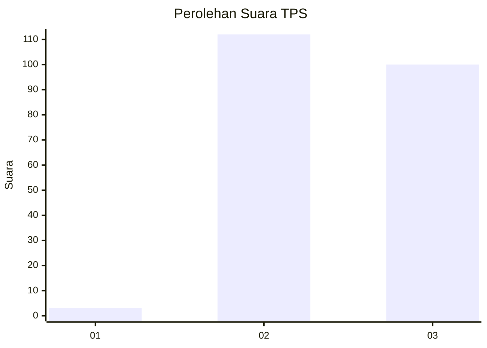
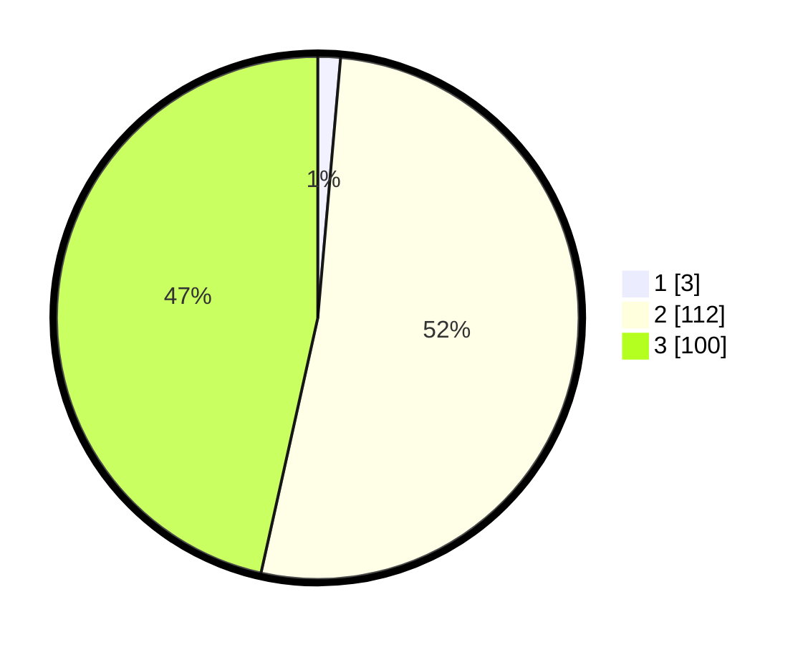

# Hasil

## Grafik

## Tabel

| No. | Nama Paslon    | Suara | Suara (raw) | Persentase |
|:--- |:-------------- | -----:| -----------:| ----------:|
| 1   | ANIES MUHAIMIN | 3     | [3][p-1]    | 1,40       |
| 2   | PRABOWO GIBRAN | 112   | [112][p-2]  | 52,09      |
| 3   | GANJAR MAHFUD  | 100   | [100][p-3]  | 46,51      |

[p-1]: https://github.com/gigit-pemilu/pemilu-2024-51-bali/blob/main/pilpres/hitung-suara/sub/51-bali/sub/02-tabanan/sub/09-baturiti/sub/2001-perean/sub/006-tps/sub/paslon-1.txt
[p-2]: https://github.com/gigit-pemilu/pemilu-2024-51-bali/blob/main/pilpres/hitung-suara/sub/51-bali/sub/02-tabanan/sub/09-baturiti/sub/2001-perean/sub/006-tps/sub/paslon-2.txt
[p-3]: https://github.com/gigit-pemilu/pemilu-2024-51-bali/blob/main/pilpres/hitung-suara/sub/51-bali/sub/02-tabanan/sub/09-baturiti/sub/2001-perean/sub/006-tps/sub/paslon-3.txt

## Foto C Plano

https://sirekap-obj-formc.kpu.go.id/26bc/pemilu/ppwp/51/02/09/20/01/5102092001006-20240215-162622--ae43c411-c4ea-43f0-968b-4bbfde3252fe.jpg

https://sirekap-obj-formc.kpu.go.id/26bc/pemilu/ppwp/51/02/09/20/01/5102092001006-20240215-162929--82a6916e-e8b6-41e2-a80c-3204a8d88212.jpg

https://sirekap-obj-formc.kpu.go.id/26bc/pemilu/ppwp/51/02/09/20/01/5102092001006-20240215-163138--8ed326ab-3cc2-4b10-a1b7-c4835c0cc0be.jpg

## Metadata

| Key        | Value               |
| ---------- | ------------------- |
| Time Stamp | 2024-02-15 23:29:50 |

