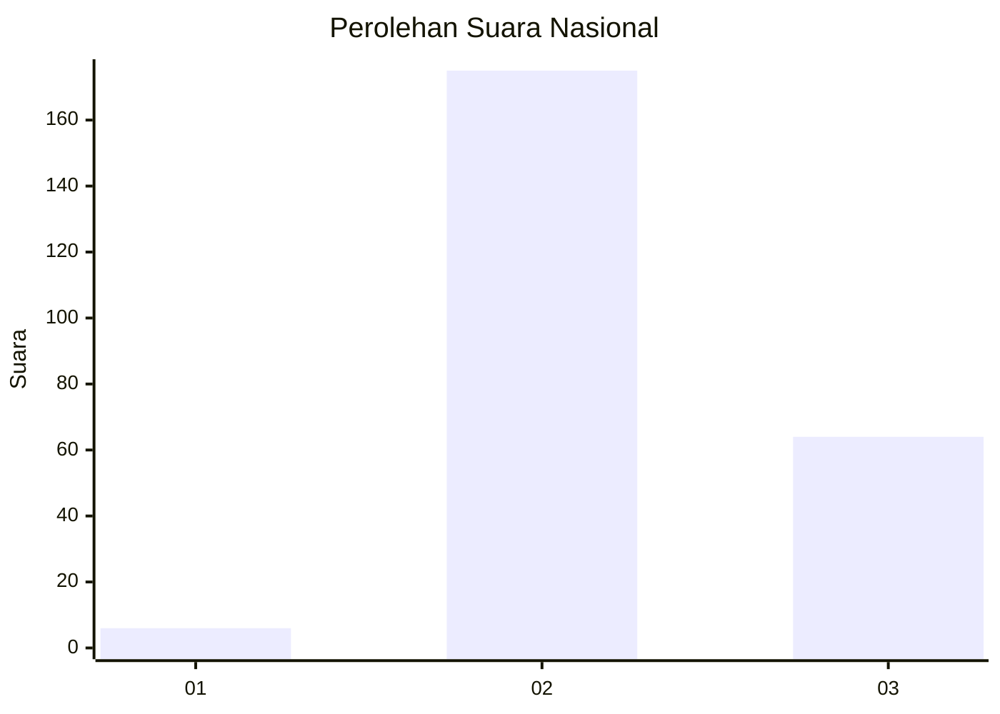
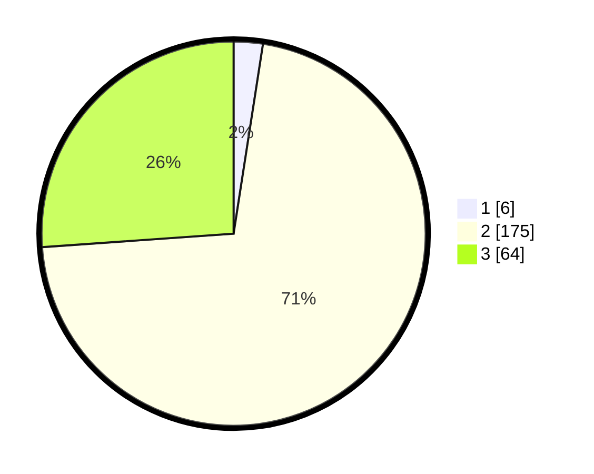

# Hasil

## Grafik

## Tabel

| No. | Nama Paslon    | Suara | Suara (raw) | Persentase |
|:--- |:-------------- | -----:| -----------:| ----------:|
| 1   | ANIES MUHAIMIN | 6     | [6][p-1]    | 2,45       |
| 2   | PRABOWO GIBRAN | 175   | [175][p-2]  | 71,43      |
| 3   | GANJAR MAHFUD  | 64    | [64][p-3]   | 26,12      |

[p-1]: https://github.com/gigit-pemilu/pemilu-2024/blob/main/pilpres/hitung-suara/sub/51-bali/sub/02-tabanan/sub/09-baturiti/sub/2002-luwus/sub/006-tps/sub/paslon-1.txt
[p-2]: https://github.com/gigit-pemilu/pemilu-2024/blob/main/pilpres/hitung-suara/sub/51-bali/sub/02-tabanan/sub/09-baturiti/sub/2002-luwus/sub/006-tps/sub/paslon-2.txt
[p-3]: https://github.com/gigit-pemilu/pemilu-2024/blob/main/pilpres/hitung-suara/sub/51-bali/sub/02-tabanan/sub/09-baturiti/sub/2002-luwus/sub/006-tps/sub/paslon-3.txt

## Foto C Plano

https://sirekap-obj-formc.kpu.go.id/9f49/pemilu/ppwp/51/02/09/20/02/5102092002006-20240215-223056--0ed122f7-a7d1-4e8d-84c1-1ef645b58f13.jpg

https://sirekap-obj-formc.kpu.go.id/9f49/pemilu/ppwp/51/02/09/20/02/5102092002006-20240216-082906--1baf6dad-0f01-45e3-af8a-db5c179744bb.jpg

https://sirekap-obj-formc.kpu.go.id/9f49/pemilu/ppwp/51/02/09/20/02/5102092002006-20240215-223653--32c517f7-b73b-4134-bf52-3332515857af.jpg

## Metadata

| Key        | Value               |
| ---------- | ------------------- |
| Time Stamp | 2024-02-16 16:25:10 |

## DATA PEMILIH TETAP

Jumlah pemilih dalam DPT: **293**.
 * L: **139**.
 * P: **154**.

## DATA PENGGUNA HAK PILIH

Jumlah pengguna hak pilih dalam DPT: **246**.
 * L: **120**.
 * P: **126**.

Jumlah pengguna hak pilih dalam DPTb: **6**.
 * L: **3**.
 * P: **3**.

Jumlah pengguna hak pilih dalam DPK: **4**.
 * L: **3**.
 * P: **1**.

Jumlah pengguna hak pilih: **256**.
 * L: **126**.
 * P: **130**.

## JUMLAH SUARA SAH DAN TIDAK SAH

JUMLAH SELURUH SUARA SAH: **245**.

JUMLAH SUARA TIDAK SAH: **11**.

JUMLAH SELURUH SUARA SAH DAN SUARA TIDAK SAH: **256**.

