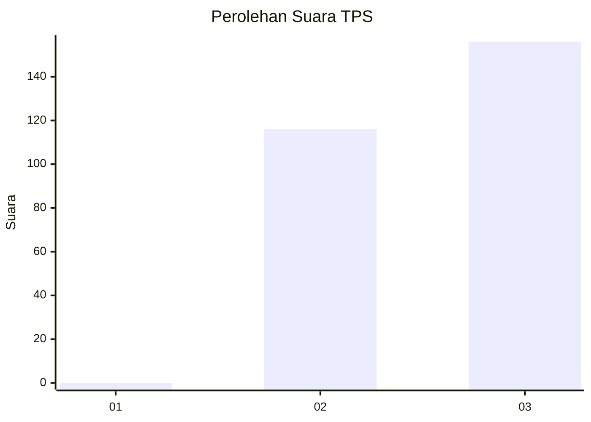
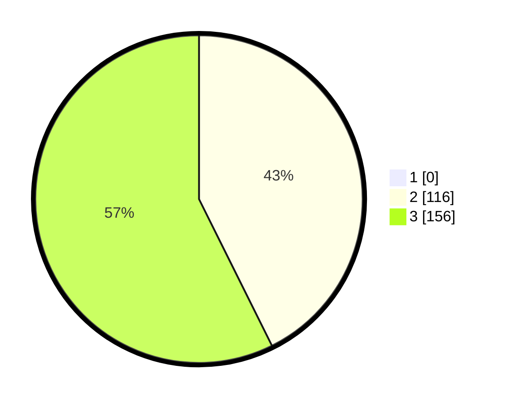

# Hasil

## Grafik

## Tabel

| No. | Nama Paslon    | Suara | Suara (raw) | Persentase |
|:--- |:-------------- | -----:| -----------:| ----------:|
| 1   | ANIES MUHAIMIN | 0     | [0][p-1]    | 0,00       |
| 2   | PRABOWO GIBRAN | 116   | [116][p-2]  | 42,65      |
| 3   | GANJAR MAHFUD  | 156   | [156][p-3]  | 57,35      |

[p-1]: https://github.com/gigit-pemilu/pemilu-2024-51-bali/blob/main/pilpres/hitung-suara/sub/51-bali/sub/02-tabanan/sub/09-baturiti/sub/2002-luwus/sub/007-tps/sub/paslon-1.txt
[p-2]: https://github.com/gigit-pemilu/pemilu-2024-51-bali/blob/main/pilpres/hitung-suara/sub/51-bali/sub/02-tabanan/sub/09-baturiti/sub/2002-luwus/sub/007-tps/sub/paslon-2.txt
[p-3]: https://github.com/gigit-pemilu/pemilu-2024-51-bali/blob/main/pilpres/hitung-suara/sub/51-bali/sub/02-tabanan/sub/09-baturiti/sub/2002-luwus/sub/007-tps/sub/paslon-3.txt

## Foto C Plano

https://sirekap-obj-formc.kpu.go.id/01e4/pemilu/ppwp/51/02/09/20/02/5102092002007-20240216-205933--5d64b12f-3e74-42fd-bca2-8295442f3550.jpg

https://sirekap-obj-formc.kpu.go.id/01e4/pemilu/ppwp/51/02/09/20/02/5102092002007-20240216-205935--9d1aea01-6567-4105-b21c-585166eb1bed.jpg

https://sirekap-obj-formc.kpu.go.id/01e4/pemilu/ppwp/51/02/09/20/02/5102092002007-20240216-205934--84d24075-90a8-4199-9a71-5bb340f7fba9.jpg

## Metadata

| Key        | Value               |
| ---------- | ------------------- |
| Time Stamp | 2024-02-21 14:00:00 |

## DATA PEMILIH TETAP

Jumlah pemilih dalam DPT: **287**.
 * L: **143**.
 * P: **144**.

## DATA PENGGUNA HAK PILIH

Jumlah pengguna hak pilih dalam DPT: **267**.
 * L: **138**.
 * P: **129**.

Jumlah pengguna hak pilih dalam DPTb: **0**.
 * L: **0**.
 * P: **0**.

Jumlah pengguna hak pilih dalam DPK: **5**.
 * L: **1**.
 * P: **4**.

Jumlah pengguna hak pilih: **272**.
 * L: **139**.
 * P: **133**.

## JUMLAH SUARA SAH DAN TIDAK SAH

JUMLAH SELURUH SUARA SAH: **272**.

JUMLAH SUARA TIDAK SAH: **0**.

JUMLAH SELURUH SUARA SAH DAN SUARA TIDAK SAH: **272**.

