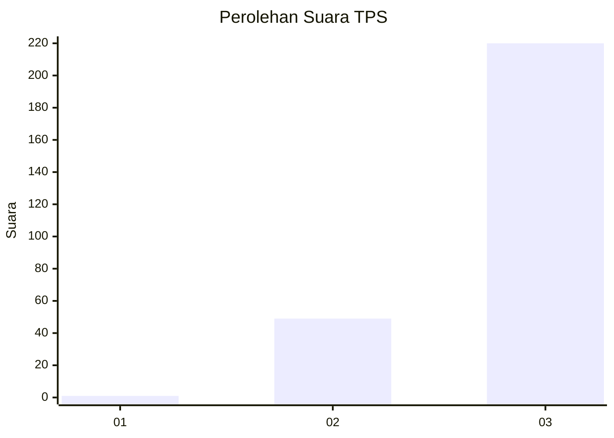
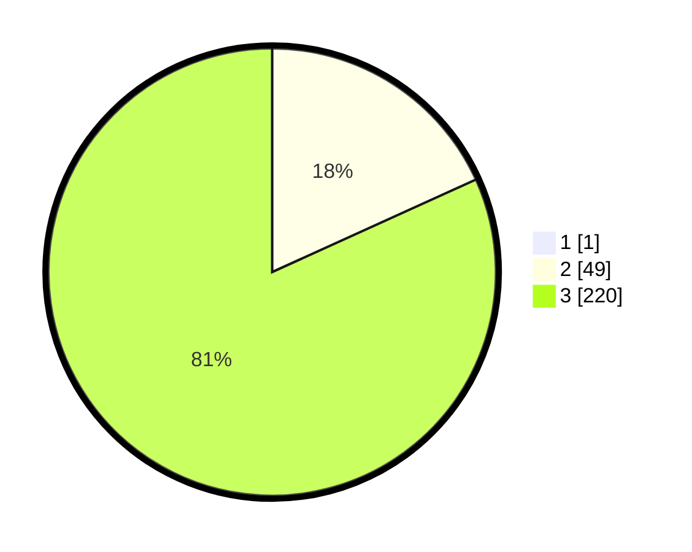

# Hasil

## Grafik

## Tabel

| No. | Nama Paslon    | Suara | Suara (raw) | Persentase |
|:--- |:-------------- | -----:| -----------:| ----------:|
| 1   | ANIES MUHAIMIN | 1     | [1][p-1]    | 0,37       |
| 2   | PRABOWO GIBRAN | 49    | [49][p-2]   | 18,15      |
| 3   | GANJAR MAHFUD  | 220   | [220][p-3]  | 81,48      |

[p-1]: https://github.com/gigit-pemilu/pemilu-2024-51-bali/blob/main/pilpres/hitung-suara/sub/51-bali/sub/02-tabanan/sub/09-baturiti/sub/2002-luwus/sub/008-tps/sub/paslon-1.txt
[p-2]: https://github.com/gigit-pemilu/pemilu-2024-51-bali/blob/main/pilpres/hitung-suara/sub/51-bali/sub/02-tabanan/sub/09-baturiti/sub/2002-luwus/sub/008-tps/sub/paslon-2.txt
[p-3]: https://github.com/gigit-pemilu/pemilu-2024-51-bali/blob/main/pilpres/hitung-suara/sub/51-bali/sub/02-tabanan/sub/09-baturiti/sub/2002-luwus/sub/008-tps/sub/paslon-3.txt

## Foto C Plano

https://sirekap-obj-formc.kpu.go.id/8fd5/pemilu/ppwp/51/02/09/20/02/5102092002008-20240215-134610--9f2053f4-e3d5-4fec-82cd-d7843dac8422.jpg

https://sirekap-obj-formc.kpu.go.id/8fd5/pemilu/ppwp/51/02/09/20/02/5102092002008-20240215-143230--ef3ce7d8-c246-404e-9bd3-79b0e7cbcf9d.jpg

https://sirekap-obj-formc.kpu.go.id/8fd5/pemilu/ppwp/51/02/09/20/02/5102092002008-20240216-165003--92083596-7c8a-4689-829d-2d6e007a6a9a.jpg

## Metadata

| Key        | Value               |
| ---------- | ------------------- |
| Time Stamp | 2024-02-16 17:30:00 |

