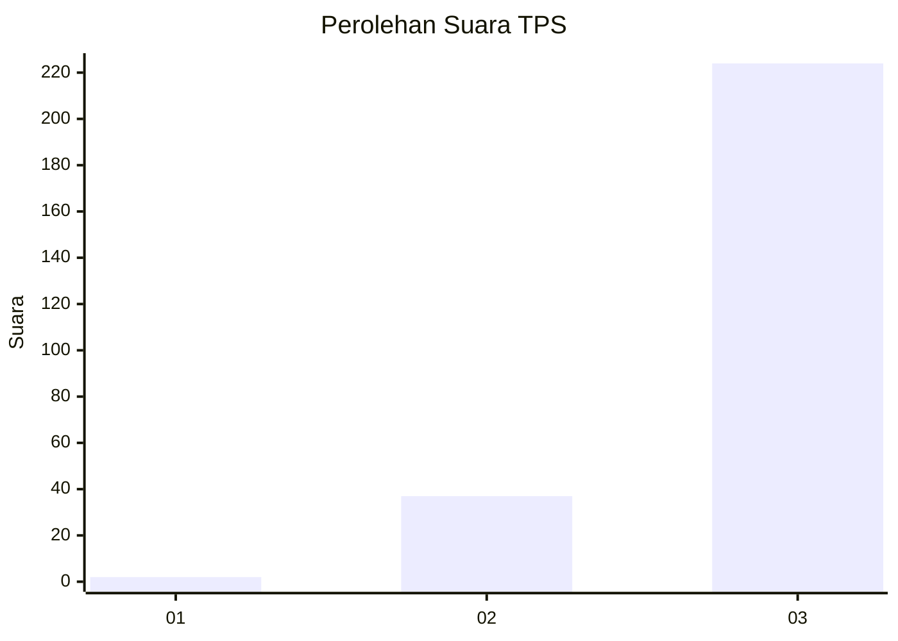
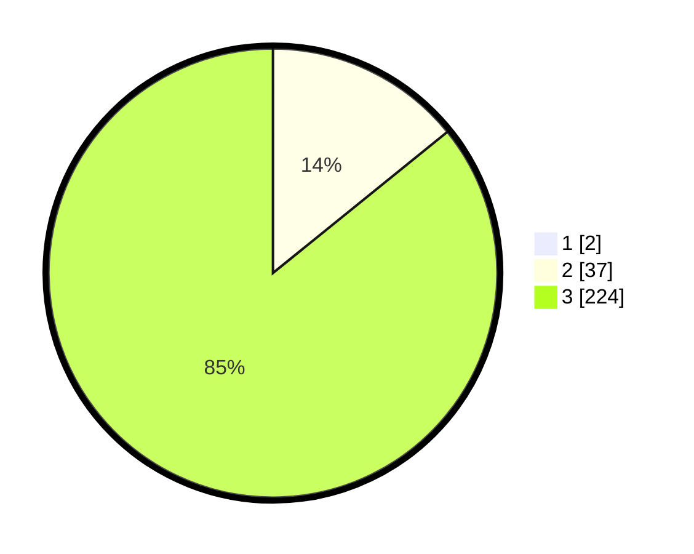

# Hasil

## Grafik

## Tabel

| No. | Nama Paslon    | Suara | Suara (raw) | Persentase |
|:--- |:-------------- | -----:| -----------:| ----------:|
| 1   | ANIES MUHAIMIN | 2     | [2][p-1]    | 0,76       |
| 2   | PRABOWO GIBRAN | 37    | [37][p-2]   | 14,07      |
| 3   | GANJAR MAHFUD  | 224   | [224][p-3]  | 85,17      |

[p-1]: https://github.com/gigit-pemilu/pemilu-2024-51-bali/blob/main/pilpres/hitung-suara/sub/51-bali/sub/02-tabanan/sub/09-baturiti/sub/2002-luwus/sub/009-tps/sub/paslon-1.txt
[p-2]: https://github.com/gigit-pemilu/pemilu-2024-51-bali/blob/main/pilpres/hitung-suara/sub/51-bali/sub/02-tabanan/sub/09-baturiti/sub/2002-luwus/sub/009-tps/sub/paslon-2.txt
[p-3]: https://github.com/gigit-pemilu/pemilu-2024-51-bali/blob/main/pilpres/hitung-suara/sub/51-bali/sub/02-tabanan/sub/09-baturiti/sub/2002-luwus/sub/009-tps/sub/paslon-3.txt

## Foto C Plano

https://sirekap-obj-formc.kpu.go.id/f262/pemilu/ppwp/51/02/09/20/02/5102092002009-20240215-194115--77681d11-2c8d-4e7f-83e4-9b0ae27b3f65.jpg

https://sirekap-obj-formc.kpu.go.id/f262/pemilu/ppwp/51/02/09/20/02/5102092002009-20240215-194120--47e06703-d70c-4001-ae2e-f52a0482d02b.jpg

https://sirekap-obj-formc.kpu.go.id/f262/pemilu/ppwp/51/02/09/20/02/5102092002009-20240215-194143--293afc66-5399-4d75-b01d-0a408c126f4f.jpg

## Metadata

| Key        | Value               |
| ---------- | ------------------- |
| Time Stamp | 2024-02-25 16:00:00 |

