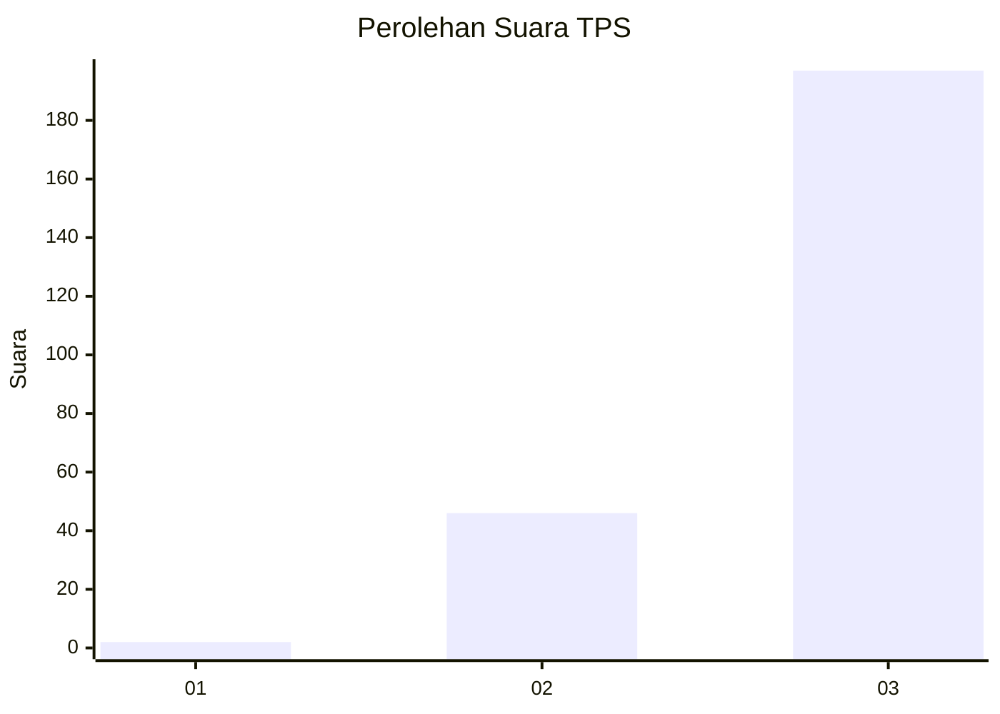
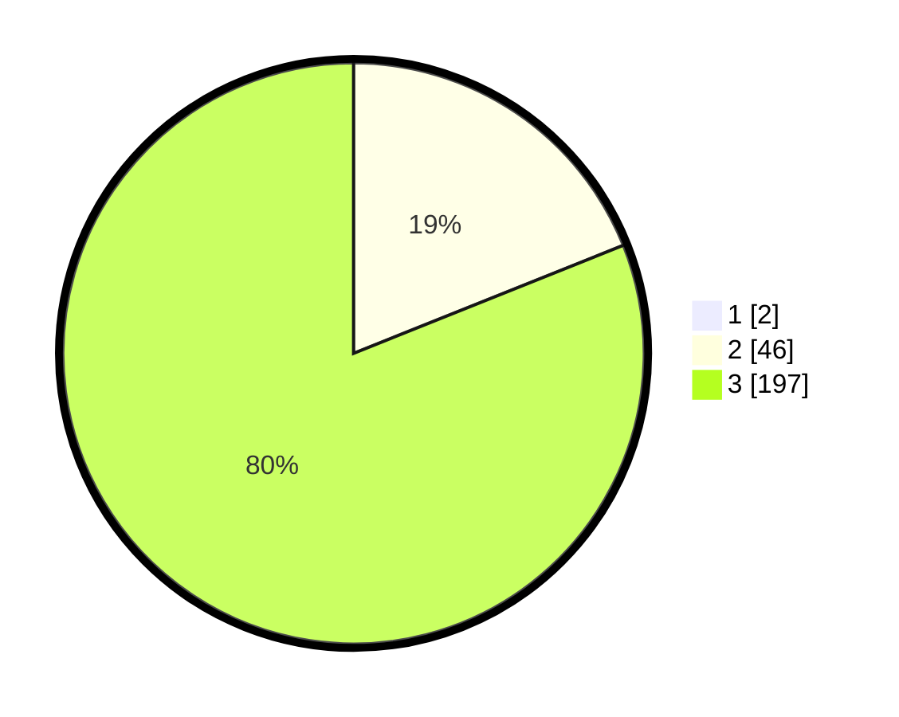

# Hasil

## Grafik

## Tabel

| No. | Nama Paslon    | Suara | Suara (raw) | Persentase |
|:--- |:-------------- | -----:| -----------:| ----------:|
| 1   | ANIES MUHAIMIN | 2     | [2][p-1]    | 0,82       |
| 2   | PRABOWO GIBRAN | 46    | [46][p-2]   | 18,78      |
| 3   | GANJAR MAHFUD  | 197   | [197][p-3]  | 80,41      |

[p-1]: https://github.com/gigit-pemilu/pemilu-2024-51-bali/blob/main/pilpres/hitung-suara/sub/51-bali/sub/02-tabanan/sub/09-baturiti/sub/2002-luwus/sub/010-tps/sub/paslon-1.txt
[p-2]: https://github.com/gigit-pemilu/pemilu-2024-51-bali/blob/main/pilpres/hitung-suara/sub/51-bali/sub/02-tabanan/sub/09-baturiti/sub/2002-luwus/sub/010-tps/sub/paslon-2.txt
[p-3]: https://github.com/gigit-pemilu/pemilu-2024-51-bali/blob/main/pilpres/hitung-suara/sub/51-bali/sub/02-tabanan/sub/09-baturiti/sub/2002-luwus/sub/010-tps/sub/paslon-3.txt

## Foto C Plano

https://sirekap-obj-formc.kpu.go.id/e6a2/pemilu/ppwp/51/02/09/20/02/5102092002010-20240215-193227--5d7b47ba-e977-45d1-a1b6-6bc6bae005ff.jpg

https://sirekap-obj-formc.kpu.go.id/e6a2/pemilu/ppwp/51/02/09/20/02/5102092002010-20240215-193234--a7beea91-f3b7-4791-b270-d148388ed0a2.jpg

https://sirekap-obj-formc.kpu.go.id/e6a2/pemilu/ppwp/51/02/09/20/02/5102092002010-20240216-190437--d54f20bd-7870-4009-b48d-f4f77d73d84d.jpg

## Metadata

| Key        | Value               |
| ---------- | ------------------- |
| Time Stamp | 2024-02-16 21:01:00 |

## DATA PEMILIH TETAP

Jumlah pemilih dalam DPT: **272**.
 * L: **127**.
 * P: **145**.

## DATA PENGGUNA HAK PILIH

Jumlah pengguna hak pilih dalam DPT: **244**.
 * L: **118**.
 * P: **126**.

Jumlah pengguna hak pilih dalam DPTb: **1**.
 * L: **0**.
 * P: **1**.

Jumlah pengguna hak pilih dalam DPK: **4**.
 * L: **2**.
 * P: **2**.

Jumlah pengguna hak pilih: **249**.
 * L: **120**.
 * P: **129**.

## JUMLAH SUARA SAH DAN TIDAK SAH

JUMLAH SELURUH SUARA SAH: **245**.

JUMLAH SUARA TIDAK SAH: **4**.

JUMLAH SELURUH SUARA SAH DAN SUARA TIDAK SAH: **249**.

