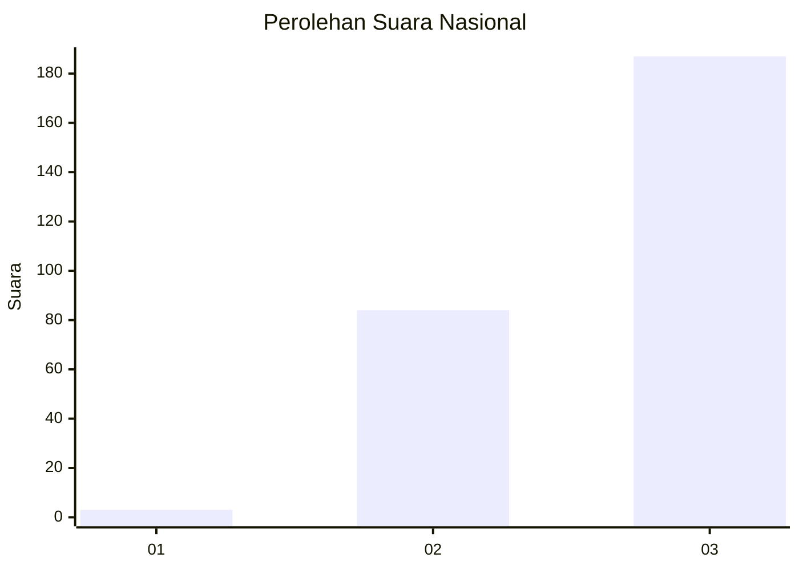
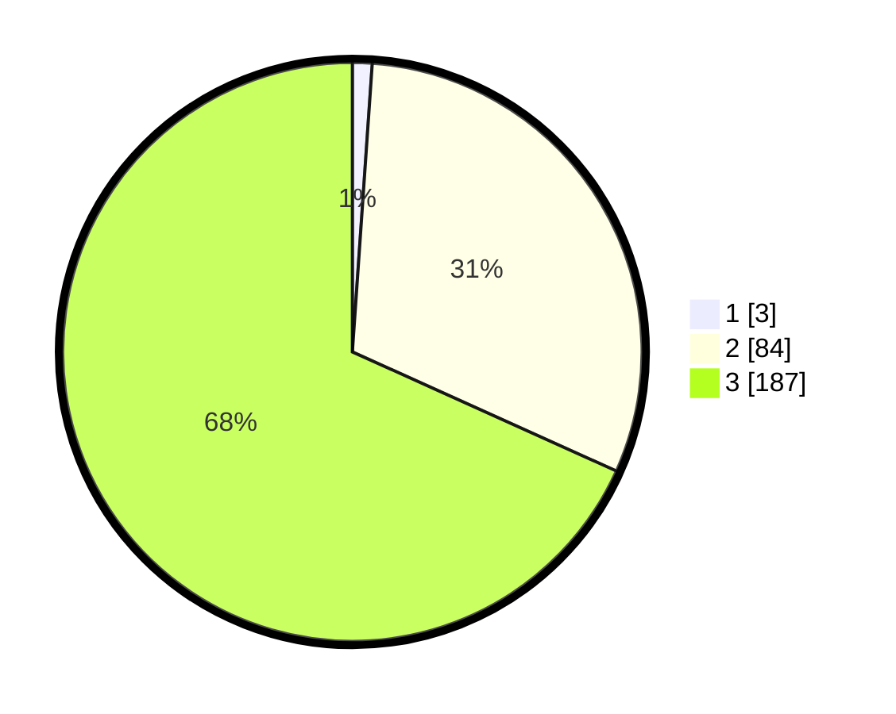

# Hasil

## Grafik

## Tabel

| No. | Nama Paslon    | Suara | Suara (raw) | Persentase |
|:--- |:-------------- | -----:| -----------:| ----------:|
| 1   | ANIES MUHAIMIN | 3     | [3][p-1]    | 1,09       |
| 2   | PRABOWO GIBRAN | 84    | [84][p-2]   | 30,66      |
| 3   | GANJAR MAHFUD  | 187   | [187][p-3]  | 68,25      |

[p-1]: https://github.com/gigit-pemilu/pemilu-2024/blob/main/pilpres/hitung-suara/sub/51-bali/sub/02-tabanan/sub/09-baturiti/sub/2002-luwus/sub/011-tps/sub/paslon-1.txt
[p-2]: https://github.com/gigit-pemilu/pemilu-2024/blob/main/pilpres/hitung-suara/sub/51-bali/sub/02-tabanan/sub/09-baturiti/sub/2002-luwus/sub/011-tps/sub/paslon-2.txt
[p-3]: https://github.com/gigit-pemilu/pemilu-2024/blob/main/pilpres/hitung-suara/sub/51-bali/sub/02-tabanan/sub/09-baturiti/sub/2002-luwus/sub/011-tps/sub/paslon-3.txt

## Foto C Plano

https://sirekap-obj-formc.kpu.go.id/cd02/pemilu/ppwp/51/02/09/20/02/5102092002011-20240214-210259--b98c06ec-71f0-4dc4-984d-ad0755f20f7a.jpg

https://sirekap-obj-formc.kpu.go.id/cd02/pemilu/ppwp/51/02/09/20/02/5102092002011-20240214-210307--02df7a79-5f38-4322-a062-da563b2ea3ce.jpg

https://sirekap-obj-formc.kpu.go.id/cd02/pemilu/ppwp/51/02/09/20/02/5102092002011-20240215-221911--d9af3754-f488-4fdc-801f-ec08fe8504b4.jpg

## Metadata

| Key        | Value               |
| ---------- | ------------------- |
| Time Stamp | 2024-02-15 22:30:27 |

