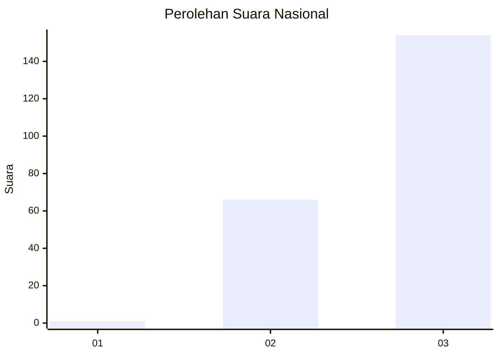
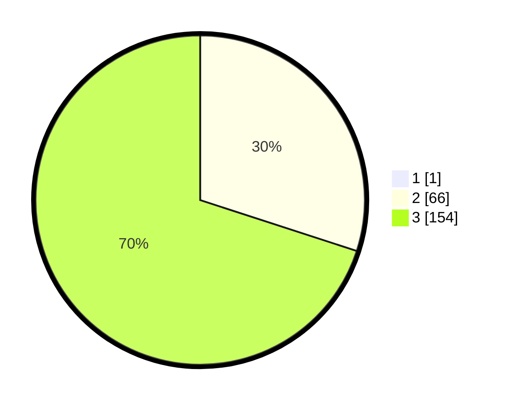

# Hasil

## Grafik

## Tabel

| No. | Nama Paslon    | Suara | Suara (raw) | Persentase |
|:--- |:-------------- | -----:| -----------:| ----------:|
| 1   | ANIES MUHAIMIN | 1     | [1][p-1]    | 0,45       |
| 2   | PRABOWO GIBRAN | 66    | [66][p-2]   | 29,86      |
| 3   | GANJAR MAHFUD  | 154   | [154][p-3]  | 69,68      |

[p-1]: https://github.com/gigit-pemilu/pemilu-2024/blob/main/pilpres/hitung-suara/sub/51-bali/sub/02-tabanan/sub/09-baturiti/sub/2003-apuan/sub/002-tps/sub/paslon-1.txt
[p-2]: https://github.com/gigit-pemilu/pemilu-2024/blob/main/pilpres/hitung-suara/sub/51-bali/sub/02-tabanan/sub/09-baturiti/sub/2003-apuan/sub/002-tps/sub/paslon-2.txt
[p-3]: https://github.com/gigit-pemilu/pemilu-2024/blob/main/pilpres/hitung-suara/sub/51-bali/sub/02-tabanan/sub/09-baturiti/sub/2003-apuan/sub/002-tps/sub/paslon-3.txt

## Foto C Plano

https://sirekap-obj-formc.kpu.go.id/d988/pemilu/ppwp/51/02/09/20/03/5102092003002-20240216-145321--e2e2ef99-d90a-4e87-8c1a-328ca7310829.jpg

https://sirekap-obj-formc.kpu.go.id/d988/pemilu/ppwp/51/02/09/20/03/5102092003002-20240216-145323--388a7b4c-2b9e-43f6-8dda-6d9566a2e6d1.jpg

https://sirekap-obj-formc.kpu.go.id/d988/pemilu/ppwp/51/02/09/20/03/5102092003002-20240216-145322--b1f6b5f1-390b-4d48-88e6-1107df47082f.jpg

## Metadata

| Key        | Value               |
| ---------- | ------------------- |
| Time Stamp | 2024-02-22 09:00:00 |

## DATA PEMILIH TETAP

Jumlah pemilih dalam DPT: **242**.
 * L: **122**.
 * P: **120**.

## DATA PENGGUNA HAK PILIH

Jumlah pengguna hak pilih dalam DPT: **220**.
 * L: **109**.
 * P: **111**.

Jumlah pengguna hak pilih dalam DPTb: **2**.
 * L: **0**.
 * P: **2**.

Jumlah pengguna hak pilih dalam DPK: **1**.
 * L: **1**.
 * P: **0**.

Jumlah pengguna hak pilih: **223**.
 * L: **110**.
 * P: **113**.

## JUMLAH SUARA SAH DAN TIDAK SAH

JUMLAH SELURUH SUARA SAH: **218**.

JUMLAH SUARA TIDAK SAH: **5**.

JUMLAH SELURUH SUARA SAH DAN SUARA TIDAK SAH: **223**.

