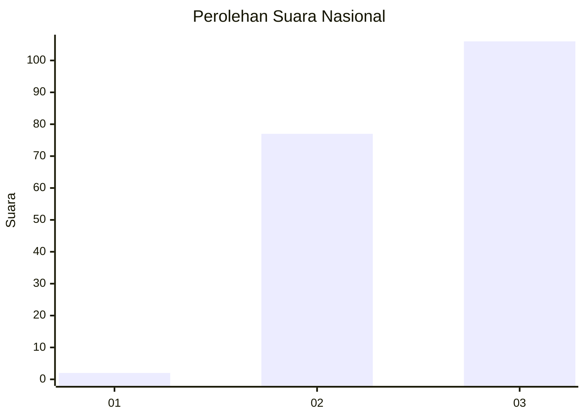
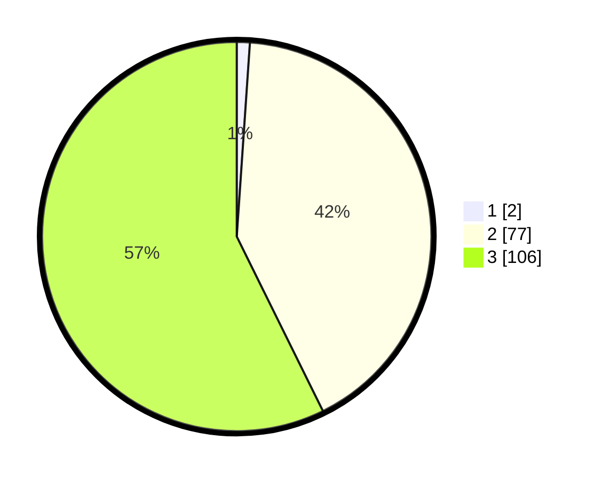

# Hasil

## Grafik

## Tabel

| No. | Nama Paslon    | Suara | Suara (raw) | Persentase |
|:--- |:-------------- | -----:| -----------:| ----------:|
| 1   | ANIES MUHAIMIN | 2     | [2][p-1]    | 1,08       |
| 2   | PRABOWO GIBRAN | 77    | [77][p-2]   | 41,62      |
| 3   | GANJAR MAHFUD  | 106   | [106][p-3]  | 57,30      |

[p-1]: https://github.com/gigit-pemilu/pemilu-2024/blob/main/pilpres/hitung-suara/sub/51-bali/sub/02-tabanan/sub/09-baturiti/sub/2003-apuan/sub/010-tps/sub/paslon-1.txt
[p-2]: https://github.com/gigit-pemilu/pemilu-2024/blob/main/pilpres/hitung-suara/sub/51-bali/sub/02-tabanan/sub/09-baturiti/sub/2003-apuan/sub/010-tps/sub/paslon-2.txt
[p-3]: https://github.com/gigit-pemilu/pemilu-2024/blob/main/pilpres/hitung-suara/sub/51-bali/sub/02-tabanan/sub/09-baturiti/sub/2003-apuan/sub/010-tps/sub/paslon-3.txt

## Foto C Plano

https://sirekap-obj-formc.kpu.go.id/0fec/pemilu/ppwp/51/02/09/20/03/5102092003010-20240216-082016--bcda4a0e-195b-4607-8a22-8a089c2891bd.jpg

https://sirekap-obj-formc.kpu.go.id/0fec/pemilu/ppwp/51/02/09/20/03/5102092003010-20240216-082029--1ab68af8-5f66-41cb-b9d3-6372cf29e374.jpg

https://sirekap-obj-formc.kpu.go.id/0fec/pemilu/ppwp/51/02/09/20/03/5102092003010-20240216-082023--4eb11867-8f34-42eb-8e93-f5e50f78623d.jpg

## Metadata

| Key        | Value               |
| ---------- | ------------------- |
| Time Stamp | 2024-02-16 16:25:10 |

## DATA PEMILIH TETAP

Jumlah pemilih dalam DPT: **240**.
 * L: **120**.
 * P: **120**.

## DATA PENGGUNA HAK PILIH

Jumlah pengguna hak pilih dalam DPT: **189**.
 * L: **96**.
 * P: **93**.

Jumlah pengguna hak pilih dalam DPTb: **0**.
 * L: **0**.
 * P: **0**.

Jumlah pengguna hak pilih dalam DPK: **0**.
 * L: **0**.
 * P: **0**.

Jumlah pengguna hak pilih: **189**.
 * L: **96**.
 * P: **93**.

## JUMLAH SUARA SAH DAN TIDAK SAH

JUMLAH SELURUH SUARA SAH: **185**.

JUMLAH SUARA TIDAK SAH: **4**.

JUMLAH SELURUH SUARA SAH DAN SUARA TIDAK SAH: **189**.

