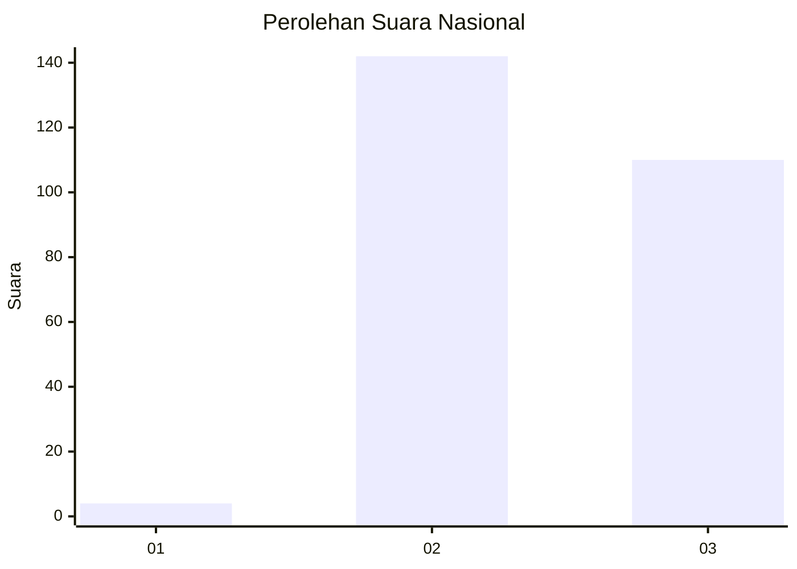
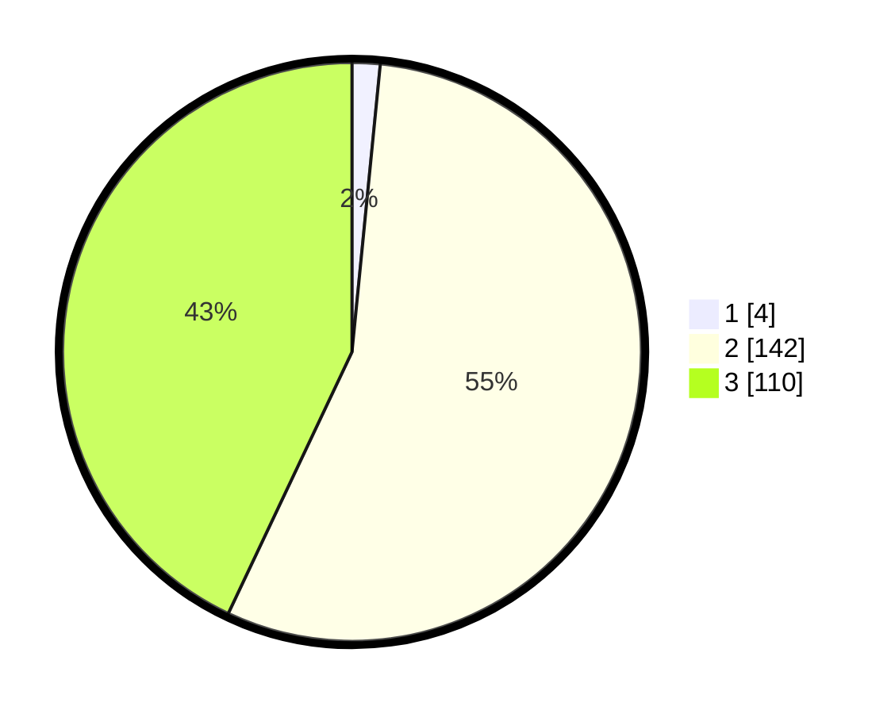

# Hasil

## Grafik

## Tabel

| No. | Nama Paslon    | Suara | Suara (raw) | Persentase |
|:--- |:-------------- | -----:| -----------:| ----------:|
| 1   | ANIES MUHAIMIN | 4     | [4][p-1]    | 1,56       |
| 2   | PRABOWO GIBRAN | 142   | [142][p-2]  | 55,47      |
| 3   | GANJAR MAHFUD  | 110   | [110][p-3]  | 42,97      |

[p-1]: https://github.com/gigit-pemilu/pemilu-2024/blob/main/pilpres/hitung-suara/sub/51-bali/sub/02-tabanan/sub/09-baturiti/sub/2003-apuan/sub/012-tps/sub/paslon-1.txt
[p-2]: https://github.com/gigit-pemilu/pemilu-2024/blob/main/pilpres/hitung-suara/sub/51-bali/sub/02-tabanan/sub/09-baturiti/sub/2003-apuan/sub/012-tps/sub/paslon-2.txt
[p-3]: https://github.com/gigit-pemilu/pemilu-2024/blob/main/pilpres/hitung-suara/sub/51-bali/sub/02-tabanan/sub/09-baturiti/sub/2003-apuan/sub/012-tps/sub/paslon-3.txt

## Foto C Plano

https://sirekap-obj-formc.kpu.go.id/1c4c/pemilu/ppwp/51/02/09/20/03/5102092003012-20240216-151000--edce8ae4-7eef-4783-8da3-7d298b523719.jpg

https://sirekap-obj-formc.kpu.go.id/1c4c/pemilu/ppwp/51/02/09/20/03/5102092003012-20240216-151001--5bd6c372-d982-4938-b6fe-c2b8b9c05fbd.jpg

https://sirekap-obj-formc.kpu.go.id/1c4c/pemilu/ppwp/51/02/09/20/03/5102092003012-20240216-151001--4139a4ab-589d-4d07-84ed-97df35e9464d.jpg

## Metadata

| Key        | Value               |
| ---------- | ------------------- |
| Time Stamp | 2024-02-24 22:31:28 |

## DATA PEMILIH TETAP

Jumlah pemilih dalam DPT: **291**.
 * L: **142**.
 * P: **149**.

## DATA PENGGUNA HAK PILIH

Jumlah pengguna hak pilih dalam DPT: **258**.
 * L: **128**.
 * P: **130**.

Jumlah pengguna hak pilih dalam DPTb: **1**.
 * L: **0**.
 * P: **1**.

Jumlah pengguna hak pilih dalam DPK: **0**.
 * L: **0**.
 * P: **0**.

Jumlah pengguna hak pilih: **259**.
 * L: **128**.
 * P: **131**.

## JUMLAH SUARA SAH DAN TIDAK SAH

JUMLAH SELURUH SUARA SAH: **256**.

JUMLAH SUARA TIDAK SAH: **3**.

JUMLAH SELURUH SUARA SAH DAN SUARA TIDAK SAH: **259**.

