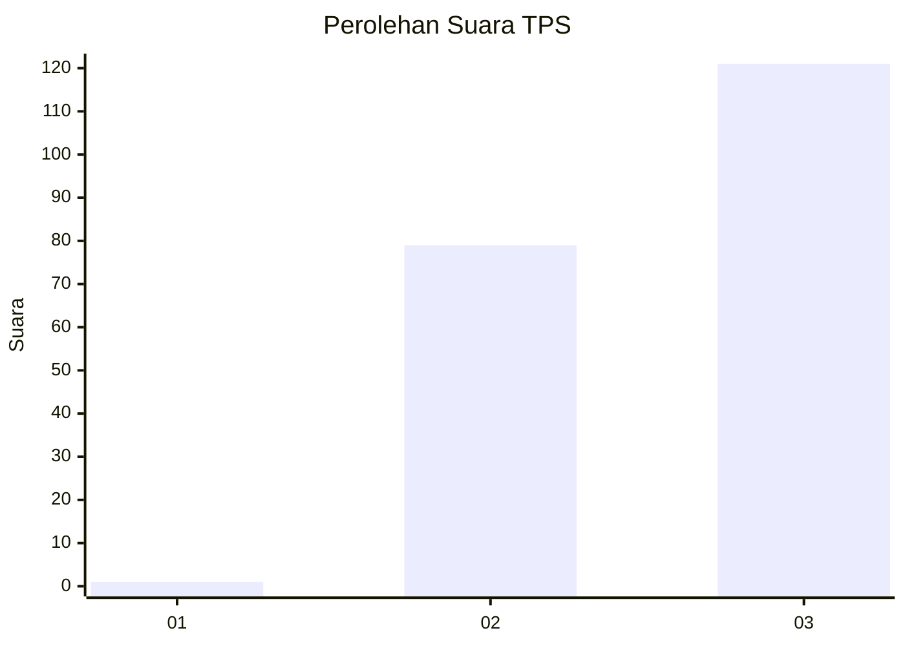
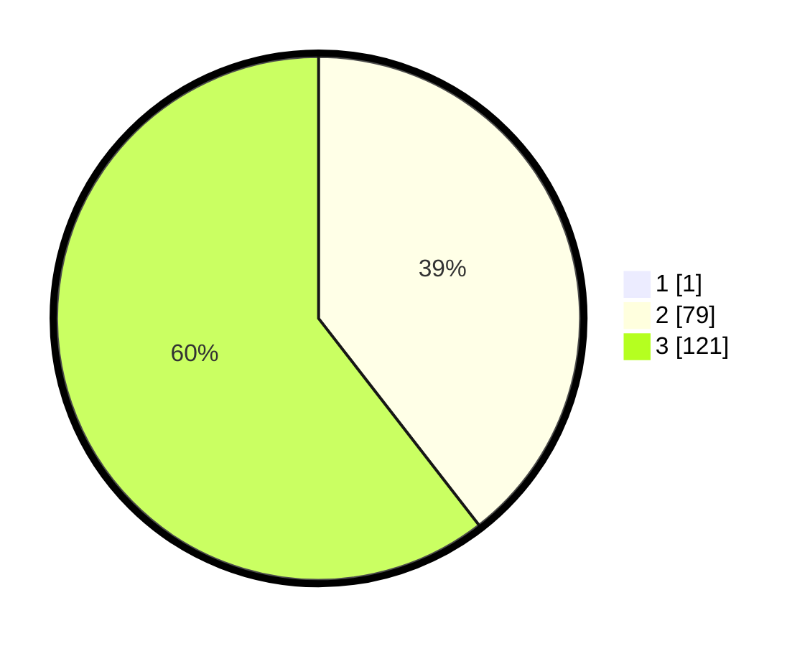

# Hasil

## Grafik

## Tabel

| No. | Nama Paslon    | Suara | Suara (raw) | Persentase |
|:--- |:-------------- | -----:| -----------:| ----------:|
| 1   | ANIES MUHAIMIN | 1     | [1][p-1]    | 0,50       |
| 2   | PRABOWO GIBRAN | 79    | [79][p-2]   | 39,30      |
| 3   | GANJAR MAHFUD  | 121   | [121][p-3]  | 60,20      |

[p-1]: https://github.com/gigit-pemilu/pemilu-2024-51-bali/blob/main/pilpres/hitung-suara/sub/51-bali/sub/02-tabanan/sub/09-baturiti/sub/2004-angseri/sub/001-tps/sub/paslon-1.txt
[p-2]: https://github.com/gigit-pemilu/pemilu-2024-51-bali/blob/main/pilpres/hitung-suara/sub/51-bali/sub/02-tabanan/sub/09-baturiti/sub/2004-angseri/sub/001-tps/sub/paslon-2.txt
[p-3]: https://github.com/gigit-pemilu/pemilu-2024-51-bali/blob/main/pilpres/hitung-suara/sub/51-bali/sub/02-tabanan/sub/09-baturiti/sub/2004-angseri/sub/001-tps/sub/paslon-3.txt

## Foto C Plano

https://sirekap-obj-formc.kpu.go.id/b807/pemilu/ppwp/51/02/09/20/04/5102092004001-20240214-215639--e2e2f7c0-57ef-4b70-934a-37e51f7be563.jpg

https://sirekap-obj-formc.kpu.go.id/b807/pemilu/ppwp/51/02/09/20/04/5102092004001-20240214-215901--7956dbbe-4d3b-495d-a223-b95ac9b814bd.jpg

https://sirekap-obj-formc.kpu.go.id/b807/pemilu/ppwp/51/02/09/20/04/5102092004001-20240214-220257--b973d7c1-f6c9-48a3-b1d3-f4f472f58764.jpg

## Metadata

| Key        | Value               |
| ---------- | ------------------- |
| Time Stamp | 2024-02-24 22:31:28 |

