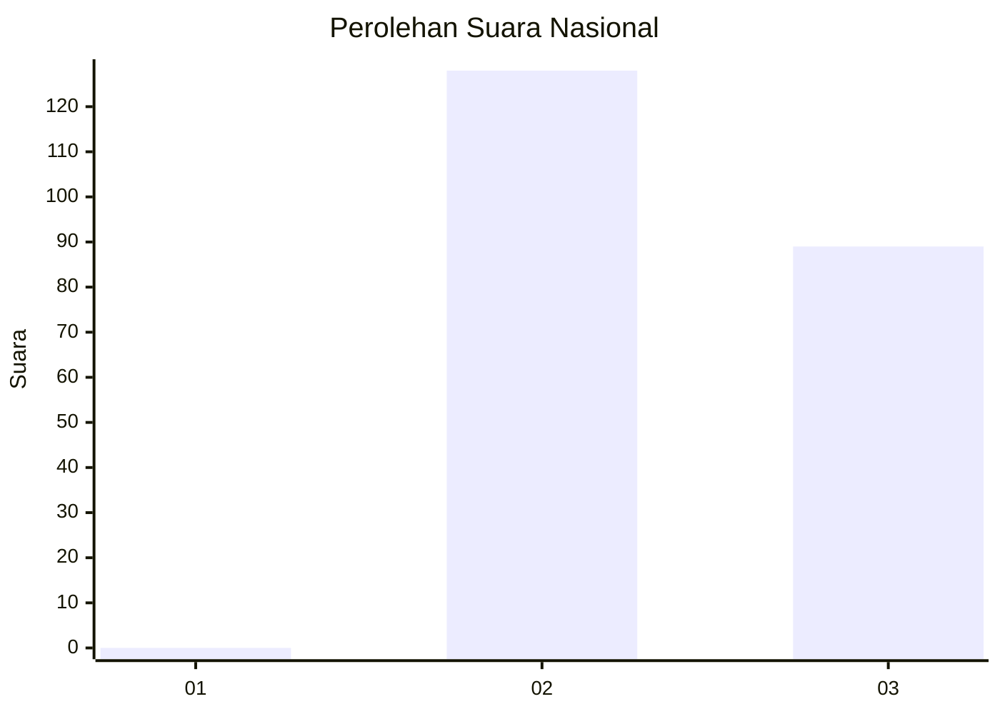
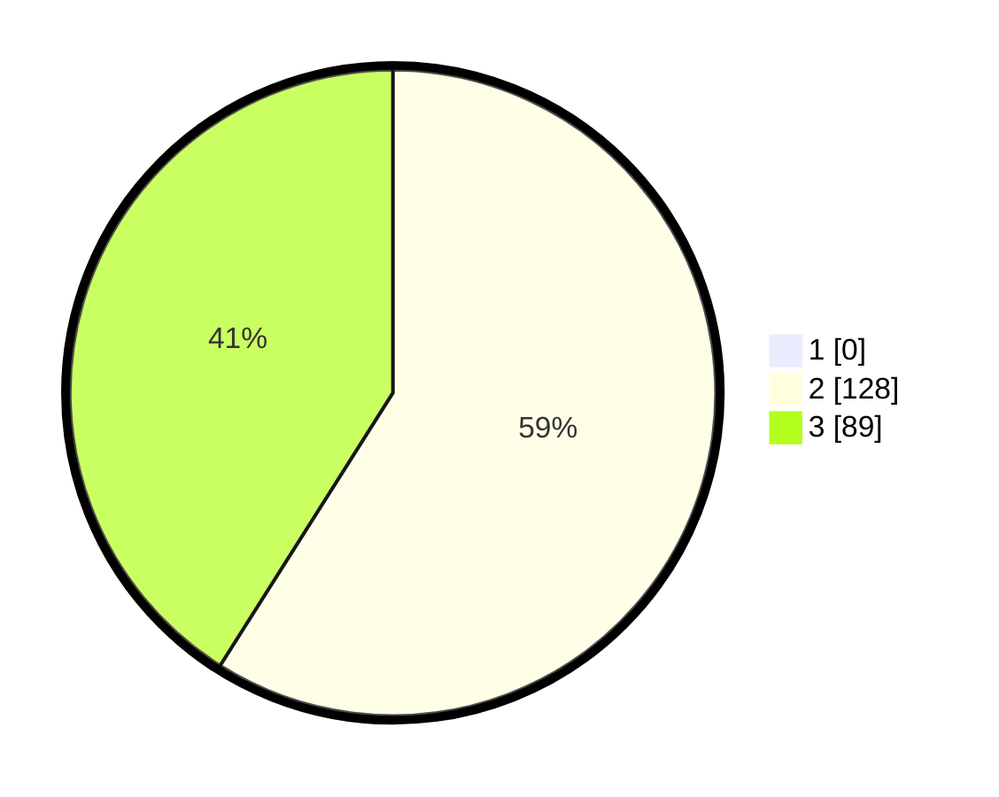

# Hasil

## Grafik

## Tabel

| No. | Nama Paslon    | Suara | Suara (raw) | Persentase |
|:--- |:-------------- | -----:| -----------:| ----------:|
| 1   | ANIES MUHAIMIN | 0     | [0][p-1]    | 0,00       |
| 2   | PRABOWO GIBRAN | 128   | [128][p-2]  | 58,99      |
| 3   | GANJAR MAHFUD  | 89    | [89][p-3]   | 41,01      |

[p-1]: https://github.com/gigit-pemilu/pemilu-2024/blob/main/pilpres/hitung-suara/sub/51-bali/sub/02-tabanan/sub/09-baturiti/sub/2004-angseri/sub/006-tps/sub/paslon-1.txt
[p-2]: https://github.com/gigit-pemilu/pemilu-2024/blob/main/pilpres/hitung-suara/sub/51-bali/sub/02-tabanan/sub/09-baturiti/sub/2004-angseri/sub/006-tps/sub/paslon-2.txt
[p-3]: https://github.com/gigit-pemilu/pemilu-2024/blob/main/pilpres/hitung-suara/sub/51-bali/sub/02-tabanan/sub/09-baturiti/sub/2004-angseri/sub/006-tps/sub/paslon-3.txt

## Foto C Plano

https://sirekap-obj-formc.kpu.go.id/934c/pemilu/ppwp/51/02/09/20/04/5102092004006-20240214-194041--fdbbb9a2-45a4-4cf9-a27b-d73a2318de6a.jpg

https://sirekap-obj-formc.kpu.go.id/934c/pemilu/ppwp/51/02/09/20/04/5102092004006-20240214-194243--afec9733-e1dc-4476-81e1-054bf7873cb7.jpg

https://sirekap-obj-formc.kpu.go.id/934c/pemilu/ppwp/51/02/09/20/04/5102092004006-20240214-194405--f1efbfb2-250d-462a-a03e-790e9f5a319f.jpg

## Metadata

| Key        | Value               |
| ---------- | ------------------- |
| Time Stamp | 2024-02-24 22:31:28 |

