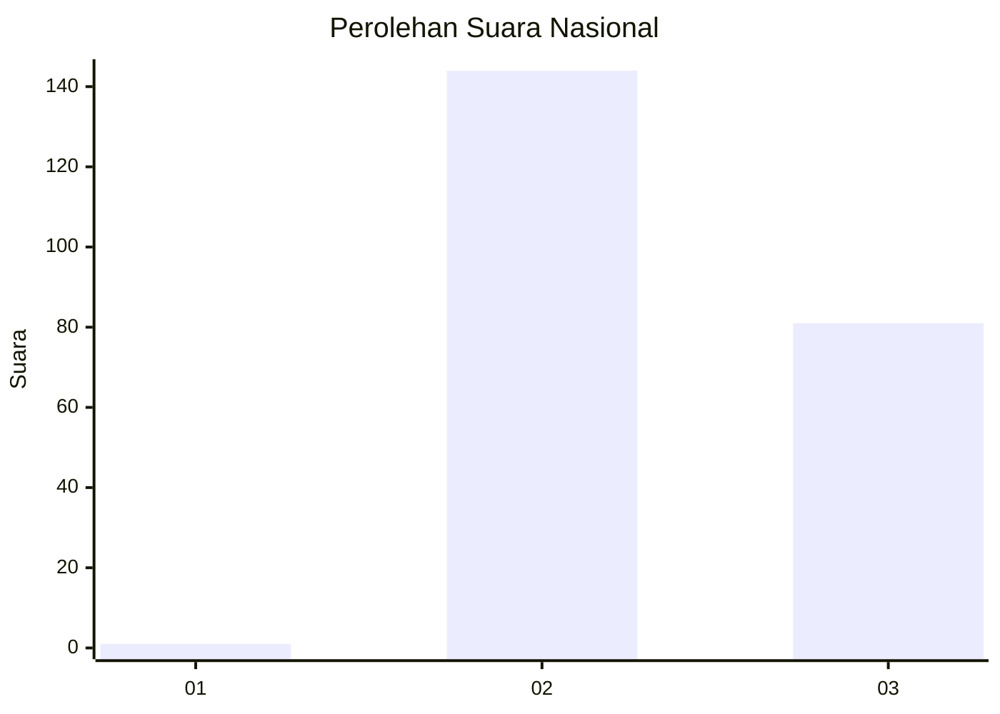
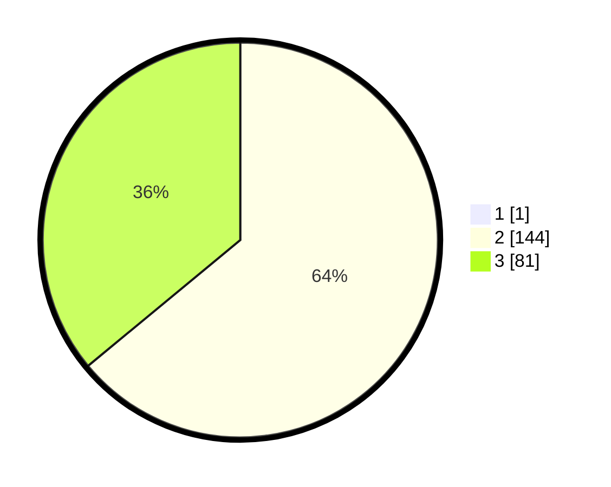

# Hasil

## Grafik

## Tabel

| No. | Nama Paslon    | Suara | Suara (raw) | Persentase |
|:--- |:-------------- | -----:| -----------:| ----------:|
| 1   | ANIES MUHAIMIN | 1     | [1][p-1]    | 0,44       |
| 2   | PRABOWO GIBRAN | 144   | [144][p-2]  | 63,72      |
| 3   | GANJAR MAHFUD  | 81    | [81][p-3]   | 35,84      |

[p-1]: https://github.com/gigit-pemilu/pemilu-2024/blob/main/pilpres/hitung-suara/sub/51-bali/sub/02-tabanan/sub/09-baturiti/sub/2004-angseri/sub/007-tps/sub/paslon-1.txt
[p-2]: https://github.com/gigit-pemilu/pemilu-2024/blob/main/pilpres/hitung-suara/sub/51-bali/sub/02-tabanan/sub/09-baturiti/sub/2004-angseri/sub/007-tps/sub/paslon-2.txt
[p-3]: https://github.com/gigit-pemilu/pemilu-2024/blob/main/pilpres/hitung-suara/sub/51-bali/sub/02-tabanan/sub/09-baturiti/sub/2004-angseri/sub/007-tps/sub/paslon-3.txt

## Foto C Plano

https://sirekap-obj-formc.kpu.go.id/bad1/pemilu/ppwp/51/02/09/20/04/5102092004007-20240214-231354--ee776b1d-96f1-445a-a95d-423f94ca555b.jpg

https://sirekap-obj-formc.kpu.go.id/bad1/pemilu/ppwp/51/02/09/20/04/5102092004007-20240214-231528--5701a352-5a92-43e5-bc77-10c3a3be3e38.jpg

https://sirekap-obj-formc.kpu.go.id/bad1/pemilu/ppwp/51/02/09/20/04/5102092004007-20240214-231646--0c513b09-ca03-4335-8a0e-21b456c2464a.jpg

## Metadata

| Key        | Value               |
| ---------- | ------------------- |
| Time Stamp | 2024-02-26 11:00:00 |

